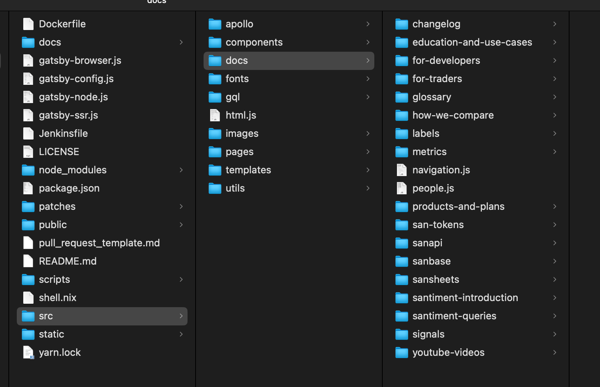

# How to write Academy articles

## High-level file structure



All pages seen on the website are located inside `src/content/docs/`.
For example all metrics articles are located inside src/docs/metrics/, pages about
Sanbase are inside `src/docs/guides/sanbase/`, etc.

This structure is very important for the visualization. It should be created inside the most appropriate directory, or if such directory is missing - create a new directory.

## Article-level file structure

When creating a new article, do the following steps:

- Decide on the article title. For the purpose of the example let's choose 'Trading and Transaction Volume'
- Locate the most appropriate directory where the article
- Create a new folder named `trading-and-transaction-volume` inside it. This directory name is important
  and should reflect the name of the article itself. Usually it is the `snake-case` version of the title.
  This directory name is important as we'll use it when we create links to that article.
- Create an `index.mdx` file inside that directory. The name is important. This will be the main/index page of
  the article.

## Contents of the index.mdx file

### Header

Always start with the header structure, which looks like this.
Fields `title` and `datePublished` are mandatory.
`datePublished` field must not be update after article deploy.
Add field `dateModified` and write any changes thee instead.

```
---
title: Trading and Transaction Volume
author: Santiment Team
datePublished: 2025-05-13
---
```


The `title` and `dateModified` fields are displayed on the article page, as seen in the screenshot.

The `title` field will be transformed to an h1 HTML tag in the final page.
One page should have one h1 tag, holding the title. In Markdown this is usually represented
as a line starting with `#`, like:

`# Trading and Transaction Volume`.

As this is done automatically by us by defining the title, we should **not** use `# title` anywhere in the article thereafter.

Do not define the title second time with markdown!

### Youtube Video

If some video from our channel needs to be added, go to the youtube video and copy the `iframe`
that is produced when you click Share->Embed


Paste the copied iframe right after the header definition, if you wish to have the video right after the title on the final page.

### Subsections

As our title is defined in the header, all main subsections are defined as:

```
## Title of subsection 1
```

These subsections are shown as h2 titles in the HTML (smaller titles than the main title).
They are also shown in the right sidebar/map of the article.


You can use `###`, `####`, etc. to further nest subsections.

You should be consistent -- all top-level subsections should be `##` and the subsections of these subsections should
be `###`, and so on.

### Links and images

#### Links

Markdown link syntax is: `[Link Text](Link URL)`. The link URL can be:

- External (link to sanbase) -- the full URL must be provided. Example: `[Sanbase](https://app.santment.net)`
- Internal -- point to some other page of Academy. These paths are relative. Relative paths allow you to link to stage
  pages on stage and to prod pages on prod. Do not use full paths when linking to other Academy pages!

  Example: `[NVT article](/metrics/nvt)`. The root of the relative path is the `/src/docs/` directory.

  Standard relative path syntax works: `./` points to the current directory and `../` points to the parent directory.

The same rules apply to linking from other pages to your new article page.
If our example `Trading and Transaction Volume` article is located in the `Education and Use Cases` directory, then
the following syntax will create a link to our article: `[Trading and Transaction Volume](/education-and-use-cases/trading-and-transaction-volume/)`

#### Images

Markdown image syntax is ``.

In almost all cases the image file is located in the same directory as the `index.md` file. If the image `img.png` is located
in the same directory, then the following syntax will add it ``. The `./` is the above-mentioned way to point
to the current directory.

Note: The `noborder` is Academy-specific and it removes borders from images. By default we prefer to not have borders.

Prefer adding the images to the directory of your article instead of using images hosted on some other server.
