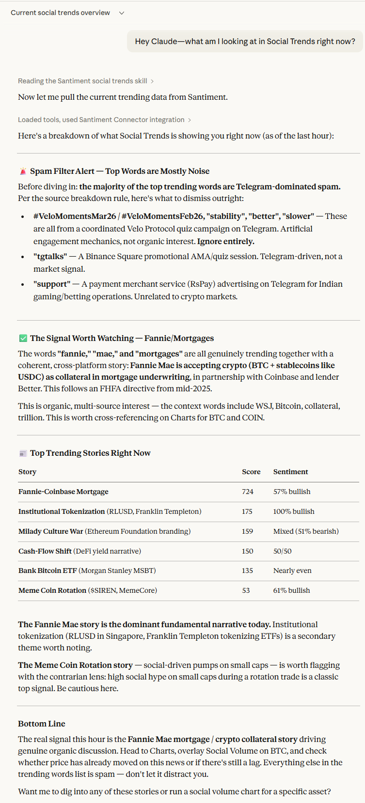

# Read the Crowd: A Santiment Social Trends Skill for Claude

A power-user guide — encoded as an AI skill — to help you get real alpha from Santiment's Social Trends feature from day one.

## What Is This?

This is a **Claude skill** — a small file that teaches Claude how to think and behave like a Santiment power user. Once installed, Claude can guide you through Social Trends in real time: explaining what you're seeing, flagging genuine signals while filtering out noise, and walking you through the workflow and analysis step by step.

The knowledge inside this skill was provided by an experienced Santiment researcher. This methodology would have taken a new user months to learn.

## What You'll Experience

With this skill active, Claude will teach you how to:

**Spot spam vs. genuine trends.** A spike dominated by a single Telegram source is almost always coordinated shilling. Claude will show you how to check the source breakdown and dismiss noise before it misleads you.

**Recognise a local top signal.** When a small or obscure coin breaks into the top 3 trending words, that's not a buy signal — it's retail euphoria at its peak. This is one of the highest-conviction contrarian signals on the platform.

**Read crowd behaviour with word combinations.** Tracking "buy" vs. "sell" social volume reveals when the crowd is all-in on one side. Because the crowd is usually wrong at extremes, strong dominance in either direction points to the contrarian outcome.

**Use the right time windows.** Most newcomers look at 24h or 7-day windows. Power users set 1 month at 1h granularity for day-to-day monitoring, and 3 months at 4h for broader context. Claude will set you up correctly from the start.

**Always cross-reference with Charts.** Social Trends tells you what the crowd thinks. Charts tell you whether the market has already priced it in. Claude will walk you through a 5-step cross-reference flow every time you spot a signal.

## The Core Idea: Social Data Is Contrarian

The single biggest mistake new users make is treating social spikes as momentum signals — "this coin is trending, so I should buy." The opposite is usually true. When social volume peaks, so does crowd participation. That's typically when smart money is exiting, not entering.

This skill is built around that philosophy. Every heuristic inside it is designed to help you read *what the crowd is feeling* — and then ask whether that feeling is reflected in the price or not.

## How to Install

1. <a href="https://github.com/santiment/academy/tree/main/src/content/docs/ai-toolkit/santiment-skills/santiment-social-trends-SKILL.md" download>Download the `santiment-social-trends-SKILL.md` file</a>
2. In Claude, go to **Settings → Claude's Skills** (or your team's skill library if using a shared workspace).
3. Upload or paste the file as a new skill.
4. Once installed, Claude will automatically apply it whenever you ask about Social Trends, social volume, trending words, or crowd sentiment on Santiment.

You don't need to do anything special to activate it — just ask Claude a question like *"what am I looking at in Social Trends right now?"* and it will guide you from there.

## How to Use

Once the skill is installed, you can talk to Claude naturally:

- *"There's a big spike in social volume for this token — is it worth paying attention to?"*
- *"How do I know if a trending word is real or spam?"*
- *"Walk me through Social Trends from scratch."*
- *"What does it mean that 'buy' is dominating social volume right now?"*

Claude will respond with the framework a power user would apply — not a generic explanation of what the feature does.

## Example Interactions

Here is a basic example using the "Hey Claude—what am I looking at in Social Trends right now?" prompt.

