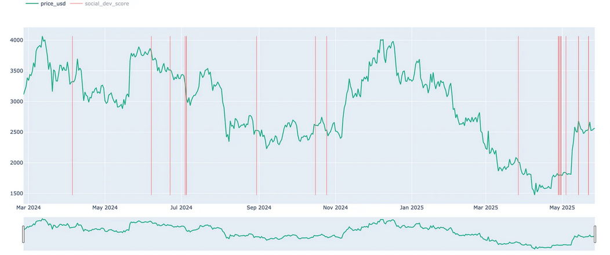

> ⚠️ **Note (August 2026):** The GitHub activity data that powers the Developer Score component is currently broken, so the Developer Score part of this anomaly may be unreliable until the GitHub metrics are restored. See [Development Activity Metrics](/metrics/development-activity) for details.

## Definition

**Social-Dev Score** Anomaly combines social media metrics and development activity to create a comprehensive scoring system for crypto assets. It helps identify notable trends and anomalies in both social engagement and development activity.

## **Score Composition**

- **Social Score (60% weight)**
    - Twitter volume
    - Reddit community activity
    - Telegram dominance
    - 4chan discussions
- **Developer Score (40% weight)**
    - GitHub activity

## **Use Cases**

- Identify assets with sudden spikes in social interest
- Monitor developer activity trends
- Detect coordinated social media campaigns
- Track overall project health through combined metrics