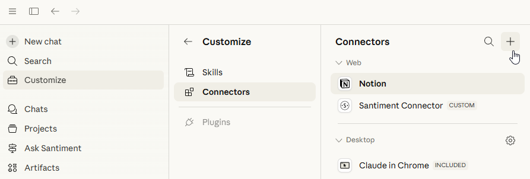

# Introduction

Santiment tracks on-chain activity, social data, exchange flows, and market behavior across thousands of crypto assets. Now, AI agents can do the research work for you — querying Santiment metrics, combining data layers, and delivering high quality reports and recommendations you can act on.

Agents need two things, data connectivity and instructions for what to do; The Santiment MCP connector is a zero-setup data access solution while skills range between providing data connectivity(API access) and/or pure intructions(Read the Crowd).

This is a new way to use Santiment. Not just dashboards and scripts — but a conversation with an agent that has direct access to the same data, designed to understand and work with it intelligently.

Ask the question, then let the agent handle the data collection and analysis.

# Santiment's Model Context Protocol(MCP) Connector (public soon)

A simple path. No difficult setup, no code, no terminal.

Connect Santiment to Claude in a few clicks:
- Open Claude and navigate to the Connectors section.
- Find Santiment and click Connect.
- You'll be redirected to Santiment to authorize access via OAuth.
- Log in (or create a free account at app.santiment.net) and approve the connection.

This will be the easiest way to get Santiment data into an AI conversation — ideal if you want results without any technical configuration.

[Visit this page](https://academy.santiment.net/mcp-connector) for use case examples and available tools.

# Santiment Skills for AI Agents

A skill is either a standalone .md file or a folder containing:
• SKILL.md (required): Instructions in Markdown with YAML frontmatter
• scripts/ (optional): Executable code (Python, Bash, etc.)
• references/ (optional): Documentation loaded as needed
• assets/ (optional): Templates, fonts, icons used in output

Our skills instruct agents on how to work with and interpret our data in specific ways. Once a skill is installed, the agent can utilize metrics for on-chain flows, social sentiment, holder behavior, exchange activity, developer activity, and more across 3,000+ assets.

Different skills offer different functionalities and levels of depth. Claude can load multiple skills simultaneously. Advanced users can even write their own skills.

Visit the [Santiment Skills page](https://academy.santiment.net/santiment-skills) to explore and learn more about available skills.
