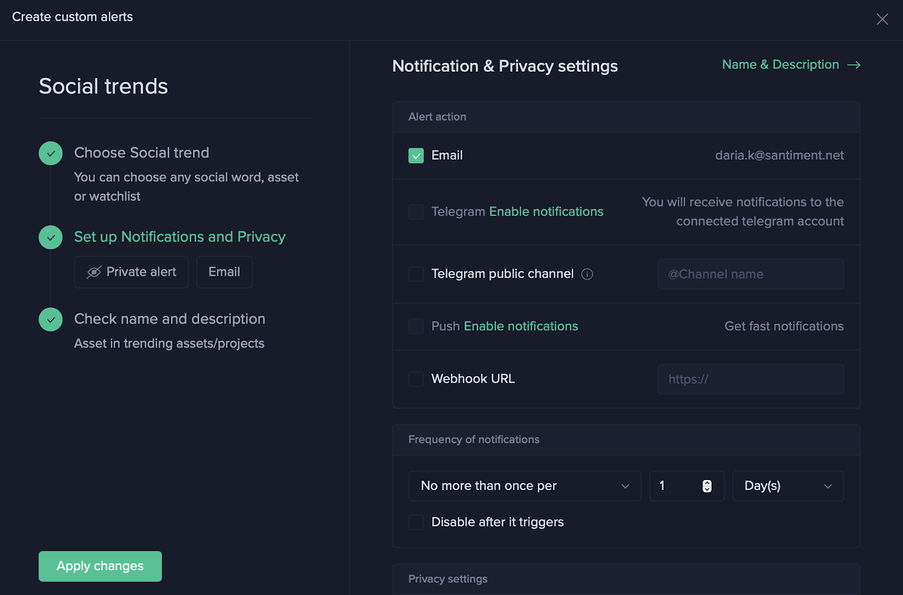
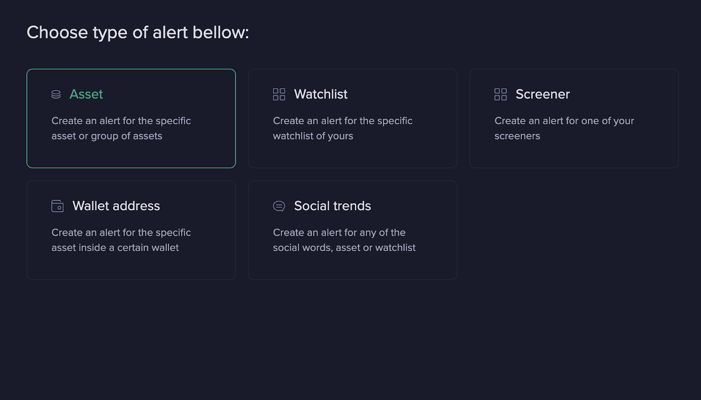
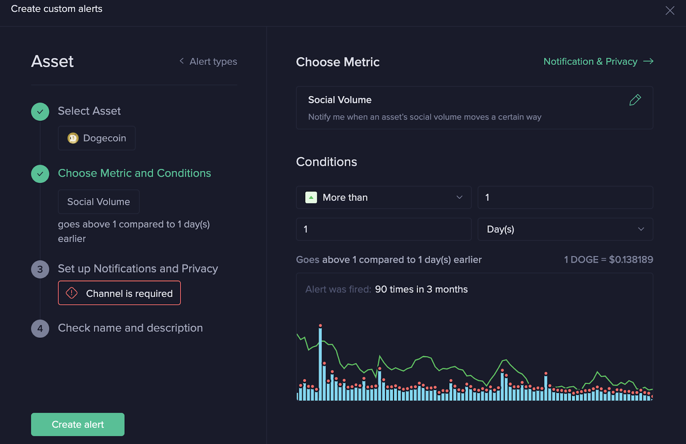
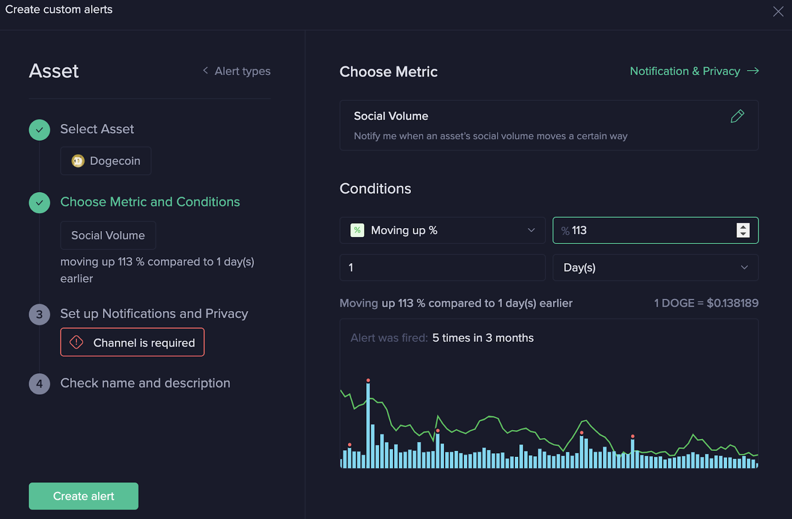
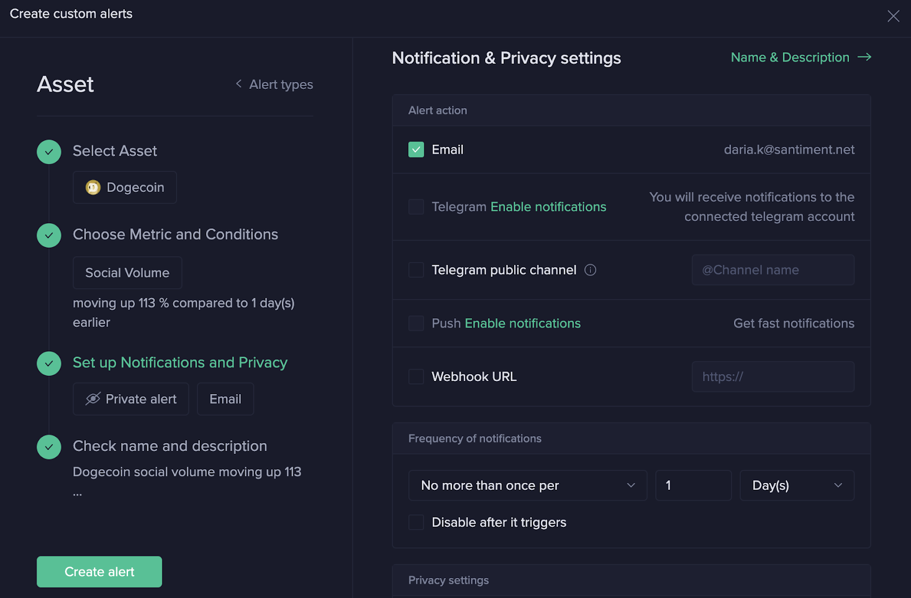
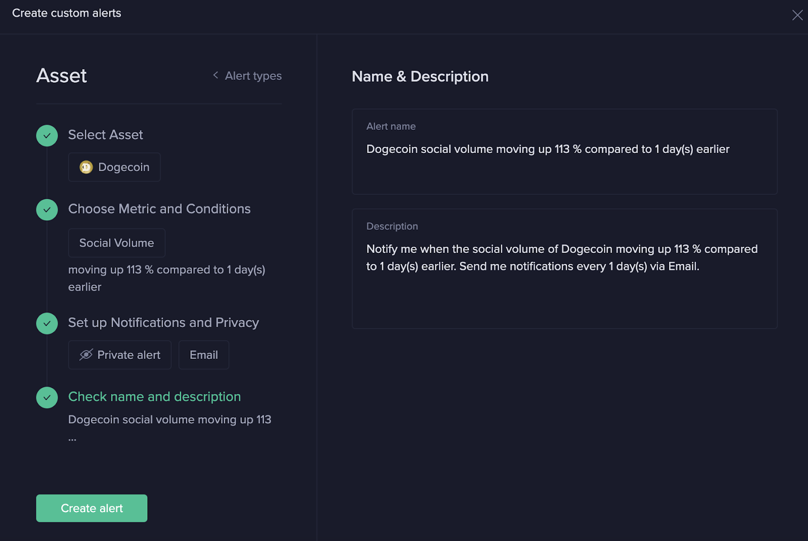

Santiment stands out in the industry as the only tool that has developed its unique approach to analyzing the cryptocurrency market. Social dynamics can serve as a powerful indicator of impending market volatility.

While you may already be following certain Twitter accounts or receiving updates from Telegram chats, there's a challenge: It's impossible to read every channel, which means your attention is confined to a select number of news sources.

As the saying goes, "where there's smoke, there's fire." If you're monitoring multiple coins, you might have noticed that some generate more social media buzz than others. Occasionally, an asset garners excessive attention, as was the case with Dogecoin.

Consider the chart below. It clearly shows a significant spike (highlighted in blue) in social volume towards the end of November 2021.

Even without advanced analytical skills, it's easy to see that the price, which was already falling, plummeted further following the social media spike.

We always emphasize that no single metric can predict such drastic changes. However, it's beneficial to monitor all of them to identify which ones resonate with you the most.

Noticing this spike in November 2021 could have served as a potent informational signal about Dogecoin.

## Setting Up Alerts for Social Trends

Let's explore how you can set up these alerts on your own. We recommend beginning with the most basic social trends alert. This alert will only be activated if your specified keyword begins to rank among the top 10 trending social terms.

## Step 1: Selecting Social Trends Alert

From the Alerts menu, select the Social Trends alert. Next, navigate to the Trending Assets tab. Here, you can choose the coins you wish to monitor. Alternatively, you can use your pre-existing watchlist.

## Step 2: Choose Your Preferred Notification Method and Frequency

Specify your preferred method and frequency for receiving notifications when the alert is triggered.

## Step 3: Assign a Name to Your Alert

Assign a name to your alert. If you don't, a name will be automatically generated based on the terms you've selected to monitor.

Congratulations! You've successfully created a robust alert. Reaching the TOP 10 is quite an achievement, so if you receive a notification, it's definitely worth investigating.

---

## Setting Up a Social Volume Alert

Another scenario where a social alert can be beneficial involves obtaining more sensitive data. This is similar to the Dogecoin example provided at the beginning of this article.

There might be instances where a significant spike in Social Media Volume for a specific coin may not be reflected in the overall Social Trends. In such cases, you could potentially miss an important signal.

To help you understand better, let's use Dogecoin as an example to walk you through the process of setting up a Social Volume alert.

## Step 1.1: Navigate to the "Assets" Tile

## Step 1.2: Select Dogecoin from the List

## Step 1.3: Selecting the Metric

In the "Choose Metric" section, navigate to the "Social" category and select "Social Volume".

Upon selection, you will see a chart with red dots. Each dot represents an instance when the alert would have been triggered in the past three months. There are 90 such instances, which can be considered as noise.

## Step 1.4: Adjusting Your Alert

To modify your alert, navigate to the dropdown menu located under the 'Condition' section and select the "Moving up %" option. Experiment with the numerical field on the right to determine the percentage increase that offers the most value.

In this specific instance, we've set it to a 113% increase compared to the previous day. This setting would have triggered our alert only five times in the past three months. As you can see from the chart, the other bars appear to be more or less equal.

## Step 1.5: Choose Your Preferred Notification Methods and Frequency

## Step 1.6: Confirm and Create Your Alert

Ensure that you are satisfied with the name of your Alert. Once you've confirmed, click on 'Create Alert'.

Congratulations, you have successfully created your Alert!
