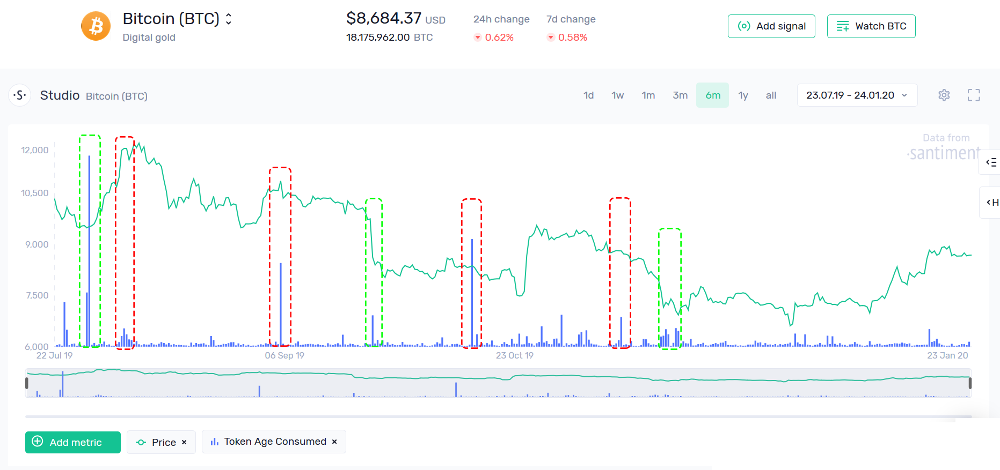
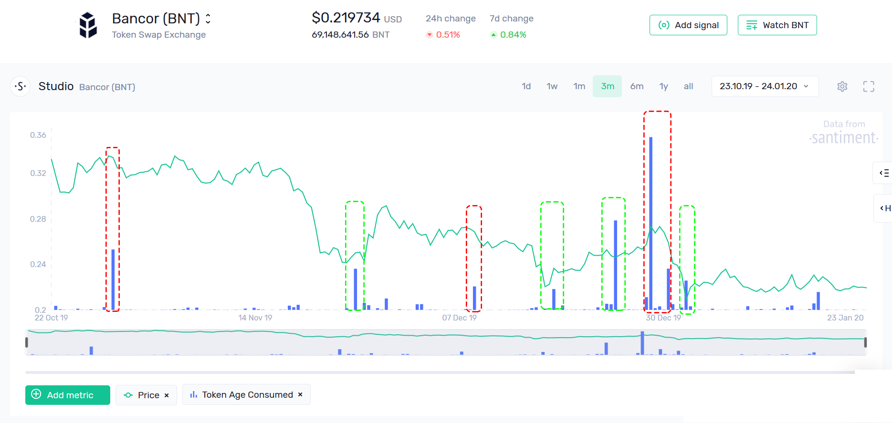

[**Age Consumed**](https://academy.santiment.net/metrics/age-consumed) or Token Age Consumed(TAC) is a reliable on-chain indicator that signals changes in market conditions. This metric assigns higher value to coins that have been held for a longer duration, compared to those recently acquired.

Spikes in the TAC chart indicate the movement of tokens that have been dormant for a considerable period. The underlying assumption is that long-term holders and experienced traders usually make well-informed decisions. Therefore, it can be very beneficial to monitor when these parties begin to transfer their holdings.

Such events can introduce volatility to the token’s short-term price action. The direction of this volatility, whether upward or downward, is unique to each situation. However, a spike in TAC is always a prompt to pay closer attention.

Consider Bitcoin's TAC chart for the past six months; Almost every significant peak either signaled an impending correction (red), or occurred at the lowest point of the rally (green):

The same pattern can be observed with an altcoin. For instance, all pictured spikes in Bancor's TAC either correlated with increasing downward pressure (red) or signaled a rebound (green):

For further illustration, here's Aragon's TAC chart, which aligns closely with major changes in price action:

From a fundamental standpoint, spikes in Token Age Consumed are among the most reliable indicators of volatility in the crypto market. When a substantial amount of 'old money' starts to move, there's almost always a significant reason behind it. Being aware of these movements as they occur is crucial.
