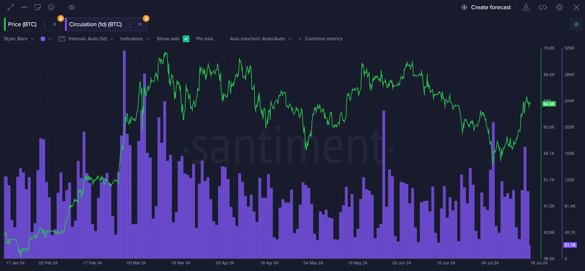

import Notebox from '$components/markdown/Notebox.svelte'

<iframe
  width="560"
  height="315"
  src="https://www.youtube.com/embed/GhHV1t_BwJQ?si=yy-nH9VqrPjqYhmC"
  title="YouTube video player"
  frameborder="0"
  allow="accelerometer; autoplay; clipboard-write; encrypted-media; gyroscope; picture-in-picture; web-share"
  referrerpolicy="strict-origin-when-cross-origin"
  allowfullscreen
></iframe>

## Definition

The [circulation metric](https://academy.santiment.net/metrics/circulation/#definition) measures the number of unique coins or tokens being
transferred between addresses on a blockchain within a specific period. It
provides insights into the actual movement and usage of the asset, indicating
network activity and utility.

Accounted tokens in Circulation are unique, meaning that if the same token is
moved multiple times per day via a \*wash trade\*\* it is counted only once.

<Notebox type="openBook">

A "wash trade" is a type of market
manipulation where a trader buys and sells the same financial instruments
simultaneously through different brokers, creating misleading activity in the
marketplace without any change in position.

</Notebox>

## Circulation VS Transaction Volume VS Stock to Flow ratio

Circulation measures the number of unique coins/tokens being transferred
between addresses, while transaction volume includes all on-chain movements of
a token. This means that if one token/coin changes hands 5 times on a given
day, it will be counted once by the token circulation, but 5 times if were to
use [transaction
volume](https://academy.santiment.net/education-and-use-cases/trading-and-transaction-volume/).

Circulation shouldn’t also be used interchangeably with [Stock to Flow (S2F)
ratio](https://academy.santiment.net/metrics/stock-to-flow/). S2F compares the
total supply of a token to the new annual production, often used to predict
price based on an asset's supply dynamics and scarcity. Circulation, on the
other hand, tracks the movement of unique coins between addresses within a
timeframe, indicating network activity and utility.

## **How to interpret Circulation metric**

High circulation often signals increased interest and utility, which can lead
to change in price direction. Depending on context, a spike in Circulation can
be a very good indicator of a nearing top or bottom as we can see on the chart
below:

For instance, looking at UNI during a period of high circulation in early April
2024, we saw a local top in price. Similarly, in November 2023, a spike in
circulation preceded a significant price increase over the following months.
These patterns suggest that spikes in circulation can be early indicators of
price movements, either up or down, depending on the context.

Context is crucial, so we strongly suggest not to make trading decisions based
solely on this metric or any other single metric for that matter. Use a
combination of metrics that will help you make a more informed decision.

## **How to monitor Circulation using Sanbase**

Here is a ready-to-be-copied Layout with Circulation for your convenience:
[Sanbase Layout](https://app.santiment.net/s/ZI_PQYY7)

As soon as you have adjusted the Chart based on your preferences (time
intervals, colors, etc.) you can save it as a new private Layout. Then, using
the Master selector (the bigger one on the top) you can change the currently
analyzed token to another while your visual preferences and metrics remain the
same.

Alternatively you can use the smaller selector to build on top of your chart
and insert more metrics, even for multiple tokens at once.

See what others in crypto can’t!

More technical documentation about the metric can be found here:
[Circulation | Santiment Academy](https://academy.santiment.net/metrics/circulation/)
