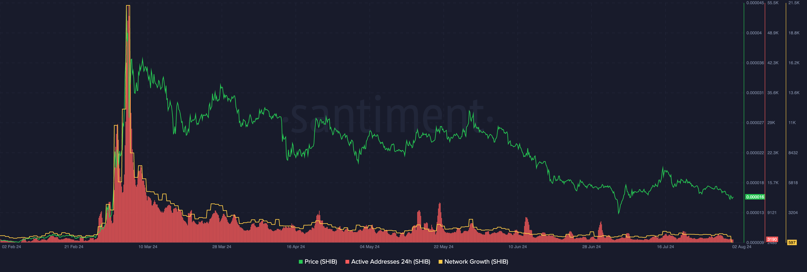
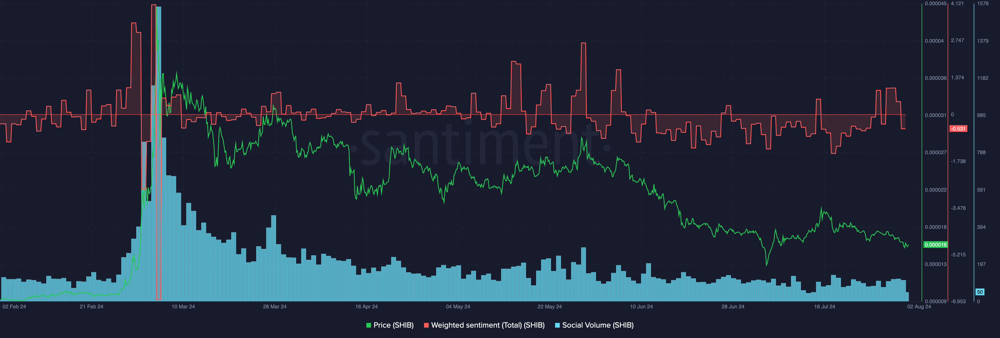
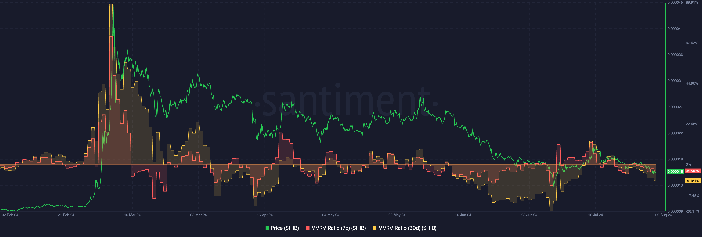
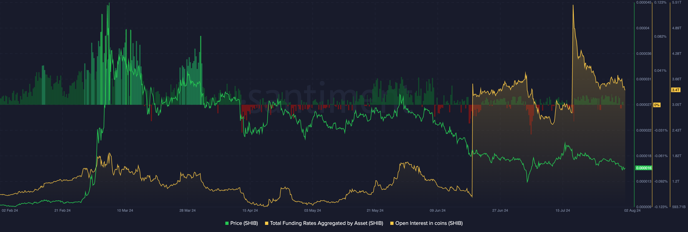

import Notebox from '$components/markdown/Notebox.svelte'

## Overview

This handbook aims to help traders and investors identify market tops. It’s
most useful for small to mid-cap coins driven by momentum and social
narratives.

&nbsp;

For the purpose, we will use a layout with four charts with key indicators. We
will use SHIB as a proxy.

&nbsp;

Key indicators are:

- Network activity (address activity and network growth)
- Social metrics (volume and sentiment)
- Valuation metrics (MVRV)
- Derivative metrics (funding rate and open interest)

&nbsp;

Open this layout with four charts and let’s dive in.

[Sanbase Charts | Short-term market cycle](https://app.santiment.net/charts/short-term-over-under-valued-coins-24504)

&nbsp;

<iframe
  width="560"
  height="315"
  src="https://www.youtube.com/embed/oYXcByj5Ano?si=onBtLCOARK8CNB3d"
  title="YouTube video player"
  frameborder="0"
  allow="accelerometer; autoplay; clipboard-write; encrypted-media; gyroscope; picture-in-picture; web-share"
  referrerpolicy="strict-origin-when-cross-origin"
  allowfullscreen
></iframe>

## Network Activity

Chart 1 of the layout combines address activity and network growth metrics.
The idea is to gauge if the price rise is supported by the network metrics
rise. If it isn’t - good chance for a top.

<Notebox type="arrowRight">
Active Addresses 24h - the number of distinct addresses that participated in a
transfer for the given asset in the past 24 hours window.

Network Growth - the number of new addresses that transferred a given coin for
the first time.

</Notebox>

<Notebox type="dart">
  Assess if price rises are supported by network activity.
</Notebox>

<Notebox type="brain">
  If network metrics don't rise with the price, it often signals a potential
  market top.
</Notebox>

## Social Metrics

Same idea applies to social volume and sentiment metrics on Chart 2 of the layout. Those metrics are usually the strongest mid-trend. When they start slumping but the price still pushes higher - that indicates narrative weakening and momentum exhaustion, which is a good signal to get out.

<Notebox type="arrowRight">
Social Volume - the total number of social media messages that contain the
given search term at least once.

Weighted Sentiment - a numeric representation of social context around a coin.

</Notebox>

<Notebox type="dart">
  🎯 Assess mid-trend strength through social metrics.
</Notebox>

<Notebox type="brain">
  A decline in social volume and sentiment despite rising prices indicates
  weakening narratives and momentum, hence an exit signal.
</Notebox>

## Valuation Metrics

Chart 3 of the layout shows Market Value to Realized Value (MVRV) Ratio metrics. The same approach applies as in long-term trend analysis, just on a much shorter timeframe.

<Notebox type="arrowRight">
  MVRV - an asset's market capitalization divided by realized capitalization.
</Notebox>

<Notebox type="dart">
  Observe divergences between MVRV and price by analyzing MVRVs for different
  timeframes based on coin movements.
</Notebox>

<Notebox type="brain">
Rising Realized Value indicates "greed," often leading to a downward trend.

Dropping Realized Value indicates losses, causing MVRV to diverge upwards.

Divergences reveal market sentiment and potential price movements.

</Notebox>

## Derivatives Metrics

On Chart 4 of the layout we look at funding rate and open interest metrics.
They allow us to analyse the derivatives market of a coin. Increase of open
interest and high funding while price staying seemingly slat might indicate
insiders positioning for an upcoming catalyst event.

<Notebox type="arrowRight">
Total Funding Rates Aggregated by Asset - the aggregation of all funding rates
by open interest for a given asset.

Open Interest in coins - the sum of open interests of all contracts for a given
asset.

</Notebox>

<Notebox type="dart">
  Analyse the derivatives market for potential insider activity.
</Notebox>

<Notebox type="brain">
  Rising open interest and high funding rates with stable prices indicate
  insider positioning for upcoming catalyst events.
</Notebox>

All of these metrics will help you better spot trend reversals early and to
identify potential infliction points.

[Sanbase Charts | Short-term market cycle](https://app.santiment.net/charts/short-term-over-under-valued-coins-24504)

Feel free to save the layout with charts as your own and use the master selector (the top one) to observe the same metrics for various tokens.

See what others in crypto can’t!
