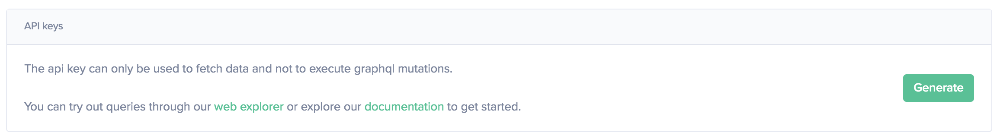
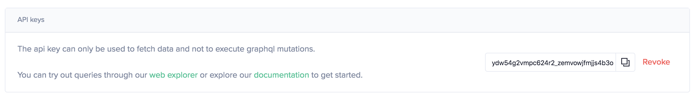

All of our current products use the [Sanbase](https://app.santiment.net)
account as reference. You cannot use Sanbase as a login
option for the API or for Sansheets. This is
where an API key comes in.

When you create a Sanbase account, you have the ability to generate an API key that carries the same access rights for use with our other products. The access rights assigned to this key depend on your subscription plan.

## Creating an API Key

To create an API key, visit the account settings of [Sanbase](https://app.santiment.net/account), [SanAPI](https://api.santiment.net/account), or [Sansheets](https://sheets.santiment.net/account).

In the account settings, click on the **`Generate`** button to create a new key.

The key will be displayed as a string. You can copy it and use it wherever needed.

You can revoke the key at any time from the same location.

## Using an API Key

The [Authentication Section](/sanapi#authentication) demonstrates how to include an API key in your requests.
