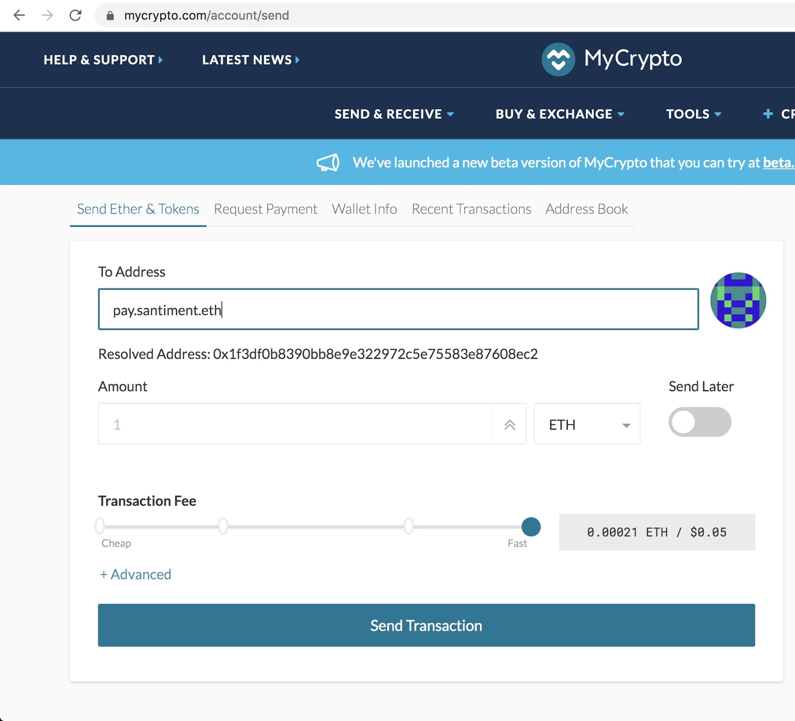

> **Note:** Payment in crypto is only available for yearly subscriptions, not for monthly ones.

## Pay With ETH or DAI

To drive cryptocurrency mass adoption, we let users pay with various cryptocurrencies for quick, easy access to our services.

_[Make use of your SAN tokens for a hefty discount](/products-and-plans/how-to-pay-with-crypto/#burning-san-tokens-to-make-payments)._

To make a payment with crypto, you can choose to use `ETH`, `DAI`, `USDC`, or `USDT` for any of our products and services. If you would like to pay with an unlisted token, please contact us at [support@santiment.net](mailto:support@santiment.net).

Send either form of crypto to this address:

`pay.santiment.eth`
or
`0x1F3dF0b8390BB8e9e322972C5e75583E87608Ec2`

After making the payment please contact our team at [support@santiment.net](mailto:support@santiment.net) so we can activate your account.

> **Note:** We accept `ETH`, `DAI`, `USDC`, or `USDT` for any of our products and services.

## Burning SAN Tokens for Subscription Payments

SAN token holders can burn their tokens to pay for subscriptions, instead of using regular payments.

What is token burning? It's the process of sending tokens to an invalid address, permanently removing them from circulation.

Benefits:

- 2x Value: If you Burn SAN we credit you at 2x the current market rate.
- Supply reduction: Every burn decreases the total SAN supply, increasing proportional ownership for all holders.

Please be aware of the following restrictions:

> - Paying via SAN burn is limited to Sanbase subscriptions and is not available for SanAPI subscriptions.
> - SAN burn is not available for residents of the Swiss Confederation due to tax regulations.
> - SAN burn can only be applied to yearly base subscription prices. No other discounts are applicable when using SAN burn.

If you are ready to burn SAN for a yearly Sanbase Pro subscription, please contact us at [support@santiment.net](mailto:support@santiment.net) and we will gladly guide you through the process.

## Providing SAN Uniswap Liquidity

Another way to gain Pro access to Sanbase is by providing liquidity for the SAN/ETH trading pair on Uniswap V2! As long as you provide 3000+ SAN to our Uniswap V2 pool (and the corresponding amount of ETH), you will receive FREE access to Sanbase Pro, including all our metrics, new templates, and daily market insights!

You can add liquidity to the SAN|ETH pool here: [https://app.uniswap.org/#/add/v2/ETH/0x7C5A0CE9267ED19B22F8cae653F198e3E8daf098](https://app.uniswap.org/#/add/v2/ETH/0x7C5A0CE9267ED19B22F8cae653F198e3E8daf098).

As soon as you hold the LP tokens in your wallet and connect it to your account or log in with it, you will automatically receive a Pro subscription within one hour. 💗

- [How to sign up/sign in with Metamask](/sanbase/logging-into-sanbase/#first-login-using-metamask)
- [How to connect your wallet to an existing account](/san-tokens/how-to-stake-san/#connecting-a-wallet-to-an-already-existing-account)

_Please make sure to do your own due diligence regarding the Uniswap protocol and the risks involved in providing liquidity. Santiment has no control over the Uniswap protocol and cannot be held accountable for any potential losses of any kind._
