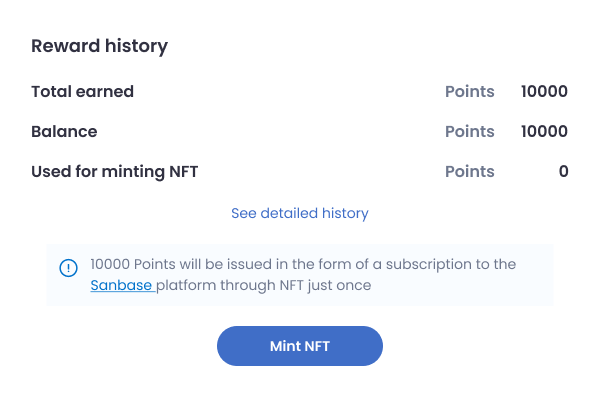

Registered [SanR.app](https://sanr.app/) users can unlock free access to the [Sanbase platform](https://app.santiment.net/) by earning **SanR points**. This access includes all features provided under the [Sanbase Pro plan](https://academy.santiment.net/products-and-plans/sanbase-pro-features), valid for 12 months. Points are earned through active participation and performance in SanR Epochs and Leagues, giving SanR users a chance to enjoy premium analytics without spending money!

## How it works

To obtain a SanR NFT, users would need to compete in the Epoch Competitions and earn points by winning the SanR Leagues. Players can compete in the Leagues by providing crypto price signals. Each Epoch includes three distinct Leagues, each ranking players based on different performance criteria. These Leagues renew every two weeks, rewarding the top 10 players in each League at the end of the period. [Video guide on how to navigate SanR.](https://www.youtube.com/watch?v=NvsqZMdhQNg)

The key to success is simple: post high-quality signals and stay consistent—whether your signals go up or down, consistency is what counts!

**Minting the SanR NFT**: When a user has collected 10,000 points, they can exchange their points to mint an NFT via SanR.app, granting them 12-month access to the Sanbase Pro plan.

Important notes

- The Sanbase Pro subscription obtained via the SanR NFT is valid for **12 months**.
- Each user is allowed to mint the NFT and claim the free Sanbase subscription **only once**.
- The same MetaMask address used to mint the NFT must also be connected to the **Sanbase** account.
- Users with an existing Sanbase Pro plan **cannot activate** the free plan from the NFT.
- After the free NFT subscription expires, users must [pay](https://app.santiment.net/pricing) to continue accessing Sanbase Pro features.

## Step-by-step process to claim your NFT

1. **Head to your SanR profile page**
   To mint an NFT, you'll need a connected [MetaMask](https://metamask.io/) wallet. Start by visiting your profile page on [SanR.app](http://sanr.app/) by clicking the profile icon in the top-right corner of the application.
2. **Mint your NFT**
   Once you’ve accumulated 10,000 SanR points, head to the **Reward History** section of your profile and exchange the points to mint your Sanbase subscription NFT.
3. **Create Sanbase account**

   If you don’t already have an account, go to the [Sanbase](https://app.santiment.net/) page and create one. If you’re already a user, simply log in.

   

4. **Connect your MetaMask wallet to your Sanbase account in Account Settings**

   In your [Sanbase Account Settings](https://app.santiment.net/account), connect the **same MetaMask address** that was used to mint your NFT. This step is crucial to access the Sanbase Pro features.

   

5. **Click on the “Check NFT access” button**

   Scroll down to the subscription section of your [Account Settings](https://app.santiment.net/account) page and click the **“Check NFT access”** button. If your MetaMask wallet holds the SanR NFT, your Sanbase Pro plan will be activated automatically.

If you encounter any issues, feel free to reach out via the [Santiment Discord](https://santiment.net/discord) for support.
