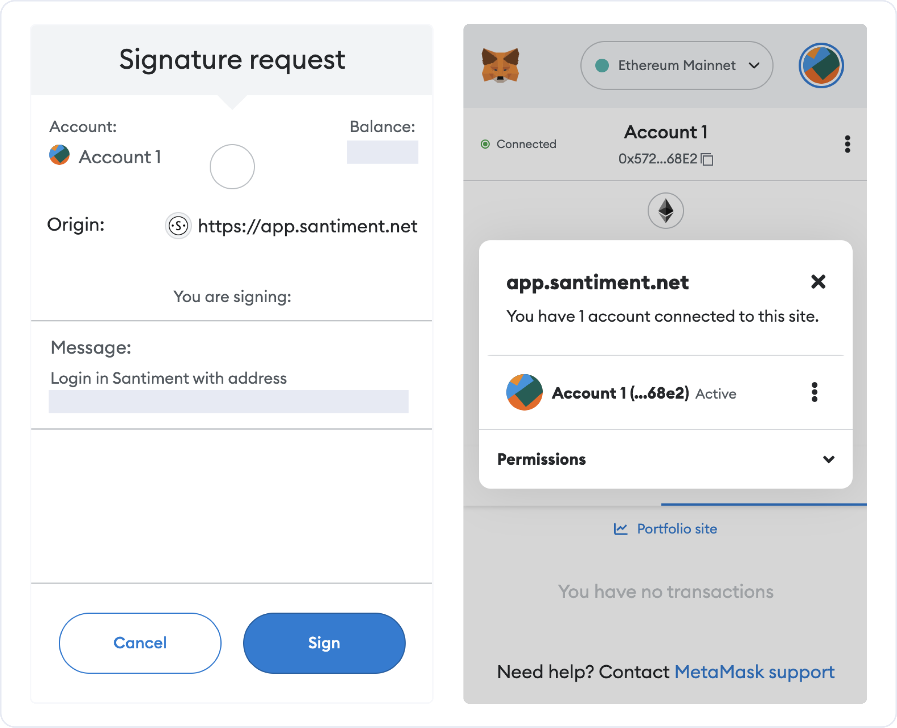

import Notebox from '$components/markdown/Notebox.svelte'
import Resource from '$components/markdown/Resource.svelte'

<Notebox type="pin">
  This article describes how to stake SAN tokens that are already in your
  possession. Please refer to [this article](/san-tokens/how-to-buy-san-tokens/)
  to learn how to buy SAN tokens in the first place.
</Notebox>

There are two ways to connect an Ethereum address to a Sanbase account. You can use MetaMask as a first login (and add an email address later) or add it to an existing account.

## Logging into Sanbase using MetaMask

This procedure is described in the article [Logging into Sanbase](/sanbase/logging-into-sanbase/). Please refer to this resource as needed.

## Connecting a Wallet to an Existing Account

After logging into Sanbase using your email address, open the account settings. These settings can be found in the upper right corner by hovering over your account icon:

In account settings, you will find the following option. Click it:

If your MetaMask plugin is not logged in yet, please do so now as prompted.

<Notebox type="note">
  Please note that MetaMask can create a local wallet within the browser, import
  a wallet in multiple ways, or be connected to a hardware wallet like the
  Ledger Nano S. Make sure your tokens are safe!
</Notebox>

Please confirm the following steps to let Sanbase connect to MetaMask (and the selected wallet):

You will now be asked to sign a message with your private key. Please note that this is not a transaction, no tokens are sent, and no changes are made to the blockchain. This step simply proves that the connected account is in your control, and hereby belongs to you.

After confirmation, you will see your address and SAN token balance in the account settings.

<Notebox type="note">
  Staking currently means that you are holding a certain number of tokens at an
  ETH address that Sanbase can check each time you visit. This is a lot like
  maintaining a minimum balance in a bank account. In the future, we plan to
  implement a more advanced staking mechanism.
</Notebox>

## What's Next?

Congratulations! You can now enjoy all the benefits provided to users holding SAN Tokens.

<Resource title="Here are a few articles you might be interested in:">
  💎 [SAN Tokens Holding Benefits](/san-tokens/san-tokens-holding-benefits)

💰 [How to Buy SAN Tokens](/san-tokens/how-to-buy-san-tokens)

</Resource>
