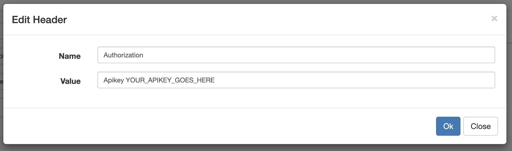

import Notebox from '$components/markdown/Notebox.svelte'

- [Overview](#overview)
- [Access the API](#access-the-api)
  - [GraphiQL API Explorer](#graphiql-api-explorer)
  - [Python library](#python-library)
  - [Programming language of your choice](#programming-language-of-your-choice)
  - [curl](#curl)
- [Authentication](#authentication)
  - [GraphiQL API Explorer](#authentication-with-graphiql-explorer)
  - [curl](#authentication-with-curl)
- [Errors](#errors)

## Overview

Santiment API utilizes [GraphQL](https://graphql.org). The reasons for choosing
GraphQL over REST include:

- It allows for precise data requests and easy batching of requests. This
  effectively addresses the problems of underfetching and overfetching data.
  For instance, why fetch all 20+ fields of a project when only its name is
  required?

- The request outlines the format of the response. This eliminates the need to
  guess what data the result contains and how to parse it.

- It provides an easy, ready-to-use method to explore our API via our Live
  Explorer.

## Access the API

Please note that some metrics may not be freely available or may have
restrictions, such as limited historical and real-time data. To explore these
metrics without restrictions, use the slug `santiment`.

There are several methods to retrieve data from Santiment's API:

### GraphiQL API Explorer

The Graph**i**QL (graphical interactive in-browser GraphQL IDE) allows you to
run queries directly from your browser. You can access the explorer at the
following link:
[https://api.santiment.net/graphiql](https://api.santiment.net/graphiql).

Here's an example of how to run a query and view the results directly in your
browser:

[GraphQL Request fetching transaction volume](<https://api.santiment.net/graphiql?query=%7B%0A%20%20getMetric(metric%3A%20%22transaction_volume%22)%7B%0A%20%20%20%20timeseriesDataJson(%0A%20%20%20%20%20%20slug%3A%20%22santiment%22%0A%20%20%20%20%20%20from%3A%20%22utc_now-90d%22%0A%20%20%20%20%20%20to%3A%20%22utc_now-60d%22%0A%20%20%20%20%20%20interval%3A%20%221d%22)%0A%20%20%7D%0A%7D&variables=>)

### Python library

Santiment offers a Python wrapper for the GraphQL API, known as `sanpy`. You
can find the documentation and installation instructions for this library
[here](https://github.com/santiment/sanpy).

You can install `sanpy` using `pip` with the following command:

```bash
pip install sanpy
```

To fetch Ethereum development activity data using this library, use the following code:

```python
san.get(
  "dev_activity/ethereum",
  from_date="2019-01-01T00:00:00Z",
  to_date="2019-01-07T00:00:00Z",
  interval="1d"
)
```

The result will be a pandas dataframe, as shown below:

```python
datetime                    activity
2019-01-01 00:00:00+00:00       44.0
2019-01-02 00:00:00+00:00       89.0
2019-01-03 00:00:00+00:00      140.0
2019-01-04 00:00:00+00:00      177.0
2019-01-05 00:00:00+00:00       46.0
2019-01-06 00:00:00+00:00       22.0
```

### Programming language of your choice

In the [san-sdk](https://github.com/santiment/san-sdk) repository, you can find
examples of how to query the API using various programming languages. Here are
some examples:

- [R](https://github.com/santiment/san-sdk/tree/master/R-graphql)
- [Ruby](https://github.com/santiment/san-sdk/blob/master/ruby-graphql/example.rb)
- [Elixir](https://github.com/santiment/san-sdk/blob/master/elixir-graphql/san_graphql_ex/lib/san_graphql_ex.ex)

### curl

The following GraphQL request will be executed with curl:

```graphql explorer
{
  getMetric(metric: "dev_activity") {
    timeseriesDataJson(
      slug: "ethereum"
      from: "utc_now-60d"
      to: "utc_now-50d"
      interval: "1d"
    )
  }
}
```

Copy and paste the following curl request into your console:

```bash
curl \
-X POST \
-H "Content-Type: application/graphql" \
--data '
{ getMetric(metric: "dev_activity"){ timeseriesDataJson( slug: "ethereum" from: "utc_now-60d" to: "utc_now-50d" interval: "1d") } }' https://api.santiment.net/graphql
```

The response should look similar to this:

```bash
{"data":{"getMetric":{"timeseriesDataJson":[{"value":38,"datetime":"2025-02-23T00:00:00Z"},{"value":345,"datetime":"2025-02-24T00:00:00Z"},{"value":411,"datetime":"2025-02-25T00:00:00Z"},{"value":461,"datetime":"2025-02-26T00:00:00Z"},{"value":364,"datetime":"2025-02-27T00:00:00Z"},{"value":334,"datetime":"2025-02-28T00:00:00Z"},{"value":164,"datetime":"2025-03-01T00:00:00Z"},{"value":186,"datetime":"2025-03-02T00:00:00Z"},{"value":262,"datetime":"2025-03-03T00:00:00Z"},{"value":236,"datetime":"2025-03-04T00:00:00Z"},{"value":155,"datetime":"2025-03-05T00:00:00Z"}]}}}
```

If you have the `jq` tool installed, you can use it to visualize the response more effectively:

```bash
curl \
-X POST \
-H "Content-Type: application/graphql" \
--data '
{ getMetric(metric: "dev_activity"){ timeseriesDataJson( slug: "ethereum" from: "utc_now-60d" to: "utc_now-50d" interval: "1d")} }' https://api.santiment.net/graphql \
| jq .data.getMetric.timeseriesDataJson
```

The output should look like this:

```json
[
  {
    "value": 38,
    "datetime": "2025-02-23T00:00:00Z"
  },
  {
    "value": 345,
    "datetime": "2025-02-24T00:00:00Z"
  },
  {
    "value": 411,
    "datetime": "2025-02-25T00:00:00Z"
  },
  {
    "value": 461,
    "datetime": "2025-02-26T00:00:00Z"
  },
  {
    "value": 364,
    "datetime": "2025-02-27T00:00:00Z"
  },
  {
    "value": 334,
    "datetime": "2025-02-28T00:00:00Z"
  },
  {
    "value": 164,
    "datetime": "2025-03-01T00:00:00Z"
  },
  {
    "value": 186,
    "datetime": "2025-03-02T00:00:00Z"
  },
  {
    "value": 262,
    "datetime": "2025-03-03T00:00:00Z"
  },
  {
    "value": 236,
    "datetime": "2025-03-04T00:00:00Z"
  },
  {
    "value": 155,
    "datetime": "2025-03-05T00:00:00Z"
  }
]
```

## Authentication

Certain APIs necessitate a valid API key, which must be linked to an account
with a paid subscription to access additional data. You can generate your API
key on your [Account Settings](https://app.santiment.net/account#api-keys)
page.

After generating your API key, you need to include it as an additional HTTP
header in the format `Authorization: Apikey <YOUR_OWN_API_KEY>`.

### Authentication with GraphiQL Explorer

Santiment also offers an advanced version of GraphiQL that is particularly useful!\[\]
for API users:
[https://api.santiment.net/graphiql_advanced](https://api.santiment.net/graphiql_advanced).
This version allows users to add HTTP headers, which can be used to include an
API key and authenticate your requests. To do this, simply add the following
header: `Authorization: Apikey YOUR_OWN_API_KEY`.



### Authentication with curl

Include the `Authorization: Apikey <YOUR_OWN_API_KEY>` header using the `-H` option:

```bash
curl \
  -X POST \
  -H "Content-Type: application/graphql" \
  -H "Authorization: Apikey <YOUR_OWN_API_KEY>"\
  --data '{ curentUser { id} }' \
  https://api.santiment.net/graphql
```

## Errors

GraphQL errors are returned with HTTP status code 200.

To check for errors, you need to check for the presence of the `errors` key in the JSON response.

If the query does not return a status code of `200`, it indicates a different
issue. Here are some possibilities:

- `429` - You're being rate-limited. Reduce the number of requests you're
  making. Check the [Rate limits](/sanapi/rate-limits) page for more
  information.
- `5xx` - An internal server error has occurred. Please let us know in the
  support channel on our [Discord server](https://santiment.net/discord).

### Error example - syntax error

For instance, if an invalid query is passed to the API, the following will occur:

```bash
$ curl \
  -X POST \
  -H "Content-Type: application/graphql" \
  --data '{getMetric' \
  https://api.santiment.net/graphql | jq .
```

```json
{
  "errors": [
    {
      "message": "syntax error before: ",
      "locations": [
        {
          "line": 1,
          "column": 2
        }
      ]
    }
  ]
}
```

### Error example - missing parameter

If your query is missing an argument, the error response will describe this:

```bash
$  curl \
  -X POST \
  -H "Content-Type: application/graphql" \
  --data '{ getMetric(metric: "price_usd"){ timeseriesDataJson(slug: "bitcoin") } }' \
  https://api.santiment.net/graphql | jq .
```

```json
{
  "errors": [
    {
      "message": "In argument \"to\": Expected type \"DateTime!\", found null.",
      "locations": [
        {
          "line": 1,
          "column": 35
        }
      ]
    },
    {
      "message": "In argument \"from\": Expected type \"DateTime!\", found null.",
      "locations": [
        {
          "line": 1,
          "column": 35
        }
      ]
    }
  ]
}
```

### Error example - historical and realtime data restriction

If the `from` and/or `to` parameters are outside of the allowed interval for the subscription plan and
[Historical and Realtime data restrictions](/sanapi/historical-and-realtime-data-restrictions) are applied,
the error will look like this:

```bash
$ curl \
  -X POST \
  -H "Content-Type: application/graphql" \
  --data '{ getMetric(metric: "mvrv_usd_1d"){ timeseriesDataJson(slug: "bitcoin" from: "2015-01-01T00:00:00Z" to: "2016-01-01T00:00:00Z") } }' \
  https://api.santiment.net/graphql | jq .
```

```json
{
  "data": {
    "getMetric": {
      "timeseriesDataJson": null
    }
  },
  "errors": [
    {
      "message": "Both `from` and `to` parameters are outside the allowed interval you can query timeseries_data_json with your current subscription SANAPI FREE. Upgrade to a higher tier in order to access more data.\n\nAllowed time restrictions:\n  - `from` - 2024-04-24 12:55:45.778508Z\n  - `to` - 2025-03-25 12:55:45.778508Z\n",
      "path": ["getMetric", "timeseriesDataJson"],
      "locations": [
        {
          "line": 1,
          "column": 37
        }
      ]
    }
  ]
}
```

<Notebox type="none">

**Read next: [Fetching Metrics](/sanapi/fetching-metrics)**

</Notebox>
