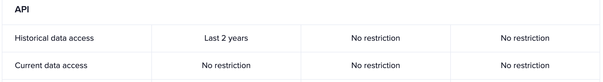

import Notebox from '$components/markdown/Notebox.svelte'

## Overview

This articles outlines the restrictions that apply to historical and realtime
data for the [metrics](/sanapi/fetching-metrics).

Example: If you are on the Free plan, you cannot access `mvrv_usd_1d` values:

- older than 1 year;
- from the last 30 days.

When you query a metric it can happen that some of the data is cut off, or if
the whole date range you request is outside the allowed range, you will get an
error.

For example, if you are on the Free plan, for most metrics you will have access
to the last 2 years of data with the last 30 days excluded. To access more historical
and current-day data, you should upgrade to a higher subscription plan.

## Free Metrics

Some of the metrics have their entire historical data and realtime data
available without any restrictions. These metrics are available to all users,
regardless of their subscription level. However, the [Rate
Limits](/sanapi/rate-limits) still apply and lower subscription plan users can
make fewer API calls, so they can get less data in the end.

## Restricted Metrics

The metrics that are not free have their historical and realtime data access
restricted depending on the subscription plan.

Users without any subscription plan are represented as using the FREE subscription plan.
They have access to 1 year old historical data without the last 30 days.

The historical and realtime restrictions seen on the [Pricing Page](https://app.santiment.net/pricing?plans=business)
apply only to those restricted metrics.



## How to determine the restrictions of each metric

You can obtain detailed information about the restrictions of each metric for a
specific subscription plan using this query:

```graphql explorer
{
  getAccessRestrictions(product: SANAPI, plan: BUSINESS_PRO, filter: METRIC) {
    name
    isDeprecated
    isAccessible
    isRestricted
    restrictedFrom
    restrictedTo
  }
}
```

The following fields are selected:

- `name` - the name of the metric
- `isDeprecated` - is the deprecated. If true, you must stop using this metric as it will be removed in the future.
- `isAccessible` - is the metric accessible with the selected subscription plan.
- `restrictedFrom` - what is the earliest date for which this subscription plan can fetch data. If `null`, then no restrictions apply.
- `restrictedTo` - what is the latest date for which this subscription plan can fetch data. If `null`, then no restrictions apply.

You are interested in the `restrictedFrom` and `restrictedTo` fields.
If they are both `null` -- the selected subscription plan has access to the full historical and realtime data for that plan.

<Notebox type="none">

**Read next: [Complexity](/sanapi/complexity)**

</Notebox>
