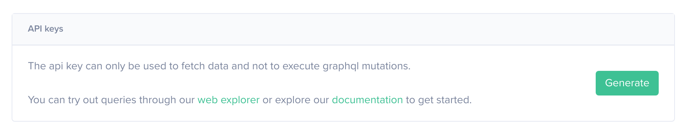
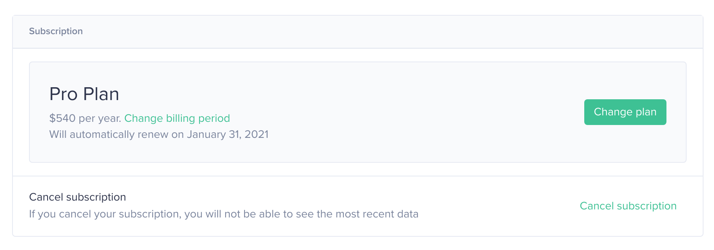

To customize your profile, please visit [Account Settings](https://app.santiment.net/account) on the Santiment website.

## Overview

Depending on your method of logging into Sanbase, you may already see some information displayed in the Account Settings upon your first visit.

## Connections and Notifications

If you initially logged in using your email, this section will display your email address, as shown in the screenshot below. You can use the `Connect with Metamask` option to associate an Ethereum address with your active account.

If you logged in using MetaMask, your ETH address will be displayed, and you can now add an email address and username.

The Notifications section allows you to choose the channels through which you want to receive notifications from Sanbase, such as triggered signals. Once you've connected an account, you can activate it. Please note that currently, you need Telegram Desktop to connect a Telegram account.

## Get tokens

If your login wallet contains any SAN tokens, they will be displayed in the `Get tokens` section located in the center of the page.

In case you wish to purchase SAN tokens, we provide links to exchanges that offer trading pairs with SAN. Alternatively, you can utilize the `Convert` button to leverage our Bancor integration. For more information on how to use this feature, please refer to [this article](/san-tokens/how-to-buy-san-tokens/#bancor).

## Creating an API Key

At the bottom of the page, you'll find options to create new API keys and view existing ones. You also have the ability to revoke any previously created keys from this location.

For more information on API usage, consider starting with [this article](/products-and-plans/create-an-api-key/).

## Subscription

From this section, you can upgrade your current plan, modify your billing cycle, or cancel your subscription as needed.

