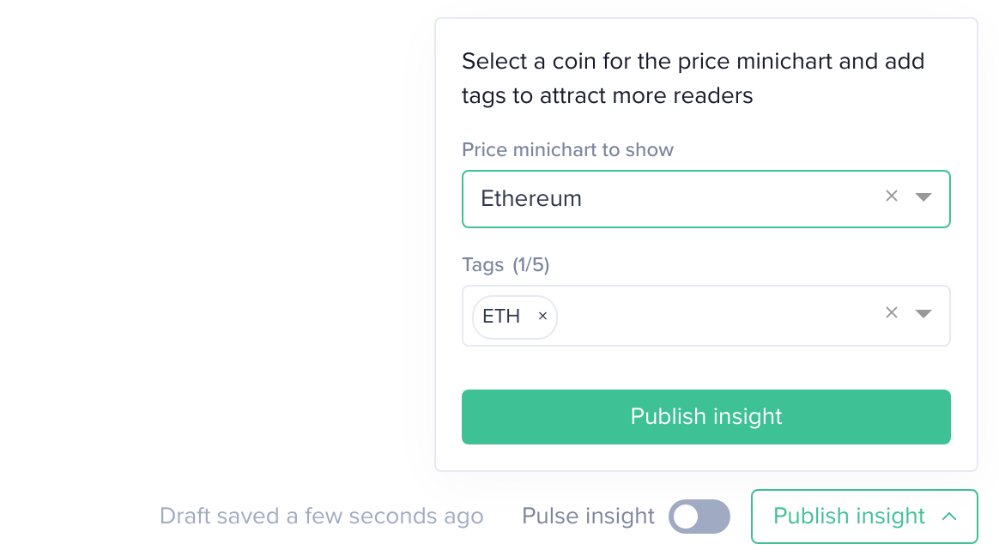

Begin your journey with **Sanbase Insights** here: [https://insights.santiment.net/](https://insights.santiment.net/)

Sanbase Insights enables you to create your own note-like posts, share them with the Santiment community, or browse through existing insights.

## Creating a New Insight

To begin creating a new insight, click on `New Insight` located in the profile dropdown menu.

During the creation process, you will be asked to provide a title and body for your insight:

Once you've filled in the title and body, Sanbase will automatically begin saving your progress as a draft.

You also have the option to add tags to your insight. Each insight can have up to five tags, which should correspond to the tickers of the crypto assets your insight is discussing.

Additionally, you have the option to immediately share your insight with the public.

## Publishing or Deleting Draft Insights

Under the `My drafts` section, you will find insights that you have initiated but have not yet published for other users. These drafts can be deleted or edited. Once edited, they can be shared using the buttons located on the right side of the screen.
