**Social Trends by Santiment** is a comprehensive set of tools for analyzing
cryptocurrency trends. These tools enable the examination of current trends,
identification of underlying factors, and studying of trend changes and how
they correlate with asset prices.

<iframe
  width="560"
  height="315"
  src="https://www.youtube.com/embed/h2hQ83U0SMk?si=OYDX8zF4vVdQNv1b"
  title="YouTube video player"
  frameborder="0"
  allow="accelerometer; autoplay; clipboard-write; encrypted-media; gyroscope; picture-in-picture; web-share"
  referrerpolicy="strict-origin-when-cross-origin"
  allowfullscreen
></iframe>

Social trends functionality consists of 5 tools:

- [Trending words](https://app.santiment.net/social-trends)
- [Trending coins](https://app.santiment.net/social-trends/trending-coins)
- [Historical Crypto Trends](https://app.santiment.net/social-trends/crypto-trends)
- [Key narratives](https://app.santiment.net/social-trends/crypto-narratives)
- [Alpha narratives](https://app.santiment.net/social-trends/crypto-narratives?dialog=alpha_narratives#alpha-narratives)

Let's take a closer look at each of these tools:

## Trending Words

[Trending words](https://app.santiment.net/social-trends?) **page contains the
hourly `Top 10` trending words related to crypto, sourced from more than 6000
crypto-specific social media channels.**

The more mentions a word starts receiving compared to the previous period, the
more it is trending. This allows you to find words whose discussions in the
cryptocurrency space are currently gaining popularity.

**Two purposes for this tool:**

- To provide a quick overview of the most discussed topics currently in the
  crypto social media.
- To provide simple AI explanations for why topics are trending and why they
  might be growing.

### Calculation Methodology

The analysis of a large number of crypto information sources identifies the
stories that are gaining popularity in the crypto community. So at any given
moment, you can see what's trending in crypto.

To do this, _every 60 minutes we calculate the top 10 words with the biggest
spike in social media mentions compared to their average social volume over the
previous 2 weeks._

This signals an abnormally high interest in a previously uninspiring topic,
making the list practical for discovering new and developing talking points in
the crypto community.

The results are sourced from more than 6000 crypto-specific social media
channels, including:

- 500+ Telegram groups
- 500+ crypto subreddits
- 400+ crypto substack newsletters
- 5000+ Twitter accounts

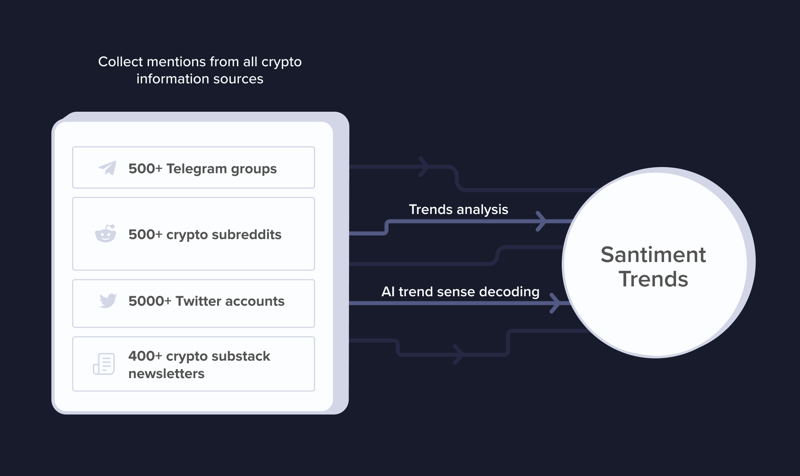

#### Hype Score

The Hype Score is the primary criterion for ranking words on our list. It's
based on this [formula](/metrics/emerging-trends/#hype-score) developed
by Santiment, which analyzes all social media messages.

Using [social volume](https://academy.santiment.net/metrics/social-volume)
and number of unique authors we rank words by popularity in social media at the
moment.

A higher **Hype Score** indicates that for the last 24 hours this particular
word or topic became more valuable for the audience compared to previous 14
days.

### How to use it

1. **Get a 1-minute overview of the biggest (developing) stories in crypto**

   Crypto social media is filled with noise and numerous minor or irrelevant
   stories. Our curated list is designed to filter out this noise, focusing
   only on topics that have garnered significant attention. Additionally, our
   list often highlights important stories that might have been overlooked by
   major crypto publications.

2. **Spot local tops and hype peaks**

   Based on our experience, we've found that the appearance of a token's ticker
   on our Top 10 list can serve as an effective indicator of a local top. If
   the coin is already in an uptrend, its presence on our list could suggest
   that a local top is imminent, indicating that the hype surrounding the coin
   has reached its peak. [See our
   research.](https://insights.santiment.net/read/can-you-trade-on-trending-crypto-tokens-7396)

### Explanation for all columns

#### Social dominance SUM

Displays the percentage of the total discussions in the crypto space that
the top 10 words occupy.

#### Trending Chart

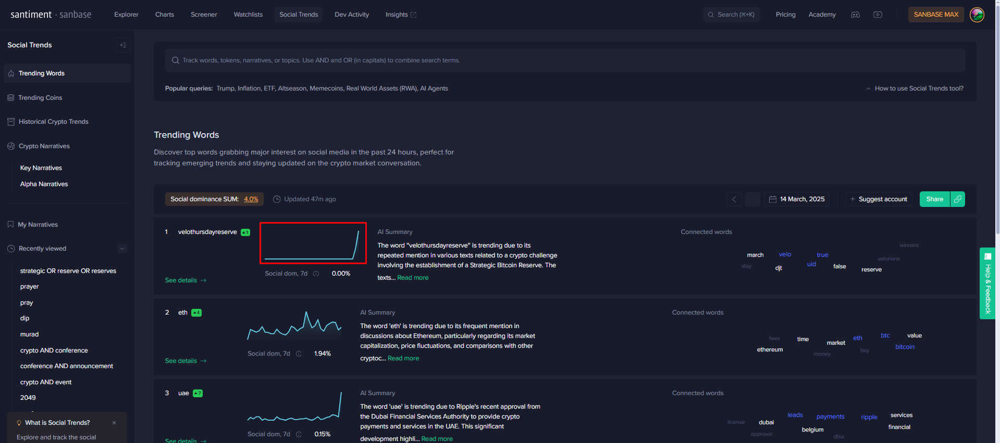

Displays a chart of the popularity of a word over the last 7 days

#### Social Dominance, 7d

Displays the average social volume of this word over 7 days; It’s a
percentage of the total number of discussions in the crypto space this word
takes up.

#### AI Summary

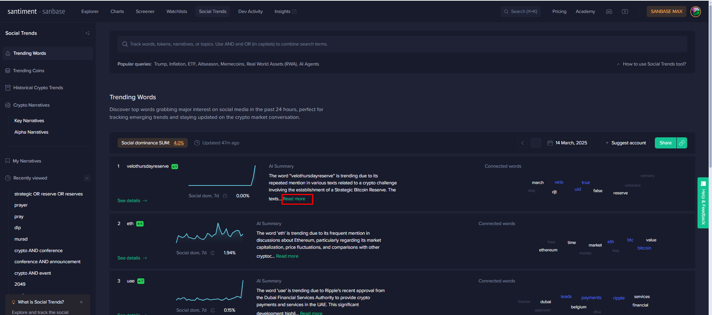

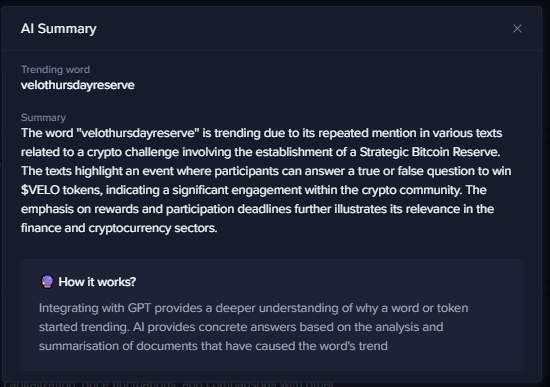

Our AI integrations helps readers understand of the reasons behind the
sudden rise in popularity of a word. Previously, people could infer the
context from the word cloud of related words, but now AI gives a more
specific answer based on many inputs and sources. In short, it answers the
common question: "**Why is this topic trending? What is the history and
opinions behind it?**"

#### Connected Words

Displays a word cloud, showing the words that are most frequently used in
conjunction with your primary keyword on crypto social media. The larger the
displayed word, the more often it appears in comments that also contain your
primary keyword.

## Trending Coins

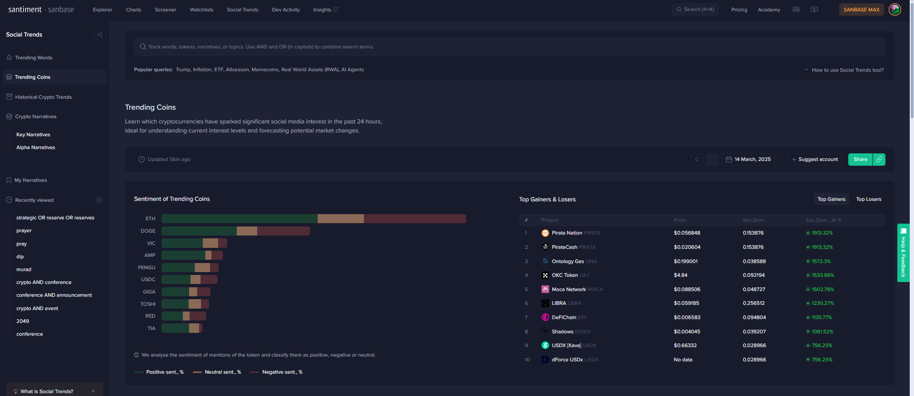

[Trending coins](https://app.santiment.net/social-trends?t=trending-tokens)
shows the top 10 tokens with the most growing number of mentions in the
cryptocurrency space. The more mentions a coin starts receiving compared to
the previous period, the more it is trending. This allows you to find tokens
whose discussions in the cryptocurrency space are currently gaining
popularity.

By tracking trending tokens, you can find effective entry points into coins
at their price peaks and then play down effectively. You can learn more by
reading [this
article](https://insights.santiment.net/read/can-you-trade-on-trending-crypto-tokens-7396).

### Token Sentiment

The social volume of token mentions is categorized into neutral, positive
and negative sentiment based on our [Social
Sentiment](https://academy.santiment.net/metrics/sentiment-metrics/#sentiment-analysis)
metric. Studying the distribution of opinions will help you understand the
prevailing sentiment.

### Top Gainers & Losers

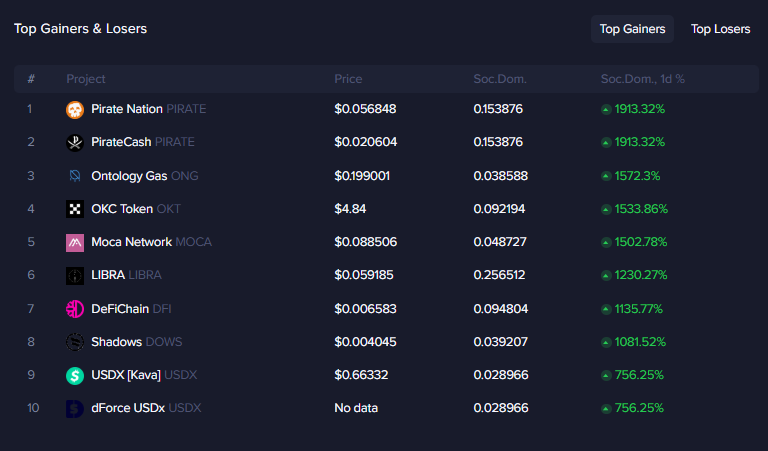

This block shows the top gainers and losers of coins by change in Social
Dominance over the last 24 hours.

### Bull-bear meter

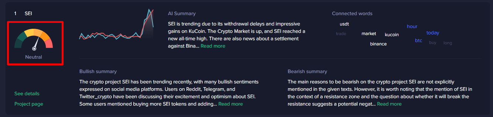

Methodology of bullish, neutral or bearish meters based on custom BERT-like
LLM trained on crypto-related messages from our social media so.

### AI summary

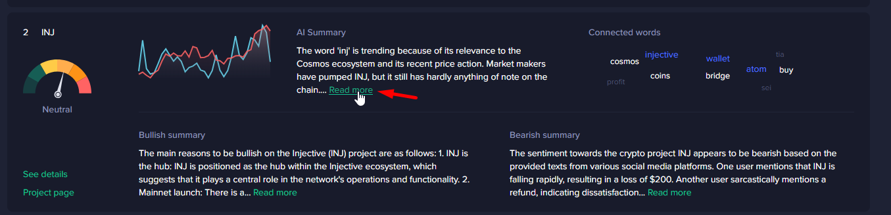

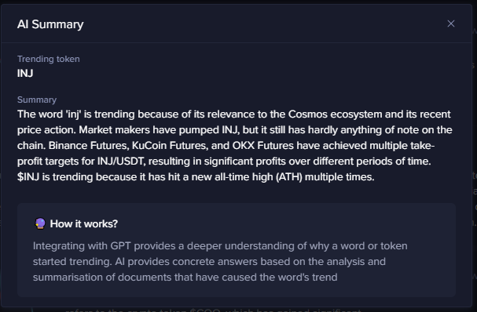

Our AI integrations helps readers understand of the reasons behind the
sudden rise in popularity of a word. Previously, people could infer the
context from the word cloud of related words, but now AI gives a more
specific answer based on many inputs and sources. In short, it answers the
common question: "**Why is this topic trending? What is the history and
opinions behind it?**"

### Bullish summary

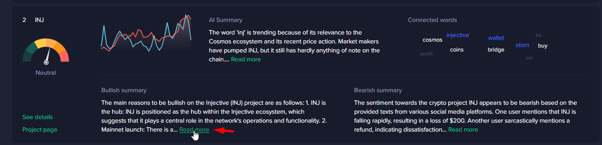

The AI does a summary of messages that have been categorized as bullish.
This way, we can get an overview of all the bullish opinions on social media
and learn in detail why.

### Bearish summary

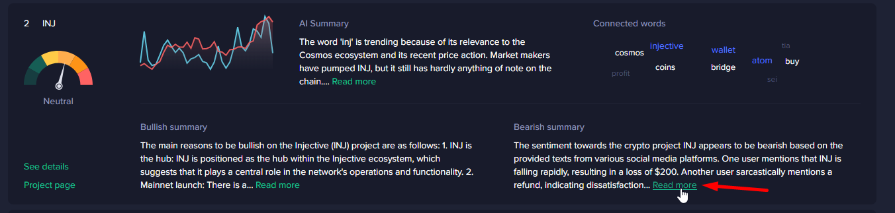

The AI makes a summary of messages that have been categorized as bearish.
This way we can get an overview of all the bearish opinions on social media
and learn in detail why.

## Historical Crypto Trends

[Historical Crypto Trends](https://app.santiment.net/dashboards/social-tool#popular-mid-term-trends)
allows you to analyze the dynamics of narratives in the cryptocurrency space
over time and study the impact of these changes on asset prices. This tool
is useful for those who want to see the big picture and historical changes
in trends.

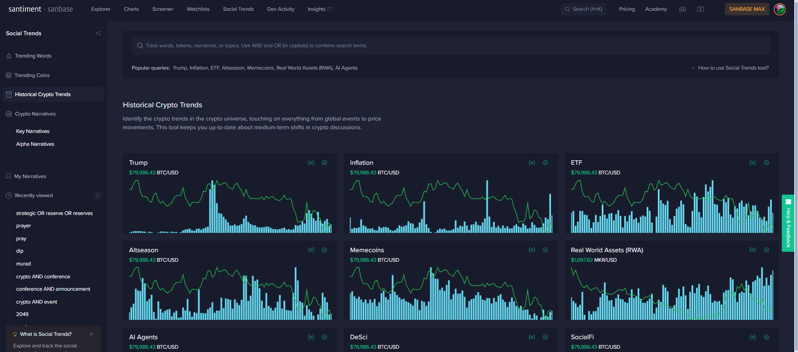

The main page shows the most popular trends at the moment. But if you need
information on a specific trend, you can use the search bar.

### Using keywords (OR and AND) and parentheses in searches

One graph will be displayed for the total mentions, as well as one for each
data source. You can use `AND`, `OR`, and parentheses to logically combine
multiple search terms. Here are some examples:

- `btc moon` – This will search for the exact phrase "btc moon".
- `btc AND moon` – This will search for messages where both "btc" and "moon"
  appear. The words do not need to be next to each other.
- `btc OR moon` – This will search for messages where either "btc" or "moon"
  appears.
- `(btc OR bitcoin) AND moon` – This will search for messages where "moon"
  appears with either "btc" or "bitcoin".

### Page with social context analysis of a particular trend

For example, let's take the Trend Analysis page for the query [bitcoin or
btc](https://app.santiment.net/labs/trends/explore/bitcoin%20or%20btc).

On the page you can see the [social volume](https://academy.santiment.net/metrics/social-volume/) chart of this
trend, on which you can overlay the [social dominance chart](https://academy.santiment.net/metrics/social-dominance/#definition), the
price of a certain asset, the correlation of the social trend with the price of
which you want to study, and more.

Below you can see the dynamics of [social volume](https://academy.santiment.net/metrics/social-volume/) change by social
data sources separately.

You can see graphs for Telegram, Reddit, Twitter, 4chan, and sometimes others.

The example on the screenshot shows that the spike in social activity on the
\$PEPE coin on the 4Chan site preceded a sharp price increase, while on the
other sources the spike in social activity occurred during or after the price
increase.

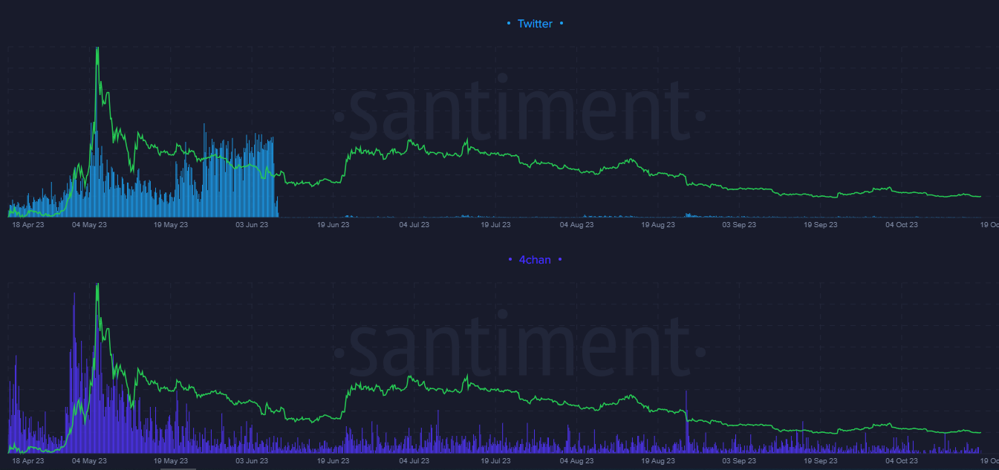

Under “Average” you can see the total social volume compared to the social
volume of your selected topic.

Nearby, the Social Context feature shows the most used words around your main
keyword on cryptocurrency social media. The size and color of each word in the
cloud represents its frequency in comments that also mention your main keyword.

If you want to compare the dynamics of one social trend with another, you need
to click “Compare” and add a trend.

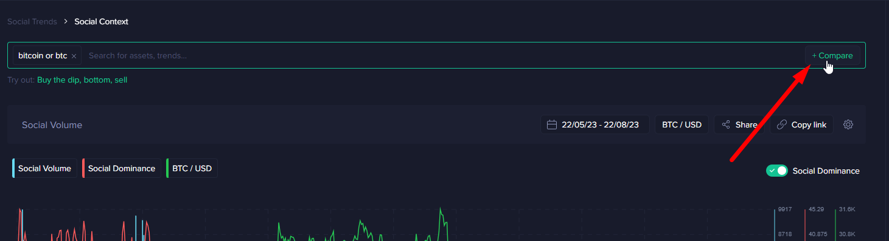

Example comparison of trends: Bitcoin vs. Ethereum

Average social volume trends comparison example

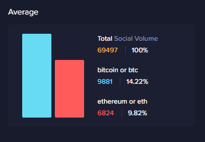

## Key Narratives

The [Key Narratives](https://app.santiment.net/social-trends/crypto-narratives)
chart displays the social media volume of curated, key narratives over time.

Hover over the chart to view the detailed query. To edit this chart, first copy
it to your Narratives.

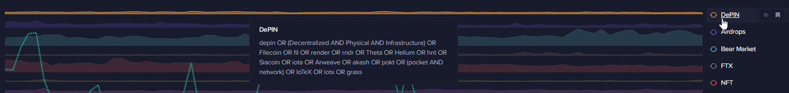

At the bottom of the page you can see the list of narratives shown on the
chart, the social query behind them, as well as the Soc. volume chart and the
Soc. dominance value, 7d.

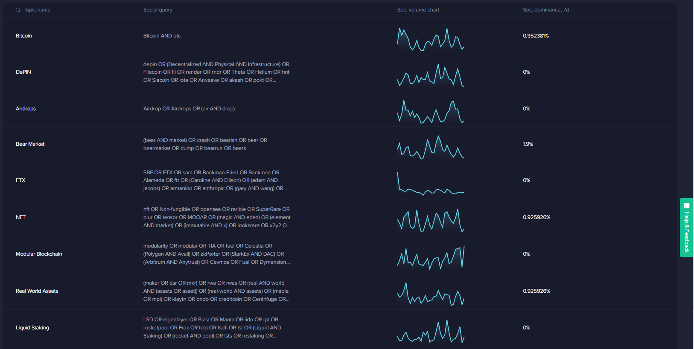

## Alpha Narratives

[Alpha Narratives](https://app.santiment.net/social-trends/crypto-narratives?dialog=alpha_narratives#alpha-narratives)
are an invaluable tool for those looking to identify the most popular
discussion topics from the past week. They provide a clear and data-informed
view of trends, steering clear of subjective opinions.

Explore how various narratives from X (formerly Twitter) influence the crypto
market. Our AI detects these narratives within the daily message volume,
providing insights into crypto community discussions.

Track how each narrative evolves over time and access AI-generated explanations
for deeper understanding.

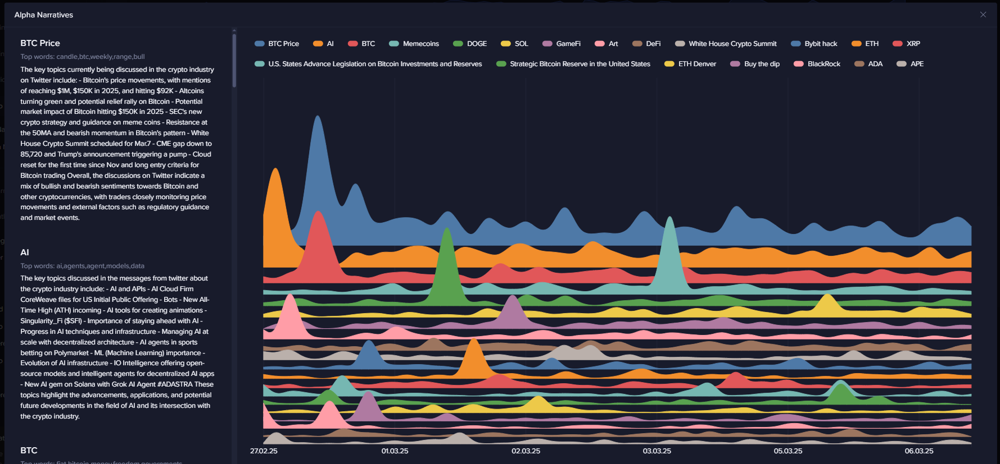
