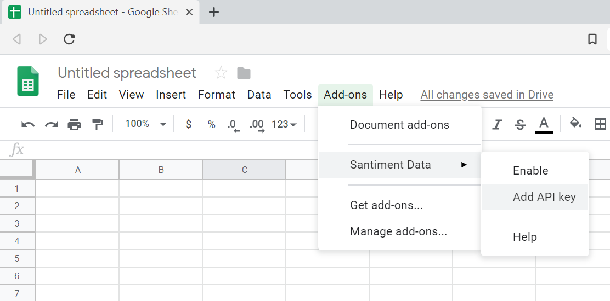

Adding an API key to Sansheets is very simple. Before you begin, make sure you have completed the following steps:

- [Setting up Sansheets](/sansheets/setting-up/)
- [Creating an API key](https://sheets.santiment.net/account#api-keys)

If you have already completed these steps, you can proceed with adding the API key to Sansheets.

You will find the option to add an API key in the **`Add-ons`** menu under **`Santiment Data`**:

A popup will appear, prompting you to enter your API key:

Copy the API key from your Sanbase account settings, paste it into the popup, and click `Ok`.

Sansheets will confirm that you have entered a valid API key:

You will now have access to more data, depending on your stake of SAN tokens.
