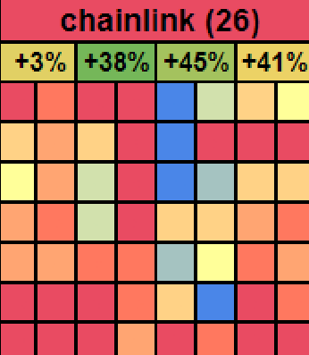
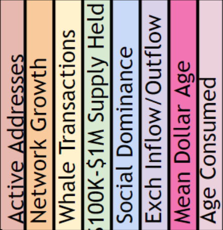
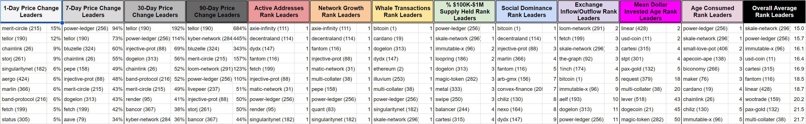
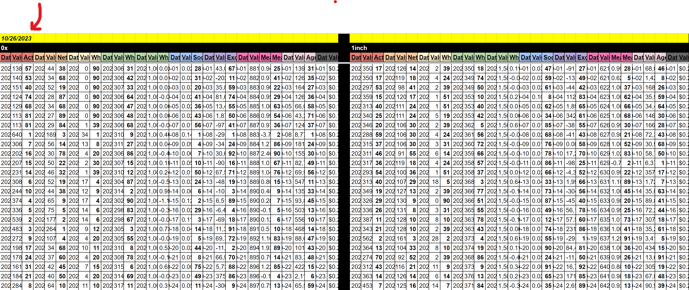

# The Activity Matrix

What if you could absorb all of your daily crypto analytic research on one page? No tab changing, no switching between individual assets one after another, and no scrolling between different metrics to see which are pointing to valuable future tops and bottoms forming.

Here is the tool for you. Available through SanSheets, the Activity Matrix captures all of the information necessary to make more informed investing and trading decisions for your portfolio. This powerful tool provides the past week of data for 114 of crypto's most well known assets, displaying how the top eight metrics currently stand compared to each asset's respective 3-month averages.

[Open the FULL version of the Activity Matrix here](https://docs.google.com/spreadsheets/d/1XSYTrBAY6b5oLO5btRRh40I7CftN76gJ1bKU_owHHeA/view), then go to File > Make a Copy, then download and enable the Sansheets Extension, and plug in your API located in your Sanbase Account Settings.

[Open the MINI version of the Activity Matrix here](https://docs.google.com/spreadsheets/d/1o3WJQCVn5wz66c33B8NZHQPf7epOSwHVAaf9iN3SrFk/view), then go to File > Make a Copy, then download and enable the Sansheets Extension, and plug in your API located in your Sanbase Account Settings.

## Activity Matrix Guide

### General Instructions and Guidelines

**Requirements for Full Version:**

- Sanbase PRO membership or an active trial.
- A paid Google Suite subscription associated with your Sanbase PRO email address.
- Sansheets [Add-on installed on Google Sheets](https://academy.santiment.net/sansheets/setting-up/)

**Requirements for Mini Version:**

- Sanbase PRO membership or an active trial.

**First time user instructions:**

- Go to File, then copy for an exact replica of the main Activity Matrix file. The source file is not editable and does not allow API data to load, but your copy will!
- Update this spreadsheet once per day, after 12am UTC. All metrics (other than price) are daily metrics and only update on Santiment's API once daily at 12:00am UTC. Even on fast computers, expect the entire loading process to take 10-20 minutes.
- To refresh, go to the Data tab and hit the 'Backspace' button on your keyboard while highlighting cell A1, wait 1 minute, then hit the Undo button. Alternatively, hit 'Ctrl' + 'Shift' + "R" or your system's equivalent for a hard refresh.
- Depending on your timezone, certain times of day will show either the past 7 full days or past 6 full days (with the bottom row intentionally blank). The amount of days loaded will depend on how far past 12AM UTC time the new partial day has elapsed. If you prefer to see all 7 days loaded at the same time, it is best to refresh 2-6 hours after 12AM UTC.
- The 'Table' and 'Data' tabs don't need to be touched, unless you plan on changing asset slugs(names). These tabs are where the calculations happen to provide the data that feeds to the more useful tabs.

**Tips:**

- Keep view of spreadsheet on 150% View magnification for optimal font & color scaling. Use keyboard shortcuts CTRL+ or CTRL- to zoom accordingly. The main 3 tabs are 'Detailed', 'Anomalies', and 'Top 10', and they will all fit a standard or widescreen monitor perfectly with this zoom percentage.
- On the 'Detailed' and 'Anomalies' tabs, you will see the amount of data loaded and completed in cell A1. With the default amount of boxes set (6,948), cell A1 on these two tabs will be considered 100.0% complete if at least 6 out of 7 full days are loaded.

### What am I Looking at?

In the Activity Matrix 'Detailed' tab, you'll see a wide range of multi-colored squares ranging from red to blue. And every single one of them has meaning.

- The y-axis for each square, as you'll see on the far left, represents the day of the week.
- The x-axis for each square, as you'll see on the top, represents the leading alpha metric that helps predict future market movement.

A red square indicates that the asset's metric is significantly higher than the average of its past 3 months.
For example, [Active Addresses](https://academy.santiment.net/metrics/active-addresses-24h): High activity is important to monitor because it generally reflects more utility on a coin's network, which can support the thesis of long-term future price growth.

A blue square indicates that the asset's metric is significantly lower than the average of its past 3 months.
For example, [Whale Transaction Count 100k+ USD](https://academy.santiment.net/metrics/whale-transaction-count): Low whale transaction numbers reflect minimal engagement and interest levels from the key stakeholders for that asset, which generally is a bit more bearish than bullish in most cases.

A yellow square indicates an average day for that metric compared to the asset's 3-month average, meaning nothing of significance is happening there.

Colors in between should be fairly intuitive to understand: red > orange > yellow > green > blue

These colors are also present in the cells containing the name of each asset. You'll see each asset's name in alphabetical order from top to bottom and left to right, with its most recent day's market cap rank in parentheses.

If the average of the most recent full day's activity for that asset has been high (for the eight metrics combined), then the name should show as red or orange. Alternatively, if the most recent full day's activity for that asset has been low, you'll see the coin's name in blue or green. Yellow would be an average day in reference to the eight metrics combined.

Additionally, on the 'Detailed' and 'Anomalies' tabs alike, four percentages appear beneath each asset’s name. Reading left to right, they show the 1-day, 7-day, 30-day, and 90-day price percentage changes. Note that the color of each percentage is based on the price returned for that interval, compared to the average of all other coins on the Activity Matrix. So if it's green, it's overperforming compared to other assets. If it's yellow, it's neutral. If it's red, it's underperforming. For example, the 7-day % for Chainlink(image below) is showing +38% in solid green, meaning it is performing better than almost every other coin based on 7-day percentages.

Having price data can be extremely important, as sometimes an asset gets hot before its price has pumped while other times it gets hot because the price has pumped. The scenario where a price hasn't yet reacted to a hot metric usually provides a better opportunity for a trade.

### The Eight Key Metrics

Let us examine the eight key metrics we track and the reasons each matters for future price movement. Please note that not every asset reports all eight; most do, but any missing value will appear as a blank (white) square.

[Active Addresses](https://academy.santiment.net/metrics/active-addresses-24h): The amount of unique addresses interacting on the coin's network. Red squares indicating high address activity show that there is a rising amount of various individuals on the sending or receiving side of transactions, and rising utility is a necessary ingredient for long-term market cap growth.

[Network Growth](https://academy.santiment.net/metrics/network-growth/): The amount of new addresses created on the coin's network. Similar to Active Addresses, red squares indicating high Network Growth imply that there are more opportunities for rising utility in the future. Simply put, more new existing addresses means more possibilities for transactions to take place.

[Whale Transaction Count 100k+ USD](https://academy.santiment.net/metrics/whale-transaction-count/): The amount of transactions that exceed $100K in value. Red squares indicating high amounts of whale transactions for that day are an indication that major key stakeholders are taking interest in the asset at an increasing rate. Yes, this can mean that whales could be selling off. But more commonly, a rising amount of large valued transactions means that there is increased interest in the asset overall from a group of traders that can cause an asset's price to rise quickly.

[$100K-$1M Supply Held](https://academy.santiment.net/metrics/supply-distribution/#our-supply-distribution-metrics): The percentage of the overall available supply of a coin that is held by wallets with ~$100K-$1M worth of the asset. This metric can work hand in hand with Whale Transactions. If there is a rising amount of $100K+ transactions AND a red square indicates that the supply held from this key tier of investors is rising, that is a sure sign that they key stakeholders are accumulating. Note that the asterisk next to this metric means that changing prices could mean that whales holding 100K-1M when the asset costs $2, may actually eventually turn into the $1M-$10M tier instead if the asset's value becomes $20. Look for new model updates from the team that reflect updated prices every few months and/or years.

[Social Dominance](https://academy.santiment.net/metrics/social-dominance): The only social metric among these eight metrics, social dominance measures the overall percentage of discussion related to an asset when combining chats on Twitter, Reddit, Telegram, and 4Chan. Generally, more long-term discussion about the asset is good. A red square indicating a rise in discussion rate shows that there is increased trader interest. That being said, understand that this metric can also occasionally be useful as a caution flag. If you see rising social dominance BECAUSE an asset has been surging in value, this is a sign of FOMO. So for Social Dominance in particular, pay attention to the price percentage changes of the asset relative to the model's other assets before getting too excited about a red square.

[Exchange Inflow/Outflow](https://academy.santiment.net/metrics/exchange-funds-flow): The net difference between coins moving on to known exchanges vs. off of known exchanges. A red square reflecting that coins are moving off of exchanges can be very helpful, especially in cases where prices have already been rising, because it means traders are content with moving more coins into self custody instead of selling them off. Alternatively, a blue square (particularly when prices have been rising) indicates that many coins are suddenly moving on to exchanges and a local top is much more common due to a likely sell-off from many traders.

[Mean Dollar Invested Age](https://academy.santiment.net/metrics/mean-coin-age): The average age in which coins have sat in their respective wallets across a coin's network. A red square indicates that the Mean Dollar Invested Age curve is moving down, which if given enough time, can be interpreted as validation of the coin being in a(n) (at least small) bull run. Alternatively, when coins are stagnant and continuing to "collect dust" in their same wallets, this prevents a healthy amount of utility and circulation that is typically necessary for market caps to grow.

[Age Consumed](https://academy.santiment.net/metrics/age-consumed): Similar to Mean Dollar Invested age, this metric looks at the amount of coins moved multiplied by the "age" in which they had been sitting prior to being moved. In short, a red square reflects that a large amount of coins (which had previously been stagnant) have suddenly moved for the first time in a long time. This is generally a bullish sign, as it means that a network just received a healthy amount of coins that can now be moved back into regular circulation, theoretically bolstering the network's overall activity.

### The Anomolies Tab

The anomolies tab is an alternative view that simplifies things if the massive array of different colors aren't your thing. The 'Anomolies' tab, shown below, displays all squares in yellow UNLESS the metric for that day is an extreme outlier. In other words, only the top 3 days(shown in red) or bottom 3 days(shown in blue), compared to the asset's past 3 months of data, will be visible. This view can make it much easier to quickly find assets of interest.

### The Top 10 Tab

If you want to get straight to the point of seeing which assets are doing best amongst different categories on the Activity Matrix model, look no further than the 'Top 10' tab. Here, you will see the 10 best performing coins on the model according to each price change interval, as well as the most recent day's current metric ranking (compared to each coin's 3-month average) for each metric.

This can be tremendously handy, and may even be your preferred way of viewing the data on this model. Want to know which coins are having the highest spikes in whale transactions vs. their 3-month averages? Look no further than the Top 10 list on this tab.

You will see the price percentage changes next to the coin's name for the price change leaderboards. And within each of the eight metric ranking leaderboards, you will see the coin's most recent full day's ranking for that metric. For example, if you see "1" this shows that the coin in question is having it's best reading of that metric in the last 3 months.

There is an 'Overall Average Rank' leaderboard on the far right of this 'Top 10' tab. It averages the rankings of all eight metrics together to indicate which coins have the best overall 'Hot' rankings.

### Loading Data

When you open the file, you will have to load the data. During loading times, you'll see how much data the model has left to load, as well as any individual coin and metric data errors coming in from the API. These errors will be rare and generally minor, but they are inevitable. So keep in mind that there is nothing wrong with your file when it does happen. Usually it's due to Google Sheets timing out temporarily when trying to retrieve a specific asset's data. If the square reaches 100%, it should turn green. If the progress bar lingers between 97 and 99 % without advancing, you may safely consider the load as complete. The stall may occur because certain metrics for certain assets are occationaly switched active or inactive on the Santiment API.

With the massive amount of data needing to be pulled, a new load takes roughly 10-15 minutes for a paid Google Suite email address. If you are on a free Google Suite plan, the API data will stop loading after 6 minutes, and there is no way around this. If you can't get around this limitation, we made a convenient [Mini Activity Matrix](https://docs.google.com/spreadsheets/d/1o3WJQCVn5wz66c33B8NZHQPf7epOSwHVAaf9iN3SrFk/view) that has 20 of the most followed assets, which should take less than the maximum 6 minutes of time that a free Google Suite account allows. It will have 20 assets instead of 100+.

### Refreshing Data

Google Sheets doesn't exactly allow a simple browser refresh to make the Santiment API reset with new and fresh data every day. Here's the easiest method to refresh:

Go to the Data tab and hit the 'Backspace' button on your keyboard while highlighting cell A1, wait 1 minute, then hit the Undo button or type '=TODAY+1' and hit the 'Enter' button on your keyboard.

Due to Google Sheets limitations, there could be trouble refreshing on certain days. To force a refresh if the above step doesn't work, copy the browser URL of your spreadsheet, close the tab on your browser, wait at least 10 seconds, and then paste the URL back in your browser and hit 'Enter' on your keyboard to "hard reload" the spreadsheet.

Note that this model has daily metrics, so there should be no need to refresh this model more than once per day. With the massive amount of data needing to be pulled, a refresh takes roughly 10-15 minutes for a paid Google Suite email address. If you are on a free Google Suite plan, the API data will stop loading after 6 minutes, and there is no way around this. If you can't get around this limitation, we made a convenient [Mini Activity Matrix](https://docs.google.com/spreadsheets/d/1o3WJQCVn5wz66c33B8NZHQPf7epOSwHVAaf9iN3SrFk/view) that has 20 of the most followed assets, which should take less than the maximum 6 minutes of time that a free Google Suite account allows. It will have 20 assets instead of 100+.

## Disclaimer

Trading is, of course, at your own risk. This model simply presents provides you the data necessary for you to make the most informed decisions for your own strategy.
