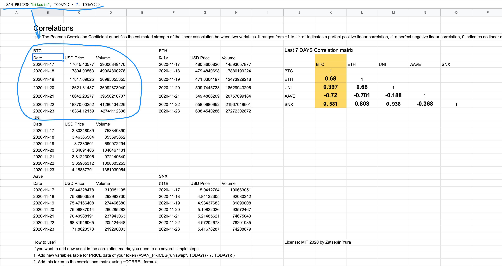

In this article, we will demonstrate the power and ease of using Google Sheets Integration with Santiment data. You will learn how to create a correlation matrix similar to the one on Cryptowatch.io, with the added bonus of being able to create a correlation matrix for not only the top 20 assets but for any crypto assets.

> In the world of finance, correlation is a statistical measure of how two assets move in relation to each other.

> Simply put, correlation tells us whether two cryptocurrencies move in the same or the opposite direction, or even behave entirely independent of each other.

> If used properly, coin correlation can elevate your trading in more ways than one. Investing in uncorrelated assets, for example, will help hedge your portfolio and mitigate risk. If you’re not sure where Bitcoin’s headed next and want to protect yourself against losses, taking a position in uncorrelated coins can (in theory) diversify your exposure in case of market correction.

> On the other hand, trading highly correlated assets is more of a risk-on strategy that some may use to amplify their returns. Even during a bull run, Bitcoin rarely does more than +15% in a week. However, mid-cap alts that tend to mirror BTC’s price action could well explode within the same time frame.

To create your own correlation matrix, you need to complete 3 steps:

1. Fetch pricing data for the last 7 days (if you want to see the correlation for the last 7 days)
2. Calculate the correlation coefficient
3. Organize a clear visualization for the resulting matrix

[You can view the full sample here](https://docs.google.com/spreadsheets/d/1UcgTvueFeDtv9k2xb2zwFLXtsAnUzy1JsN0KIHvC40I/edit?usp=sharing)

## How to Fetch Pricing Data

Fetching pricing data is simple using SAN functions in the formula field. Enter the following formula:

```
=SAN_PRICES("bitcoin", TODAY() - 7, TODAY())
```

This function will automatically populate the last 7 days of Bitcoin's USD price and trading volume, as shown below:



## How to Calculate Correlations

Google Sheets has a built-in function for calculating the Pearson Correlation:
`=CORREL()`

To calculate the Pearson Coefficient for Bitcoin and Ethereum, simply select the cells with BTC price data (in our case, C7:C13) and the cells with Ethereum price data (G7:G13) within the `=CORREL()` function, as shown below:


## Create an Effective Visualization

We recommend using the following matrix structure for better visualization. You can refer to the image below.


> To create a more visually appealing correlation result, consider rounding the numbers to two decimal places. For example, change 0.034343434 to 0.03.
>
> You can achieve this by using the built-in feature shown in the image below.
>
> 

---

Using Sansheets (Google Sheets Integration of Santiment data) is a convenient and flexible way to conduct your own research based on on-chain, social, and financial data without the need for Python or Julia code. The sample for this article was created in just 10 minutes.

[View the final sample here](https://docs.google.com/spreadsheets/d/1UcgTvueFeDtv9k2xb2zwFLXtsAnUzy1JsN0KIHvC40I/edit?usp=sharing)
