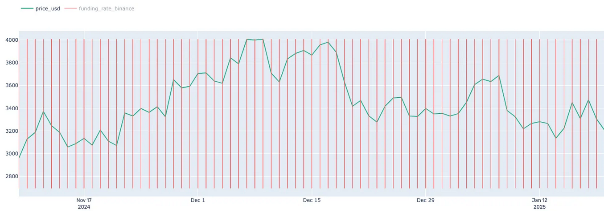

## Definition

**Binance Funding Rate** is designed to monitor significant changes in Binance's funding rate for perpetual futures contracts. Persistent spikes or drops in the funding rate can indicate extreme market sentiment, allowing traders to anticipate price movements or periods of heightened volatility.

Funding rate is a periodic payment made to ensure the price of perpetual futures contracts remains anchored to the spot market price. A positive funding rate indicates that the perpetual contract price is higher than the spot price, with long position holders paying shorts. A negative funding rate suggests the opposite, with short position holders paying longs.

## Use Cases

- **Market Sentiment Analysis:** The anomaly tracks funding rates across major trading pairs (e.g., BTC/USDT, ETH/USDT). When funding rates significantly deviate from historical norms, the anomaly is triggered. High positive rates may indicate extreme bullish sentiment, while high negative rates may suggest panic selling and bearish sentiment.

- **Risk Management:** If funding rates reach extreme levels, it could imply incoming sharp price movements, prompting precautionary actions.

- **Funding Rate Arbitrage**: Traders can exploit differences in funding rates across different exchanges by taking opposing positions to capture the spread, thereby generating risk-free or low-risk profit.

- **Volatility Trading**: Traders may use funding rate anomalies as an indicator of upcoming volatility. Significant shifts in funding rates can imply an impending price move, allowing traders to implement volatility-based strategies such as buying options or utilizing straddles to profit from expected price swings.