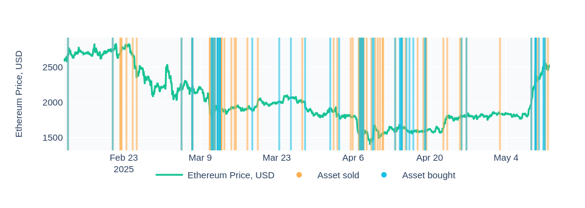

## Definition

**Dex Exchanges 1M USD** anomaly is fired when a decentralized exchange (DEX) transaction involves a token trade amounting to $1 million USD or more. This alert identifies unusually large swaps or trades that take place on DEX platforms, often indicating significant market activity by major holders or institutional players operating in a decentralized and transparent environment.

Such transactions can have a noticeable impact on token prices, liquidity, and market sentiment, and are often precursors to major market movements or strategic portfolio changes.

## Use Cases

- **Large Trade Monitoring on DEXs**
Track large-scale trading activity in real time. These trades can signal intent to accumulate or offload a position without going through centralized exchanges.
- **Liquidity Shock Detection**
A massive trade on a DEX may result in price slippage and sudden liquidity changes. This anomaly can warn traders and liquidity providers about possible short-term volatility.
- **DeFi Project Analysis**
DeFi analysts and investors can assess how significant token holders interact with their ecosystem, helping them evaluate project health, token stability, or manipulation risks.

##Examples

