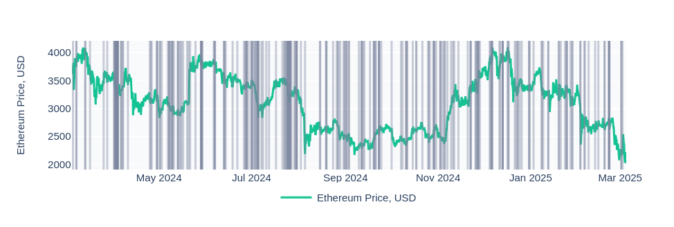
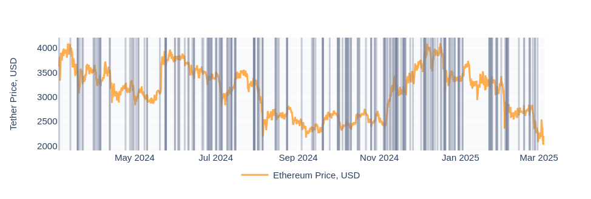

## Definition

**Large Transfers** anomaly is triggered when a significant non-DEX and non-CEX transfer occurs for a particular token. This alert activates when a transfer in USD value exceeds the top-10th largest transfer in the last two weeks for that token.
This data anomaly is essential for monitoring whale movements, tracking large holder activity, and detecting potential strategic shifts in the market.

## Ethereum large transfers:

## Tether large transfers (with ETH price on the chart):

## Use Cases

- **Whale Activity Monitoring**
Large transfers often indicate movements by major holders or institutions. Identifying these transactions can provide insights into potential market shifts and price movements.
- **Suspicious Transaction Alerts**
If a sudden large transfer occurs without clear market indicators, it may suggest upcoming volatility, liquidation events, or even potential security threats.