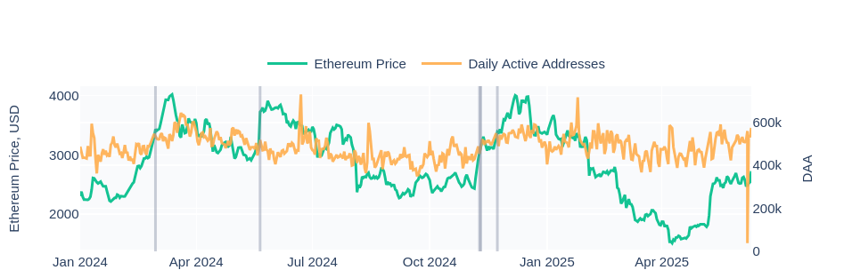
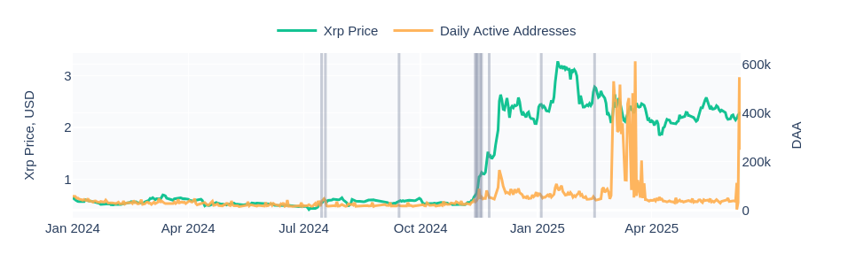
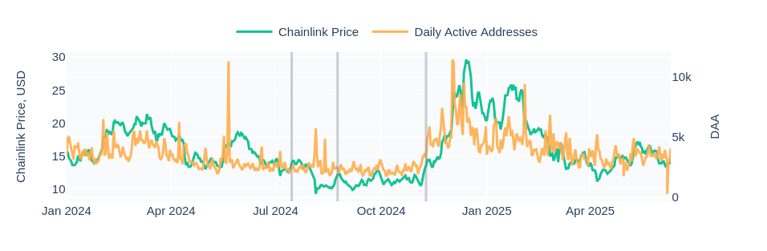

## Definition

**Network Activity - Price Divergence** Data Anomaly identifies anomalous price surges that are not accompanied by a corresponding rise in network activity (growth). It flags potentially unsustainable or speculative price increases that are not backed by healthy user adoption or blockchain usage.

The detection logic is based on the modified z-score applied to the price-to-growth momentum ratio, using Median Absolute Deviation (MAD) for robustness against outliers. We smooth raw metrics to reduce noise and focus on consistent deviations from historical behavior.

The anomaly is triggered only if the price growth exceeds 3% on the same day — ensuring the alert is relevant for significant bullish moves.

## Use Cases

- **Token Due Diligence**
Identify tokens that are experiencing unusual price rallies not supported by on-chain fundamentals. This helps investors filter hype-driven assets during bull runs.
- **Risk Monitoring for Listings**
Exchanges or asset managers can use this anomaly to detect early signs of artificial inflation or wash trading prior to token listings or announcements.
- **Alpha Signal for Reversals**
Divergence between price and network activity may indicate upcoming price correction. Traders can use this anomaly as a contrarian indicator to time exits or hedging strategies.

## Examples:

- **Ethereum**:

- **Dogecoin**:

- **XRP**:

- **Chainlink**:

- **Cardano**:

