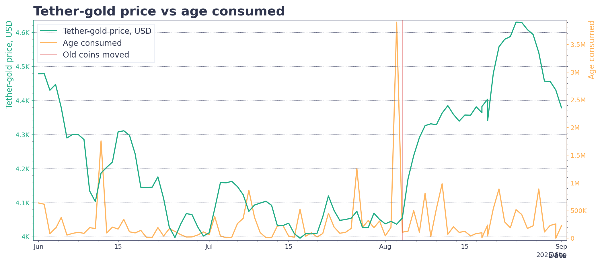
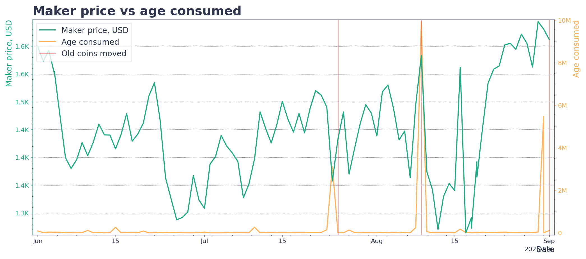

## Definition

"Old Coins Moved" identifies days when an asset's Age Consumed is unusually high relative to its own recent history. Age Consumed weights moved coins or tokens by how long they had remained inactive, so a spike highlights renewed movement from older holdings.

Version 3 uses the native daily Age Consumed metric for the top 300 non-stablecoin assets by market capitalization. It evaluates only completed UTC days and uses only prior observations for its baseline.

## Examples

## Covered assets

* TOP-300 non-stablecoin assets by current market capitalization

## Use Cases

- **Long-Term Holder Monitoring**
The signal helps analysts spot unusual movement from previously idle holdings and focus follow-up research on holder behavior, exchange flows, price action, and market context.

It is a contextual risk marker, not a standalone trading signal. A trigger does not by itself show that the assets were sold, deposited to an exchange, or will produce negative future returns.
