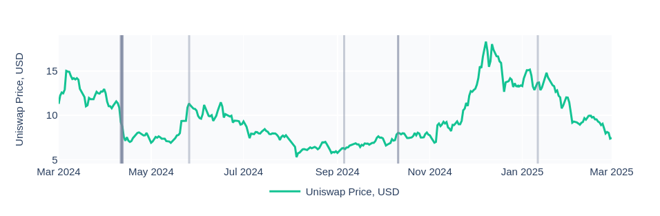
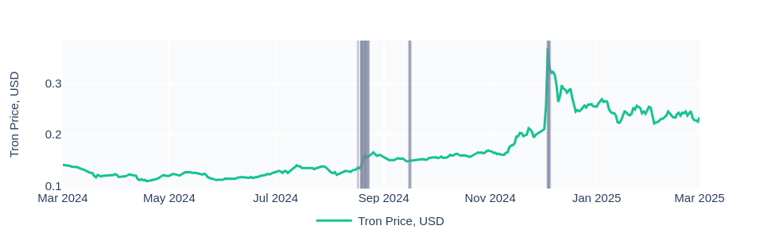
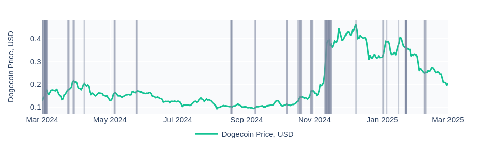

## Definition

**Project in Trends** Anomaly is triggered when a specific crypto token (excluding Ethereum and Bitcoin) gains significant traction in online discussions, placing it among the top 10 most-mentioned words in crypto-related conversations across social media platforms. By leveraging real-time data, the ‘project in trends’ anomaly helps users identify tokens that are generating buzz, allowing them to react quickly to market trends, sentiment shifts, and potential investment opportunities.

- Uniswap anomalies:

- Tron anomalies:

- Dogecoin anomalies:

## Usecases

- **Early Trend Detection for Traders**
A sudden surge in mentions can indicate both hype and risk. If a token is trending due to controversy or security issues, users can take precautionary measures to protect their investments.