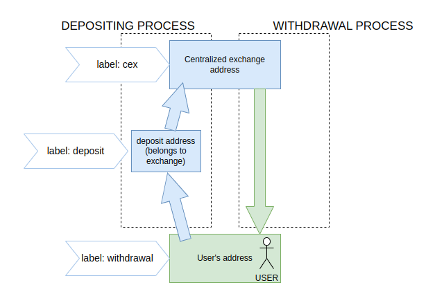

## Description

A deposit address is an address that belongs to some entity (e.g. centralized exchange) and is used by that entity in order to distinguish between deposit transactions of different users.

The address is considered a deposit address if it satisfies two conditions:

1. The address sends funds to a single entity only (single entity doesn't mean single address; some entities own multiple addresses).
2. The address is not the entity itself that it sends funds to.

The most common case is a centralized exchange deposit. See the details in the picture below.

## [Label fqn](/labels/label-fqn)

`santiment/deposit:v1`

## Label Examples

Kucoin deposit address: [0xb50a586be6a5542c0da84ff42de0ebdf8761203c](https://etherscan.io/address/0xb50a586be6a5542c0da84ff42de0ebdf8761203c)

Gate.io deposit address: [0x11e67b9ca21ae5ab385a31d03929bd0cc1c96bec](https://etherscan.io/address/0x11e67b9ca21ae5ab385a31d03929bd0cc1c96bec)

## Available Blockchains

* ethereum
