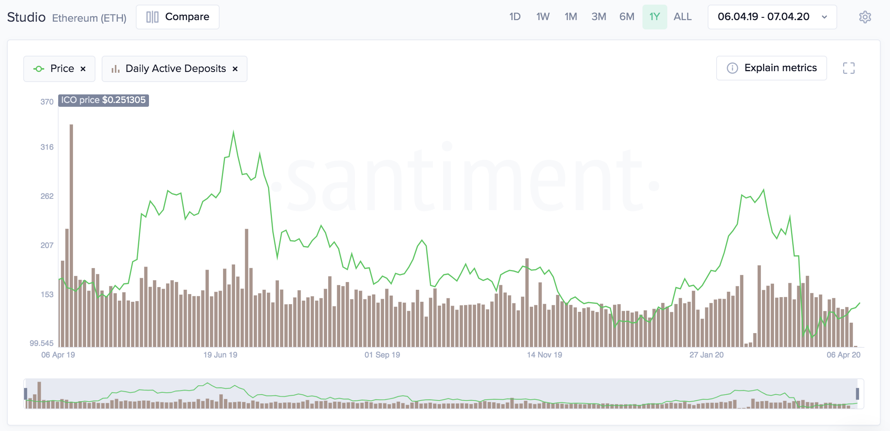

## Definition

### Active Deposits

Shows the **number of unique deposit addresses** that have been active on a
particular day for a given asset. Refer to a [deposit address explanation here](/labels/deposit)



`active_deposits` metric shows the number of **daily** active deposits. `active_deposits_5m` shows the amount of active deposits for a given **5 minutes** interval.


### Deposit Transactions

Deposit transactions metric shows the total number of all **incoming and outcoming transactions** involving
deposit addresses on a particular day for `deposit_transactions` and for a particlar 5 minutes interval for `deposit_transactions_5m`.

As such, this metric accounts for both user-to-exchange transactions:

1. from a personal wallet to a deposit address, and
2. from a deposit address to the main exchange wallet.

Deposit-related Transactions is often valuable when used in conjunction with
**Exchange Inflow** -- [another one of our
metrics](/metrics/exchange-funds-flow/) -- which shows the total amount of
coins moving to exchange wallets on a particular day.

So, for example, an **increase in exchange inflow** but a **plateauing number of
deposit-related transactions** means that more coins are entering the exchanges,
although the number of transactions to the exchanges stayed the same. In other
words, **the average deposit size has increased.**

For an exchange-specific data please refer to [that page](/metrics/labeled-exchange)

---

## Access

The metric is with [restricted access](/metrics/details/access#restricted-access).

---

## Measuring Unit

Non-negative number of addresses

---

## Data Type

[Timeseries Data](/metrics/details/data-type#timeseries-data)

---

## Frequency

[Daily intervals:](/metrics/details/frequency#daily-frequency)

* `active_deposits`
* `deposit_transactions`

[Five-Minute Intervals:](/metrics/details/frequency#five-minute-frequency)

* `active_deposits_5m`
* `deposit_transactions_5m`


---

## Latency

Daily Active Deposits has [on-chain Latency](/metrics/details/latency#on-chain-latency)

---

## Available Assets

[active_deposits](<https://api.santiment.net/graphiql?variables=&query=%7B%0A%20%20getMetric(metric%3A%20%22active_deposits%22)%20%7B%0A%20%20%20%20metadata%20%7B%0A%20%20%20%20%20%20availableSlugs%0A%20%20%20%20%7D%0A%20%20%7D%0A%7D%0A>)

[deposit_transactions](<https://api.santiment.net/graphiql?variables=&query=%7B%0A%20%20getMetric(metric%3A%20%22deposit_transactions%22)%20%7B%0A%20%20%20%20metadata%20%7B%0A%20%20%20%20%20%20availableSlugs%0A%20%20%20%20%7D%0A%20%20%7D%0A%7D%0A>)

[active_deposits_5m](<https://api.santiment.net/graphiql?variables=&query=%7B%0A%20%20getMetric(metric%3A%20%22active_deposits_5m%22)%20%7B%0A%20%20%20%20metadata%20%7B%0A%20%20%20%20%20%20availableSlugs%0A%20%20%20%20%7D%0A%20%20%7D%0A%7D%0A>)

[deposit_transactions_5m](<https://api.santiment.net/graphiql?variables=&query=%7B%0A%20%20getMetric(metric%3A%20%22deposit_transactions_5m%22)%20%7B%0A%20%20%20%20metadata%20%7B%0A%20%20%20%20%20%20availableSlugs%0A%20%20%20%20%7D%0A%20%20%7D%0A%7D%0A>)


---

## SanAPI

```graphql explorer
{
  getMetric(metric: "active_deposits") {
    timeseriesDataJson(
      slug: "maker"
      from: "2019-05-09T11:25:04.894Z"
      to: "2019-06-23T11:25:04.894Z"
      interval: "1d"
    )
  }
}
```

Deposit transactions are available under `deposit_transactions` and `deposit_transactions_5m` names.


```graphql explorer
{
  getMetric(metric: "deposit_transactions_5m") {
    timeseriesDataJson(
      slug: "ethereum"
      from: "2024-01-01T00:00:00.000Z"
      to: "2024-01-02T00:00:00.000Z"
      interval: "1h")
  }
}
```


