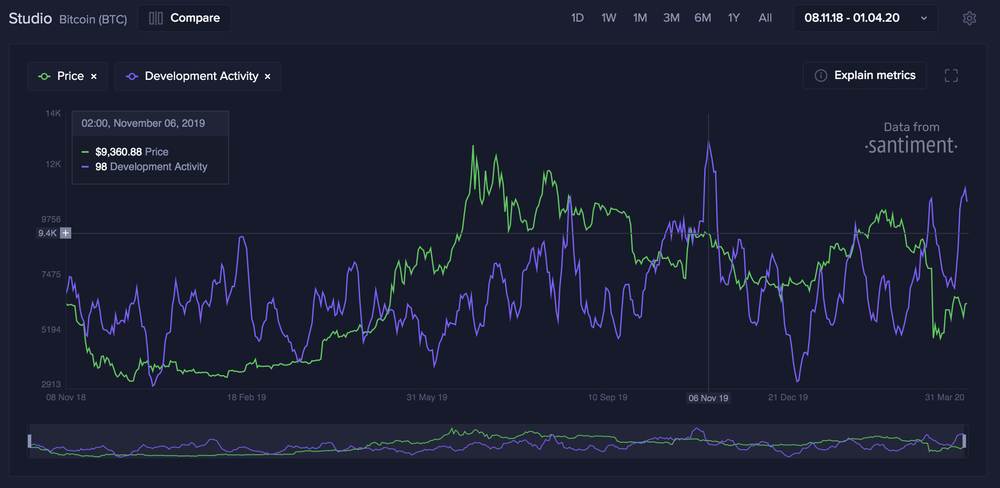
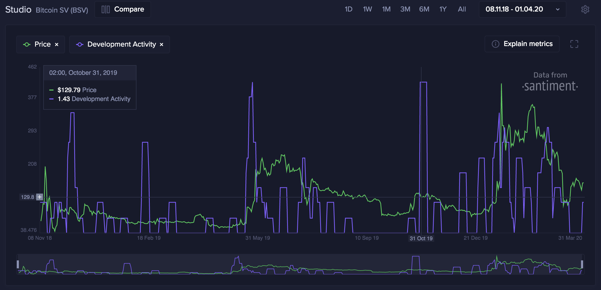

## Metrics

The development-related data allows the definition of different metrics.
These metrics include:
- [Development Activity](/metrics/development-activity/development-activity/) -
  Ignores non-development related events. Excluding these allows values of
  projects that use Github for issue tracking and projects that do not use Github
  for issue tracking to be fairly compared.
- [Development Activity Contributors Count](/metrics/development-activity/development-activity-contributors-count/)
  - Tracks the number of unique development activity contributors.
- [Github Activity](/metrics/development-activity/github-activity/) - Counts all
  events for a project.
- [Github Activity Contributors Count](/metrics/development-activity/github-activity-contributors-count) -
  Tracks the number of unique Github activity contributors.

Development Activity and Github Activity have two versions. Version 2.0
(`modern:v1`) removes the activity of bots, both official bot accounts and
suspicious activity from personal accounts. See
[Development Activity Versions](/metrics/development-activity/development-activity-versions/).

> **Note:** The full development activity data is available through the
> [API](/sanapi/accessing-the-api/). This includes data for crypto assets and for
> any GitHub organization with public repositories, at every supported interval.
>
> The [S3 export](/for-developers/metrics-exported-s3) is more limited. It
> contains only **daily** values, and only for the **supported crypto assets**.
> Data for other GitHub organizations and intervals lower than one day are not
> included in the S3 export, but you can still fetch them through the API.

---

## Why Does Development Activity Matter?

The development activity of a project that Santiment tracks is done in the
project's public GitHub repositories. The work done in private repositories
cannot be tracked. In crypto, a lot of the work is done in public repositories,
so this metric is available for many projects.

A developer's time is an expensive resource, so high development activity
implies that:

- The project is serious about its business proposition;
- The project will likely ship new features in the future and address existing issues;
- It's less likely that the project is just an exit scam.

Simply put, development-related metrics can be used to gauge a project's commitment to
creating a working product, and continuously polishing and upgrading its
features.

> **Note:** Only development work done in public github repositories can be tracked.
> Work done in private/unknown repositories or public repositories outside
> GitHub won't be counted. In Github, switching a repository from private to public does
> not emit events for past actions, so the development activity will track only the work
> done after making the repository public.

---

## How Is Development Activity Tracked?

Development-related metrics use the events emitted by Github. The metrics
**do not** use the number of commits in a repository.

When developers work, they encapsulate their code changes in commits. When a
repository page [like this](https://github.com/santiment/sanbase2) is opened in
Github, one of the first things shown is the number of commits.

One would naturally think that counting commits is an accurate approximation of
development activity. A lot of the data aggregators track the number of Github
commits, an unfortunate solution that returns skewed data.

### Why Is Counting Commits Not Optimal?

There are a lot of projects that fork (copy everything up until this moment)
other blockchains' source code and make small changes on top of it, without the
intent of proposing these changes back to the original repository. The process
of forking inherits all commits, but this is other people's work -- this is
not work done by the team that makes the fork.

#### Example
For example, if a person forks the [Bitcoin Github
repository](https://github.com/bitcoin/bitcoin), they will inherit all 40,000+
commits, while performing just one action of forking.

### How Does Santiment Measure Development Activity?

At Santiment, we implemented a more reliable approach $-$ tracking the number of
[Github events](https://docs.github.com/en/rest/using-the-rest-api/github-event-types?apiVersion=2022-11-28)
that the project generates. Pushing a commit generates an event,
but there are also many other activities that generate an event:

- Creating an Issue
- Creating a Pull Request
- Commenting on an issue/Pull Request
- Forking/starring/watching a repository
- Many others.

More importantly, when a project is forked, it does not inherit any of the
already emitted events. Our custom method dramatically improves both accuracy
and serviceability of Github data. The reason is that the process of forking a
repository generates just a single `ForkEvent` instead of creating an event for
every commit that gets inherited.

At the time of writing, the [bitcoin](https://github.com/bitcoin/bitcoin)
repository has around 40k commits and the [Bitcoin
SV](https://github.com/bitcoin-sv/bitcoin-sv) repository has around 18.9k
commits. Let's take a look at the events counting approach:

Bitcoin: 

Bitcoin SV: 

We observe that Bitcoin has a high development activity all the time.
Meanwhile, Bitcoin SV has 0 dev activity most of the time.

If you want to learn more about the difference - and the benefits of our bespoke
approach - I highly suggest [this
piece](https://medium.com/santiment/tracking-github-activity-of-crypto-projects-introducing-a-better-approach-9fb1af3f1c32)
by Valentin, our ex-CTO.

---
