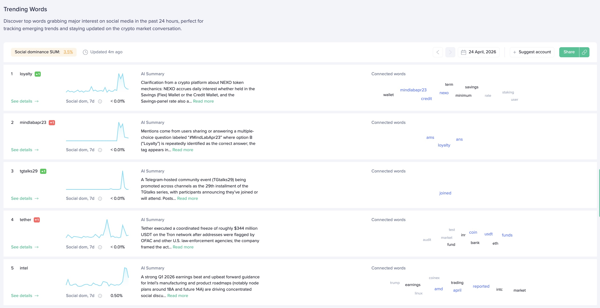

## Definition

**Trending Words** is a list of words that describe the topics which _emerged_
faster than any others over the last 24 hours. By "emerging" we mean getting
more social attraction from the crowd, being discussed much more than any
other topic.

We detect these words by computing the so-called _hype score_ for each single
word that is present in the [social data](/metrics/details/social-data/) after filtering
and cleaning the data. Once this number is calculated, the words are ranked
according to the corresponding scores in a descending order. The top 10 words in
the resulting list are the top trending words.

We constantly update our labels, which helps us keep them as fresh as possible but results in historical data changes. Any modifications to labels, social sources, or relevant jobs will prompt recalculation of the previous month's data. Within a 12-hour period, the metric can be supplemented with new data.

---

## Access

The metric's real-time data is **free**.
The metric's historical data has [restricted access](/metrics/details/access#restricted-access).

---

### Filtering and Cleaning

In order to reduce the level of noise, spam, and duplicates while calculating the
hype scores, we apply some preprocessing to the text data, namely:

1. Clean all the texts from
   [stopwords](https://en.wikipedia.org/wiki/Stop_words) and non-alphabetic
   characters.

2. Transform each pair `(user_id, text_documents)` to a [bag of
   words](https://en.wikipedia.org/wiki/Bag-of-words_model) representation and
   remove all the bag of words duplicates.

3. For all the text documents that have more than a certain number of words in
   general (usually 5) - remove the exact duplicates (i.e., messages that look
   exactly the same are considered only once).

These steps help to make the approach robust to spam and multiple replications
of the same word or short word combinations.

---

### Hype Score

After the processing is done, for each of the words we calculate the **hype
score** (or **trend score**). For any timestamp $t$ we define the hype score as
follows:

$$
HypeScore(t) := \frac{(v_t  ^n - \frac{1}{14} \sum_{i=t-15}^{t-1} v_i^n) * v_t^n *
\log_{10} u_t}{1 + \frac{1}{14} \sum_{i=t-15}^{t-1} v_i^n}
$$

where:

- $v_i^n$ is the _normalized_ social volume of the word at the moment $i$ (i.e.
  the usual [social volume](/metrics/social-volume)
  divided by the total amount of messages in that particular [data
  source](/metrics/details/social-data/)),

- $u_t$ is the total amount of unique users that have used the word under
  consideration at least once.

On an intuitive level, the hype score tends to be a measure of how rapidly the
social volume of a certain word increased over the last 24 hours in comparison
to the past 2 weeks. This is done by comparing the current social volume change
to the average social volume of the past 14 days.

Additionally, we multiply this factor by $\log(\text{unique\_users})$ $-$ this way words
with a high social volume and a relatively low number of unique users that
mentioned it at least once will have a smaller hype score. For example, if a
given word was used many times by exactly one user (i.e., most probably it is
heavy spam), this word will have a hype score of **0** thanks to the
$\log(\text{unique\_users})$ component. On the other hand, words with 100 and 200 users
will have more or less the same chance to get a higher hype score.

It is also worth noticing that we use the **normalized** social volume instead of
the regular one. This makes it easier to compare the resulting hype score across
different data sources with different average daily volumes of talks.

---

### Ranking the Words

Once the texts are cleaned and each word has its hype score, we first rank the
words in descending order (the highest hype score goes to the top) and then
combine the results across different data sources if necessary: this is done by
averaging the hype score for each word across all desired data sources and
ranking the words afterwards again. In case a given word is present in source 1
and is not present in source 2, we assume that its hype score in the second data
source is 0.

---

## Measuring Unit

The [hype score](#hype-score) does not really have a qualitative meaning; it can
be treated as a relative number: the higher it gets, the faster a given word is
"emerging".

---

## Data Type

[Timeseries Data](/metrics/details/data-type#timeseries-data)

---

## Frequency

Trending Words are available at [hourly intervals](/metrics/details/frequency#hourly-frequency)

---

## Latency

Trending Words have [social data Latency](/metrics/details/latency#social-data-latency)

---

## Available Assets

The algorithm takes into account all the [social data](/metrics/details/social-data/),
so the list may or may not contain asset names and tickers.

---

## How to Access

### [Sanbase](https://app.santiment.net/social-trends)

Trending Words are available on the [Social Trends page](https://app.santiment.net/social-trends).

### [SanAPI](https://api.santiment.net)

Trending Words are available as part of the API, the metric is called
`getTrendingWords`:

```graphql explorer
{
  getTrendingWords(
    from: "2026-01-01T12:00:00Z"
    to: "2026-01-01T13:00:00Z"
    size: 10
    interval: "1h"
  ) {
    datetime
    topWords {
      word
      score
    }
  }
}
```
