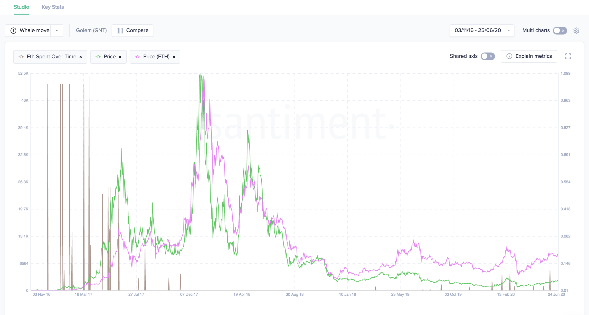

## Definition

Track the amount of ETH leaving the wallets where ICO funds were collected.

> Note: Transactions are not followed to exchanges.

#### Example

Below is the ETH spent over time of Golem plotted against the Golem price and ETH price.
Enabling the ETH is useful to give you an approximation for the value in USD that this
ETH movement generated. Most often ICOs move ethereum out of their ICO wallets to
sell them on exchanges to fund the project.



## Access

[Free Access](/metrics/details/access#free-access)

---

## Measuring Unit

Ethereum amount

---

## Data Type

[Timeseries Data](/metrics/details/data-type#timeseries-data)

---

## Frequency

[Five-minute Intervals](/metrics/details/frequency#five-minute-frequency)

---

## Latency

[On-Chain Latency](/metrics/details/latency#on-chain-latency)

---

## Available Assets

Available for [these
assets](https://api.santiment.net/graphiql?query=%7B%0A%20%20allErc20Projects%20%7B%0A%20%20%20%20slug%0A%20%20%7D%0A%7D%0A)

---

## SanAPI

### Timeseries data

Available as a field of the project graphql type, fetch the amount of ETH spent for every `interval` in the time range.

```graphql explorer
{
  projectBySlug(slug: "santiment") {
    ethSpentOverTime(
      from: "2019-01-01T00:00:00Z"
      to: "2020-01-07T00:00:00Z"
      interval: "30d"
    ) {
      datetime
      ethSpent
    }
  }
}
```

### Aggregated data per project

In order to fetch how many ETH every project spent in a the last N days, you can execute the following GraphQL query (the `days` can contain any number of days):

```graphql explorer
{
  allProjects {
    slug
    ethSpent(days: 30)
  }
}
```
