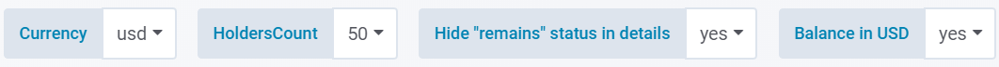

`Top Holders` describes a set of up to 100 Ethereum addresses which
have the highest balances at a given time, either in Ether or in a
specific ERC-20 token. The amount of addresses can be reduced, but 100
is the maximum. So one could analyse the 20 top holders for BAT, as well
as the 100 top holders for ETH.

Top Holders metrics are calculated daily.

The top holder metrics can be found under `ETH Top Holders` for Ether
(ETH) itself. To find top holder information about a specific ERC-20
token, look for `Overview. All ERC-20 tokens`, which will lead you to
a list of all ERC-20 tokens Santiment is currently including in its
calculations. Find the needed token and select `Open Dashboard` in the
very last column, which should be named `Top Holders`.

As all top holder metrics are shown in the same overview, they share a
set of options:

- **_`Currency`_** - lets you switch the price from being displayed in
  USD to BTC
- **_`HoldersCount`_** - sets the amount of top holders to include,
  maximum is 100
- **_`Hide "remains" status in details`_** - refers only to the fourth
  metric listed below and hides specific table rows. See its article for
  more information
- **_`Balance in USD`_** - display the top holders balances in amount of
  tokens or converted to USD

### Our current metrics for top holders

## Top Holders - Balance

This graph shows the sum of all the top holders balances plotted against
the asset`s price.

As you can see, we also display the total balance split by exchange- and
non-exchange wallets.

The amount of top holders addresses included in the calculation can be
chosen at the top by selecting `HoldersCount`. The HoldersCount in the
above screenshot of BAT's top holders balances is set to 50.
The assets's price can be displayed in USD or BTC, which can be
selected through the `Currency` field at the top. The `Balance in
USD` field lets you switch between displaying the balances in amount of
tokens and displaying them converted to USD.

## Top Holders - Percent of Total Supply

This graph shows the relative amount of tokens held by all the top
holders compared to the total amount of tokens in existence, as well as
the asset`s price.

As you can see, we also display the top holder`s share of the total
supply split by exchange- and non-exchange wallets.

The amount of top holders addresses included in the calculation can be
chosen at the top by selecting `HoldersCount`. The HoldersCount in the
above screenshot of BAT\`s top holders percentage of total supply is set
to 50.
The assets\`s price can be displayed in USD or BTC, which can be
selected through the `Currency` field at the top.

## Top Holders - Changes

This graph shows the total number of new addresses entering the top
holders list.

The amount of top holders addresses included in the calculation can be
chosen at the top by selecting `HoldersCount`. The HoldersCount in the
above screenshot of BAT`s changes to the top holders list is set to 50.
So at the day shown in the screenshot, three out of 50 addresses where
not in the 50 top holders list the day before.

The assets\`s price can be displayed in USD or BTC, which can be
selected through the `Currency` field at the top.

## Top Holders - Details

It shows detailed data for the top holders for the selected period, sorted by
date (the current day compared to the previous day).

The **status** column specifies whether the address either (was)

1. `added`
2. `removed`
3. `remained` unchanged

from that particular spot in the top holders list on the given day.
Select `Hide "remains" status in details` to toggle on showing the
`remains` status, which will make it easier to see the full list of top
holders accounts for a particular day.

Along with the rank among the top holders, the table shows **balance**
(the balance of that particular account, in amount of tokens or USD) and
**% of total** (the share of the total token supply this specific top
holders address holds) - both for the day listed and the previous one.

In case you are having trouble finding specific data points in this
potentially very long list, please consider reducing the time frame -
either by using the options in the upper right corner of the screen or
by selecting a time frame straight in the graph by clicking and dragging
your mouse. The Details list will only show data from the selected time
frame.

Clicking any top holders address will lead you to its details on
[https://etherscan.io](https://etherscan.io).
