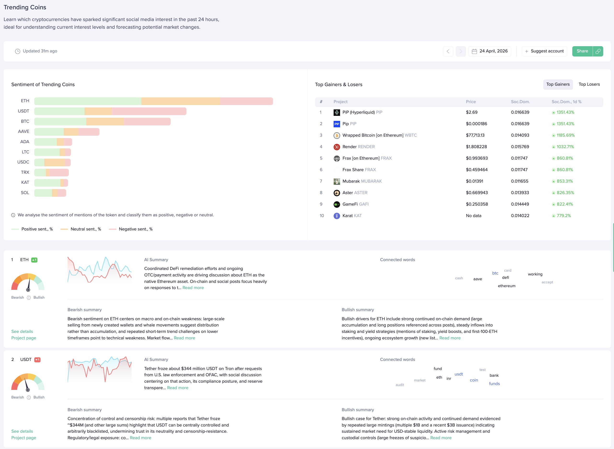

## Definition

**Trending Coins** is a subset of [Trending Words](/metrics/emerging-trends)
restricted to words that map to a tracked project (coin or token). It answers
the question "which assets is the crowd talking about the most right now?".

Under the hood the metric uses the same [hype score](/metrics/emerging-trends#hype-score)
and ranking as Trending Words — the only difference is that the list is
filtered down via the `wordTypeFilter: PROJECT` argument of `getTrendingWords`.

---

## Access

The metric's real-time data is **free**.
The metric's historical data has [restricted access](/metrics/details/access#restricted-access).

---

## Measuring Unit

See [hype score](/metrics/emerging-trends#hype-score).

---

## Data Type

[Timeseries Data](/metrics/details/data-type#timeseries-data)

---

## Frequency

Trending Coins are available at [hourly intervals](/metrics/details/frequency#hourly-frequency)

---

## Latency

Trending Coins have [social data Latency](/metrics/details/latency#social-data-latency)

---

## How to Access

### [Sanbase](https://app.santiment.net/social-trends/trending-coins)

Trending Coins are available on the [Trending Coins page](https://app.santiment.net/social-trends/trending-coins).

### [SanAPI](https://api.santiment.net)

Trending Coins are available as part of the API via the `getTrendingWords`
query with `wordTypeFilter: PROJECT`. Each returned word resolves to its
underlying project, so you can read the slug, name, and ticker directly:

```graphql explorer
{
  getTrendingWords(
    from: "2026-01-01T12:00:00Z"
    to: "2026-01-01T13:00:00Z"
    size: 10
    interval: "1h"
    wordTypeFilter: PROJECT
  ) {
    datetime
    topWords {
      word
      score
      project {
        name
        slug
        ticker
      }
    }
  }
}
```
