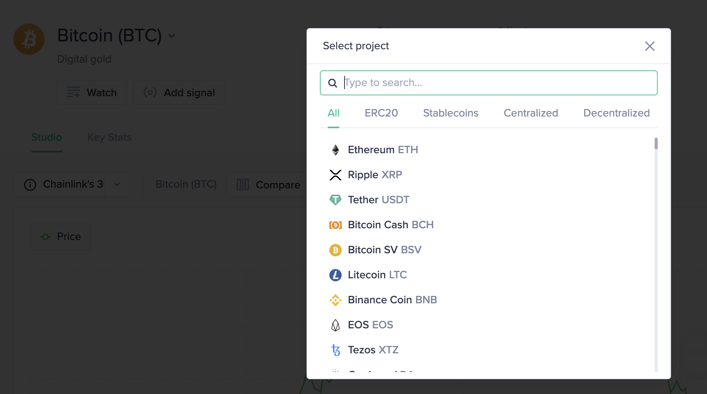
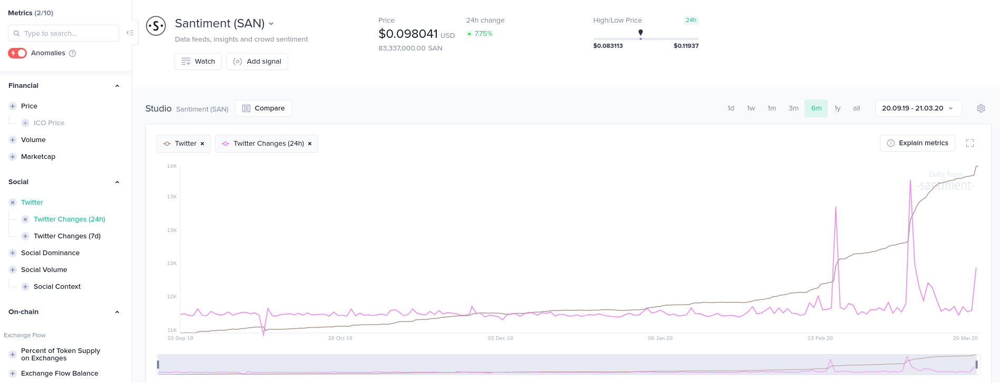
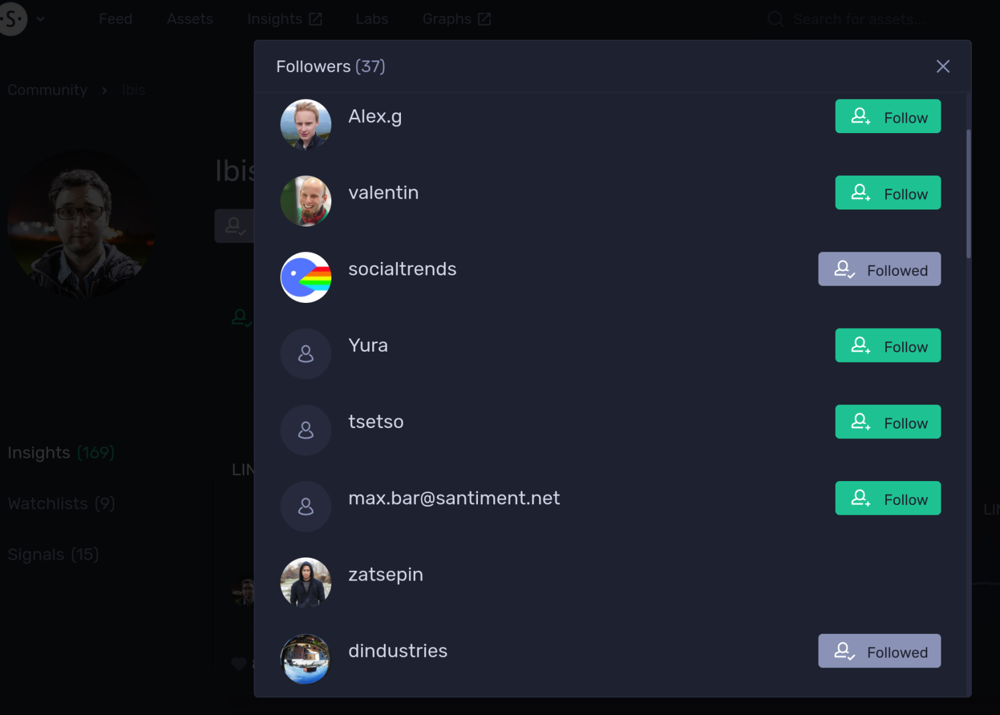
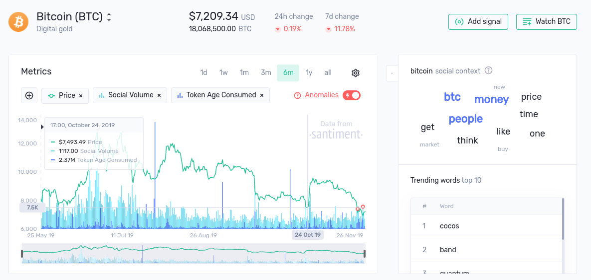
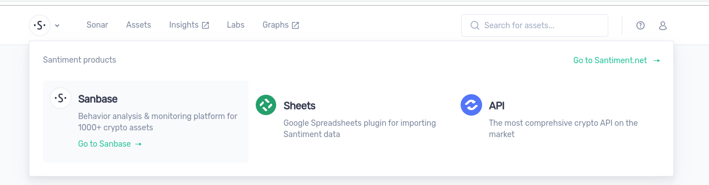
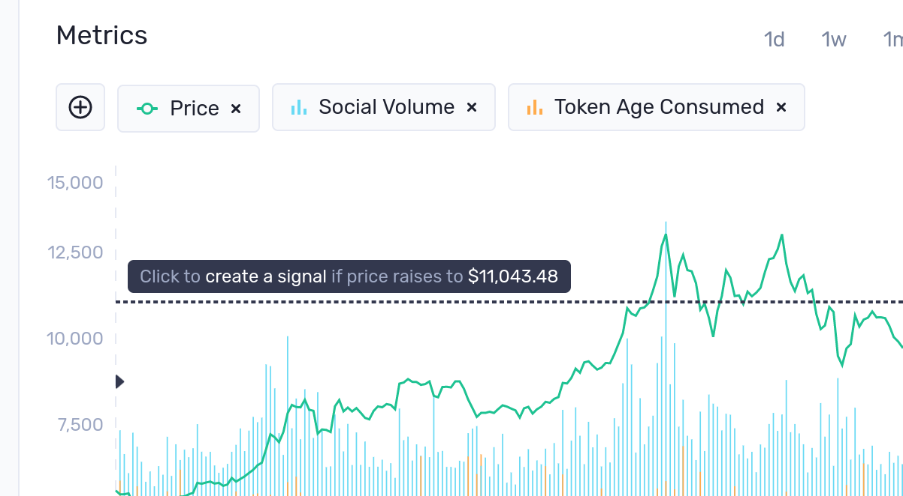

Keep track of development updates, new product features and other items from our changelog.
We update this page every two weeks or more frequently.

## January 2021


``14.01 - 20.01``

**Sanbase**

Charts & Dashboards
- New metric "MVRV USD intraday"
- New dashboard ["Ethereum 2.0 Staking Analytics"](https://app.santiment.net/eth2)
- Custom interval selector for dashboard charts

Screener & Watchlists
- "Newest first" my watchlists & screeners sorting in navigation dropdown
- Screener table loading improvements: server-side pagination and sorting
- `/watchlists` and `/assets` pages stability improved
- Watchlists and Screener pages SEO links

Santrends
- Trends table stability improved

Fixes
- Metamask login
- Dashboards: mobile/tablet versions improvements


``24.12 - 13.01``

**Sanbase**

Alerts

- Add MVRV metrics
- Add Network Profit Loss

Screener

- Autorefresh toggle in Screener and Watchlist table
- Bug fix: Correct sorting for percent columns in Screener

- Bug fix: Social_active_users, miners_balance metrics
- Bug fix: Chart Layout with empty title(?)
- Bug fix: Checkout form night mode styles
- Bug fix: Show the latest price on social tool

**Sansheets | Santiment plugin for Google sheets**

- Add SAN_HOLDERS_DISTRIBUTION (projectSlug, from, to, balance, interval)
- Add SAN_BITMEX_PERPETUAL_CONTRACT_FUNDING_RATE (projectSlug, from, to, interval)
- Add SAN_NETWORK_PROFIT_LOSS (projectSlug, from, to, interval)

## December 2020

``17.12 - 23.12``

Screener
- Ability to filter assets through your watchlists

Santrends
- New design for trends page/table

Alerts
- New metric 'Network profit/loss'

Account settings
- Show monthly usage of API calls

Historical balance
- Address’ labels, comments and latest transactions
- Recently viewed “Chart layouts” on home page
- Lookup wallets using global search
- Watchlists for addresses


``10.12 - 16.12``

New home page for the Sanbase app is here!
Now you can easily navigate to your personal watchlists, screeners, exclusive PRO features and more, directly from our home page.

Charts:

- “Exchange Flow Balance” settings added
- Data from Coinbase wallets added to Exchange metrics (Inflow/Outflow/Flow Balance) for ETH and ERC20 projects

Screener & Watchlists

- New "save as" button for community watchlists + description field
- Added settings for alert frequency
- Fixed a Firefox bug with small Infographics
- Two-way table scrolling
- Saving indicator in the header

Historical balance

- Fixed project infrastructure

Sanbase

More data on Santiment
We start tracking Coinbase erc20 wallets.

Charts

- Chart layouts stores the color settings
- New MVRV visualisation
- More contrast axes in the night mode
- Assets selector has a new category "DeFi"
- Add Recents Chart Layouts to desktop navigation dropdown


## November 2020

Sanbase

- Added 'sign in with Google' option
- New topics added to Social Trends widgets on the home page
- Watchlist & Screener | 'Recent' category added to desktop navigation dropdown

Charts

- Draw straight lines on the chart by holding “Shift” while using the draw tool
- Fixed the “Spent Coin Cost” widget

Mobile

- Watchlists & Screener | Added a mini price chart next to each asset, supports 24h, 7d and 30d range

---

Charts

- Allowing to draw on charts for beta users
- Cursor mode toggle
- New share flow


---

Charts:

- New metrics: average/median fees (only for ethereum)
- Small fixes

---

Sanbase has a New Plan! This Plan is the perfect for **Crypto Lords**!

What's inside?

* All in PRO and
* Dedicated account manager
* Basic API 300k API calls
* Closed Webinars with Santiment Analytics
* Closed chat with Santiment market analysts
* Custom education & onboarding

---

Watchlist & Screener page:

- Rename & save as actions
- Copy assets to watchlist & save as watchlist table actions
- Price graph 7 days column
- Infographics available for watchlists.
- Screener has new one infographic: Volume and Marketcap
- Screener has a new 'Age consumed' filter

Charts:

- Labelling all metrics with a project’s ticker
- Select project’s metrics for comparison in a sidebar
- New Metric 'Dev. Activity Contributors Count'

Sanbase:

- Historical balance/Alerts now has support BTC/LTC and other wallets
- Uni Dashboard New Navigation and charts
- Add help&feedback button

Fixes:

- Fixed responsive mode of home page

---

- Charts | Allowing to change metric’s style
- Charts | Moving Average indicators for bar metrics
- Charts | Supporting BTC addresses in Top Transactions Table
- Watchlist | Full-width layout
- Screener | Outside percent filter
- “BTC locked on ETH” dashboard

## October 2020

- Account Settings | Limit of notification per day setting;
- Historical Balance | Performance and loading speed improved;
- Stablecoins Dashboard | Exchange inflow/outflow chart added;
- Uniswap Dashboard | 30d period setting for the Top claimers table;
- Stablecoins and Uniswap Dashboard | Top exchanges table added;
- Charts | Moving average indicators for line metrics;
- Charts | Displaying MVRV as %
- Charts and Screener | Supporting short URL sharing
- Charts | Studio’s chart performance improved
- Charts | Displaying MVRV timebounds as %
- Charts | Correctly displaying alerts on different scales
- Charts | Unlocked cursor when holding “Alt”
- Charts | Add metric Dormant Circulation
- Insights | (For authors) Manual selection of minichart’s project
- Dashboards | Add 'Sushiswap' to DEXs list on DEX dashboard, add 'ctrl+click' for metrics for dashboards charts
- Insights and Sanbase | Fresh insight's card design and likes logic
- Screener | Optimize loading data for infographics
- Alerts | Add mvrv 365d/180d metrics support
- Halloween event is coming
- Fees distribution: Ability to see distribution for selected day
- Top holders on exchanges: More readable balances
- Bug fixes.

## September 2020
- New Uniswap Dashboard
- Uniswap Dashboard | Date selection for the “UNI Flow Balances” widget;
- Uniswap Dashboard | Update top claimers table: transaction volume inflow/outflow;
- Several app bug fixes.
- New global search. Simultaneous lookup for assets, trending words, insights and popular users
- Move all metrics from API Custom plan to Pro
- Add BTC top transactions table
- New metric SAN_ACTIVE_ADDRESSES_24H available for SanSheets
- Charts | “Top Token Transactions” table now supports BTC;
- Charts | “Price DAA Divergence” and “Adjusted Price DAA Divergence” widgets (available only for beta users);
- Charts | Supporting negative bars visualization (e.g. Price DAA Divergence)
- Charts | Add more labels for transactions table(this table also works for BTC)
- Charts | Add new Active Addresses 1h & 24h metrics
- Charts | MVRV is displayed using a gradient line
- Charts | “Exchange Inflow/Outflow” metrics’ exchange setting now has exchanges divided into 2 categories: CEX and DEX
- Charts | Add Dex Volume and Trade Amount metrics
- Charts | Add new Price-DAA Divergence metrics: `price_daa_divergence`, `adjusted_price_daa_divergence`
- Charts | Search submetrics(Twitter Followers 24h, Socail active users, etc) in metrics search,
- Charts | New metric Social Active Users
- Charts | "Exchange Inflow" and "Exchange Outflow", You can choose specific exchange
- Charts | More sanfam users added to  the “Sanfam Insights”
- Charts | Chart performance improved
- Charts | Holders Distribution Combined Balance widget
- Charts | Holders Distribution percentage metric’s label and value are appended with the ‘%’ sign
- Screener | New filter category `Flow metrics` with 34 new filters;
- Screener | Fix some problems of "Compare"
- Screener | New metrics: Social volume %, Mean dollar inv. age (only %), Circulation (180d) in USD, Exchange inflow in USD, Exchange outflow in USD, Coin Supply on Exchanges (as % of total supply)
- Screener | Search input for Market Segments filter
- Screener & Watchlists | New "compare" feature, which makes life easier to compare assets from your list
- Screener | UX improvement | Open operator by default (when add a new filter)
- Screener | Screener tab in  the main navigation
- Screener | Add change metrics for Social Volume, Sentiment and Social Dominance
- Screener | 3 new filters: inside channel, outside channel, inside % channel
- Screener | Pro popup
- Screener | Search for metrics in filter
- Screener | Toggle "Only active filters"
- Screener | Changes in ui
- Screener | Various fixes around screener signals
- Alerts | Fix the master of the historical balance alert
- Add navigation on Stablecoins Dashboard
- Stablecoin Dashboard - the Stablecoin Hub - https://app.santiment.net/stablecoins
- API performance optimizations. Fixed issue in available metrics caching which will prevent API performance degradation over time.
- Add new labeled balance and flow metrics:
    Ex. Eth & Uniswap - [https://tinyurl.com/y5zrc4lp](https://tinyurl.com/y5zrc4lp)
Social Active Users metric - [https://tinyurl.com/yyycjjcg](https://tinyurl.com/yyycjjcg)

```
        "miners_balance",
        "genesis_balance",
        "dex_trader_balance",
        "defi_balance",
        "dex_balance",
        "cex_balance",
        "withdrawal_balance",
        "deposit_balance",
        "proxy_balance",
        "whale_balance",
        "makerdao_bite_keeper_balance",
        "makerdao_cdp_owner_balance",
        "proxy_balance",
        "miners_to_exchanges_flow",
        "exchanges_to_miners_flow",
        "miners_exchange_balance",
        "whales_to_exchanges_flow",
        "exchanges_to_whales_flow",
        "whales_exchange_balance",
        "dex_traders_to_exchanges_flow",
        "exchanges_to_dex_traders_flow",
        "dex_traders_exchange_balance",
        "defi_to_exchanges_flow",
        "exchanges_to_defi_flow",
        "defi_exchange_balance",
        "dex_traders_to_dexes_flow",
        "dexes_to_dex_traders_flow",
        "dex_traders_dex_balance",
        "dex_traders_to_cexes_flow",
        "cexes_to_dex_traders_flow",
        "dex_traders_cex_balance",
        "dex_traders_to_defi_flow",
        "defi_to_dex_traders_flow",
        "dex_traders_defi_balance",
        "genesis_to_exchanges_flow",
        "exchanges_to_genesis_flow",
        "genesis_exchange_balance",
        "other_to_exchanges_flow",
        "exchanges_to_other_flow",
        "other_exchange_balance",
        "unlabeled_to_labeled_flow",
        "labeled_to_unlabeled_flow",
        "unlabeled_to_unlabeled_flow",
        "labeled_to_labeled_flow",
        "unlabeled_balance",
        "all_known_balance"
```

## August 2020
- Charts | Insights layout on the Charts tool
- Charts | Related Asset's Insights on the Asset's Detailed Page
- Charts | Small fixes for Chart Layouts (Remove Duplication Action)
- Charts | CMD + SHIFT + CLICK - Add metric to the new chart
- Charts | New metric - Defi total value locked in USD (ETH, for beta users)
- Charts | Holders Distribution is available in Search for metrics
- Charts | Make more visible Insigths on the chart
- Charts | Add more categories for Insights
- Charts | Chart layout hot fix
- Charts | More labels on Top Token Transactions
- Charts | Chart’s right axis padding
- Charts | Interval setting for the bar metrics
- Charts | Displaying insights for the selected chart’s time frame
- Charts | "Top Transactions Table" is now available in metrics search by its name or “ttt” abbreviation
- Charts | Interval setting for line metrics
- Charts | Showing only backend-available intervals
- Charts | Hiding tooltip when future ticks are hovered
- Charts | Holders Distribution has Merge tool now
- Screener | Add suggestions for some filters
- Screener | Small updates for visualisations
- Screener | New metric in the Filter "Network Growth" with % changes
- Screener | You can edit/save as your screener
- Screener | Small improvements/fixes of visualisations
- Screener | Add new metrics: Market Segments, Transaction Volume USD, Circulation (180d), BitMEX Perpetual Contract Funding Rate, Dormant Circulation (1y)
- Sanbase | Update Recent highlights
- Santrends | Fix bugs with compare feature
- Insights | Popular authors
- Metrics | NEW: Transaction Volume in USD
- Update Navbar Header | New dropdown for Chart layouts
- Rename Watchlist in the Navigation Bar to Market
- Insights | You can see new category - Only for PRO users
- Update User's dropdown in the Navigation Barj

## July 2020

**`Sanbase`**:
  - New | Santiment Screener is here!
  - Insights has new home page
  - Watchlist & Screener has new column "Market segments"
  * New metric | Top transactions table (It's connected metric with Transaction volume)
  * New metric | Bitmex Basis Ratio
  * New metric | Holders distribution (You can add more than one Holders Distributions in your chart layout)
  * You can apply any chart layout from your watchlist
  * We add settings for the watermark for our charts.
  * Webhooks for alerts works with Discord.
  - New metric | Sentiment Weighted
  - On Alerts page we add the featured list of alerts. It's a good examples of usage
  - Add keyboard navigation in all search by assets. 
  - Fix when search list was empty
  - Add formatting for Exchange Flow Balance metric
  - Fixes for tooltip UX
  - Fixes for Alpha reports
  - Fixes Login/Create an account Flow
  - Shift swapped to CMD + Click for Transactions Table
  - The huge update for Santiment Charts. There is much more flexibility to setup your own dashboard based on Santiment metrics.
  - Fix watchlists stats on mobile
  - Fix search order on Sanbase
  - Add more keyboard shortcuts
  - CMD + Click {Charts Page} on Holder Distribution list will pick only only one group
  - CMD + L {Charts Page} will open a list of chart layouts
  - / {Any page} will focus on search input
  - CMD + M {Charts Page} will toggle Mapview/Charts mode

## June 2020

**`Sanbase`**:
  * Webhooks for Alerts
  * Dev activity on Desktop now looks better (default MA 7 days)
  * MVRV Long/Short looks better. (Area lines, percents instead of ratio)
  * Add Sentiment Metrics (Finally on Santiment App we have Sentiments :smile: )
  * Add Derivatives Metrics (For BTC & ETH)
  * We rebuild fullscreen for the Chart. It's bigger now
  * Chart becomes bigger
  * Grid on the Chart becomes more granular
  * Chart layouts - small fixes
  * You can open our chart tool right from navigation now
  * Add Frequencies for each metric in "Explanation" sidebar
  * Add Price in BTC & ETH
  * New Alert: MVRV Intraday
  * Many fixes for links and docs
  * New minimap feature: https://www.loom.com/share/8362041e6551404ba7dd092d125dac5d
  * New Select&ZoomIn feature for Sanbase Charts
  * You can edit the calendar as a text.

## May 2020

- **`Sanbase`**: You can setup manually amount of top holders for next metrics


- **`Sanbase`**: Add categories for Quick Search



- **`Sanbase`**: All projects now have Social Volume metric available.

- **`Sanbase`**: Our chart has 2 Axis support now.


- **`Sanbase`**: Social tool has better suggestions. And some small changes for better UX.


## April 2020

- **`Sanbase`**: Social tool has a new feature. "Comparing". You can compare any topics and assets by social volume and social dominance.


- **`Sanbase`**: You can save your ideas with new feature "templates" and manage them in profile


- **`Sanbase`**: We have a new flow for selecting a datetime interval


- **`Sanbase`**: You can add an alert for any "text" topic in our social tool.


- **`Sanbase`**: We add very specific metric for Ethereum. Say welcome to Miners Balance


- **`Sanbase`**: New Top Holders metric on Sanbase Charts


## March 2020

- **`Sanbase`**: We add Twitter % changes 24h, 7d



- **`Sanbase`**: You can create alerts right from the chart with shortcuts.


- **`Sanbase`**: ICO price can be visible right on the chart


- **`Sanbase`**: Studio supports comparison our metrics and assets now


- **`Sanbase`**: We add a better explanation for our metrics on •Studio•


## February 2020

- **`Sanbase`**: We add time bounds metrics


- **`Sansheets`**: `=SAN_MEAN_DOLLAR_INVESTED_AGE` function has been published

- **`Sanbase`**: New look of Santiment Studio. Our chart tool is much ease to use now.
  

- **`Sanbase`**: First time to see our new feed. Where you can find latest hot events, insights and anomalies in the crypto world.
  And now Santiment has own Indices.
  

- **`Sanbase`**: It's time to pay with crypto for our tools. https://app.santiment.net/pricing

- **`Sanbase`**: We've updated Sanbase's user profile. And you can track followers.
  

## January 2020

- **`Sanbase`**: We make fresh new chart's engine for our services. Now our charts become much faster. You can try it on our desktop web app - https://app.santiment.net/

- **`Sanbase`**: Better mobile experience is here. Also you can open our chart in `fullscreen` mode.
  

* **`Sansheets`**:

1. Removed `SAN_NEWS` function.
2. Change order of returned data of `SAN_OHLC` function.
   <br/>

- **`Sanbase/Insights`**: Now you can see an amount of comments per Insight
  

- **`Sanbase`**: Small changes of our navigation super menu
  

## December 2019

- **`Sanbase`**: Our profile page is live - https://app.santiment.net/profile/120

- **`Sanbase/Insights`**: Let's talk about crypto in our new comments
  

- **`Sanbase`**: User can toggle the fullscreen mode for our chart.

<br/>

## November 2019

- **`Sanbase`**: Now you can check top trending words on our charts -
  
  Just hovering the chart and moving the mouse pointer. This works with Social Volume metric.
- **`Sanbase`**: You can use the new search field if you looking for some metric
  
- **`Sanbase/Sansheets/API`**: Finally we have unified header for all our services (except santiment.net)
  
- **`Sanbase Graphs`**: Graphs is the part of Sanbase account and user flow
  

- **`Sansheets`**: New function introduced `=SAN_FUNCTIONS` - returns a list of all the available san functions.

- **`Sanbase.Insights`** Insights has a new widget with a list of assets in this insight.
  

- **`Sanbase/Sansheets/API`**: Increased the historical access for paid plans:
  Sanbase/Sansheets: Pro plan now gives 5 years of access instead of 3
  API: Basic plan gives 3 years instead of 6 months, Pro: 7 years instead of 1.5 years
- **`Sanbase`**: Now you can download CSV data from our Sanbase's chart tool.
  

- **`Sansheets`**: Some functions has been introduced:

```
 SAN_DAILY_AVG_MARKETCAP
 SAN_DAILY_CLOSING_MARKETCAP
 SAN_MEAN_REALIZED_PRICE
 SAN_MVRV_LONG_SHORT_DIFF
 SAN_MEAN_AGE
 SAN_VELOCITY
 SAN_EXCHANGE_INFLOW
 SAN_EXCHANGE_OUTFLOW
 SAN_EXCHANGE_BALANCE
 SAN_AGE_DESTROYED
```

<br/>

## October 2019

- **`Sanbase`**: New weekly report for your watchlists. Now you can get hot info about assets from your watchlist in your inbox.
  

- **`Sanbase`**: New beta feature. You can setup simple pricing signal on the chart tool.
  

* **`Sanbase`**: Since today on-chain data is available on the charts for EOS
  (discontinued in May 2020), Ripple and Binance Chain. Binance Chain is
  available under the `Binance Native` name and `binance-coin-native` slug. The
  old `Binance/binance-coin` is still pointing to the ERC20 contract. Not all
  the available data is currently displayed, the frontend team is working on
  that.
