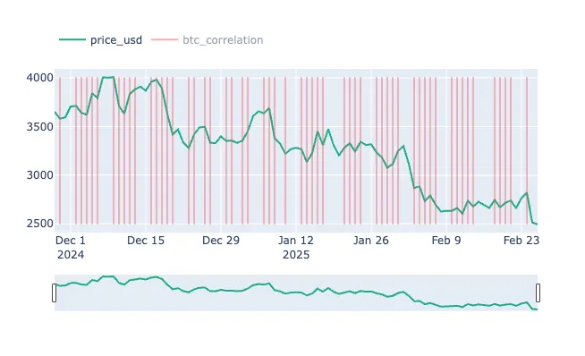

## Definition

**BTC Correlation** Anomaly is designed to monitor and analyze the correlation between Bitcoin (BTC) and GOLD and SPY. By examining how BTC moves in relation to other market participants, traders can gain valuable insights into market dynamics and interdependencies. This signal is essential for understanding diversification opportunities, managing risk, and identifying broader market trends.

**Correlation** measures the strength and direction of the relationship between two assets, typically represented by a coefficient ranging from -1 to 1. A value close to 1 indicates a strong positive correlation, meaning the assets tend to move together, while a value near -1 suggests a strong negative correlation, where the assets move in opposite directions.

## Use Cases

- **Diversification Strategies**:
    
    Utilize the BTC Correlation Anomaly to assess which assets may provide diversification benefits. When BTC shows low or negative correlation with certain altcoins or traditional assets, these instruments can help stabilize your portfolio during periods of BTC volatility.
    
- **Risk Management**:
    
    By tracking shifts in BTC’s correlation with other assets, traders can identify periods of heightened systemic risk. A rising correlation across multiple assets may signal market stress, prompting adjustments in position sizing and hedging strategies.
    
- **Market Sentiment Analysis**:
    
    Changes in correlation can be indicative of evolving market sentiment. For instance, a decreasing correlation between BTC and traditional financial instruments might suggest a divergence in market behavior, offering clues about potential shifts in investor sentiment and macroeconomic trends.
    
- **Hedging Strategies**:
    
    Understanding BTC’s correlation with other assets helps in constructing effective hedges. For example, if BTC exhibits a strong inverse correlation with a specific altcoin or commodity, traders may use this relationship to offset potential losses and protect their portfolios during downturns.