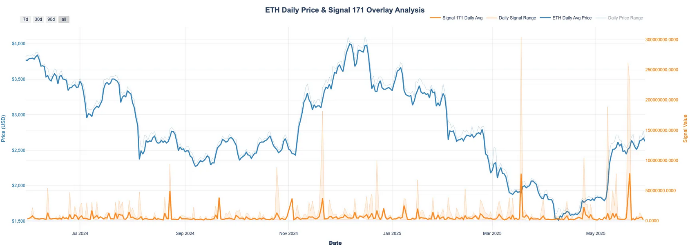

## Definition

**ETH Whale Dump** anomaly is designed to detect potential large-scale ETH dumps by monitoring whale wallet behaviors. It specifically focuses on identifying significant outflows from addresses that could indicate selling pressure from major holders. The anomaly uses a 30-day holding period as a key parameter to distinguish between normal trading activity and potential dump scenarios.

## Use Cases
- Identifying potential large-scale selling pressure
- Monitoring whale behavior patterns
- Early warning system for significant market movements
- Risk management for ETH positions

This data anomaly helps traders and analysts anticipate potential market pressure from large ETH holders, particularly focusing on cases where long-term holders (30+ days) initiate substantial outflows that could impact market conditions.