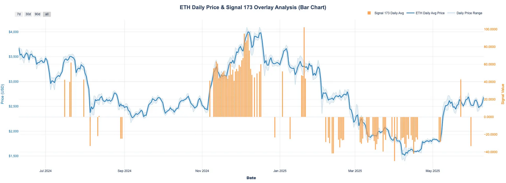

## Definition

**Hyperliquid Average Funding Rates** Anomaly monitors Hyperliquid's funding rates to detect anomalies when rates exceed predefined high/low thresholds. It retrieves data from ClickHouse, identifies unusual funding patterns, and streams alerts to Kafka for real-time processing.

## Use Cases

**Risk Management**

- Early warning for excessive leverage conditions
- Market stress detection before major price movements

**Trading Opportunities**

- Identify arbitrage opportunities from funding imbalances
- Optimize position timing based on funding cycles

**Market Analysis**

- Track liquidity conditions and market sentiment
- Monitor unusual market behavior for research/compliance