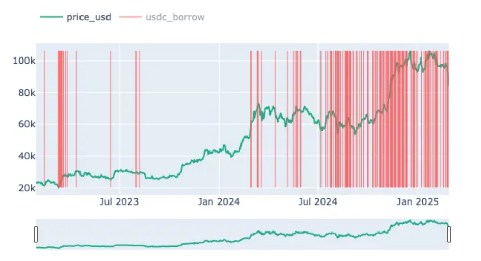

## Definition

**USDC Borrow** anomaly monitors significant changes in the total amount of USDC borrowed across major decentralized finance (DeFi) platforms. This anomaly is calculated by summing the USDC borrowed in AAVE and Compound, providing insight into the market's borrowing behavior and liquidity dynamics.

**USDC Borrow** represents the aggregated value of USDC that market participants are borrowing on these platforms. An increase in borrowing can indicate rising demand for liquidity, increased leveraging, or bullish market sentiment, whereas a decrease might suggest a more cautious approach or reduced market activity.

## Use Cases

- **Market Sentiment Analysis**:
    
    By tracking the combined USDC borrowing on AAVE v3 and Compound v3, traders can gauge overall market sentiment. A significant uptick in borrow activity may signal confidence and aggressive positioning, while a downturn might indicate risk aversion.
    
- **Liquidity Assessment**:
    
    Monitoring USDC borrow levels provides insights into liquidity conditions within the DeFi ecosystem. High borrowing activity often reflects strong liquidity and market participation, whereas lower levels could point to tightening liquidity.
    
- **Risk Management**:
    
    Elevated borrowing can serve as an early indicator of potential market volatility. By recognizing these trends, traders and risk managers can adjust their positions, hedge exposures, or prepare for possible market corrections.
    
- **Arbitrage and Yield Strategies**:
    
    Shifts in USDC borrow rates can impact interest rates and reward structures on lending platforms. Traders can exploit discrepancies between these platforms for arbitrage opportunities or optimize yield farming strategies based on borrowing trends.

This anomaly provides a valuable overview of borrowing dynamics across key DeFi platforms, enabling traders to better interpret market trends, assess liquidity, and implement more informed risk management and trading strategies.