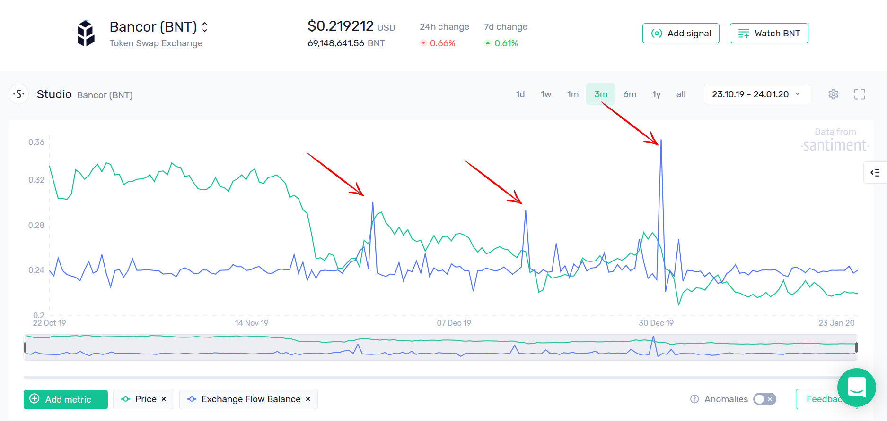
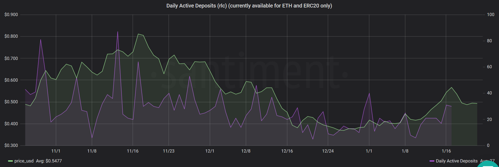

Santiment offers a number of metrics that allow you to analyze the level of speculative activity on the blockchain. In this article, we will discuss two popular exchange-based indicators:

- **Exchange Balance**
- **Daily Active Deposits**

The **Exchange Balance** metric represents the combined values of an asset moving into and out of exchange wallets over time. Simply put, if the line is above zero for the day, it indicates that more of a specific coin has entered the exchange wallets than has left, and vice versa.

Large movements of tokens to exchanges often precede rapid price declines, as the increasing sell pressure becomes too much for the market to absorb. For instance, consider the Exchange Balance of Bancor (BNT) shown below. You'll observe that three of the most significant spikes in Bancor's recent exchange flows occurred shortly before major price corrections:

Similarly, **Daily Active Deposits** measures the total number of 'deposit' addresses interacting with the observed coin. These 'deposit' addresses, owned by exchanges, are interim addresses that all coins pass through before reaching the main exchange wallets.

Spikes in daily deposits, particularly during price increases, are a clear indication of rising speculative interest. These spikes can often signal an impending trend reversal as both the crowd and whales look to offload their holdings. An example of this can be seen in RLC's recent Daily Deposits, where spikes directly correlated with several interim and long-term peaks:

As demonstrated, these two metrics can serve as excellent indicators of speculative activity on the network. They can reveal significant shifts in holder behavior and signal crucial 'offloading' events.

