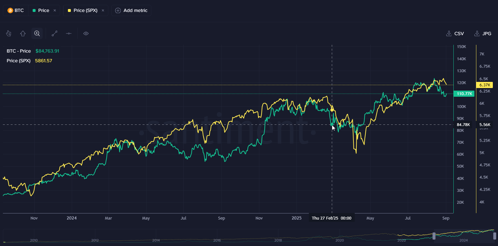
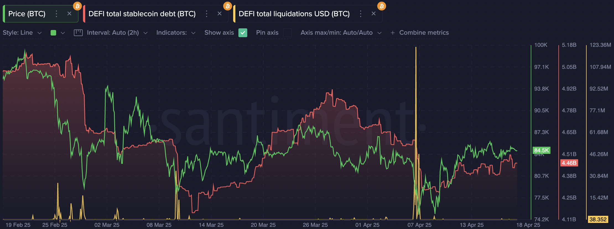
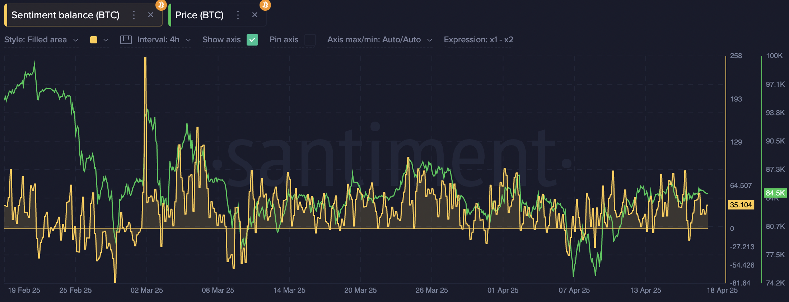

### Metrics

`Total Liquidations`, and `Total Stablecoin Debt` combined metric for [multiple defi protocols](https://academy.santiment.net/metrics/lending-and-borrowing-protocols)
Social Sentiment analysis ([Social Trends tool template](https://app.santiment.net/labs/trends/explore/bull%20OR%20bullish?addedTopics=Bear%2520OR%2520bearish&slug=bitcoin&ticker=BTC)): `Social Volume`, `Social Dominance` of various words and word combinations.

### Scenario

Late February 2025. The market is on a comedown from the Trump inauguration euphoria and a fresh all-time-high on BTC. The prices pulled back a bit, but general sentiment was still positive. Then, in the last days of the month, Trump came out guns blazing with the tariff announcements, which sent every asset into a tailspin. If you’re a dip-buying connoisseur, this seems like the time to buy, but when?

That’s where a few particular Santiment metrics came in handy. I personally love to use, and did use in this particular scenario, a combination of DeFi liquidations ([chart template](https://app.santiment.net/charts/De_wFHJh__sCl)) and Social Sentiment analysis ([chart template with custom metric](https://app.santiment.net/labs/trends/explore/bull%20OR%20bullish?addedTopics=Bear%2520OR%2520bearish&slug=bitcoin&ticker=BTC)) to accurately gauge both what was happening to people’s on-chain positions and what they were expressing on social media.

What you want to see here is:

1. Big spikes in liquidations on a falling price mean there is forced selling.
2. Stablecoin debt reducing means people are closing their leveraged positions.
3. Negative sentiment readings mean people are posting bearish social media content.

This combination of signals gave me the conviction to enter a position on Feb 28th, at $84,700 per BTC and then proceed to add more on March 9-10th at $80,000 and \$79,300. Holding through the next dip in early April was very scary, but the huge spike in liquidations and debt unwind confirmed that the price shouldn’t go much lower from there, as indeed happened eventually.

The result by the time of writing is that I accumulated BTC at very favorable prices right before the huge run to the new ATH at \$123k.
