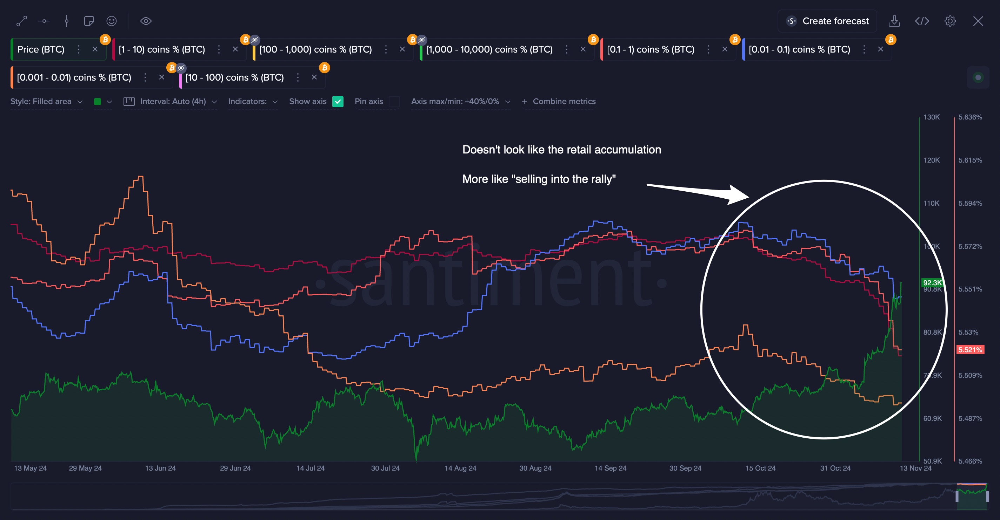
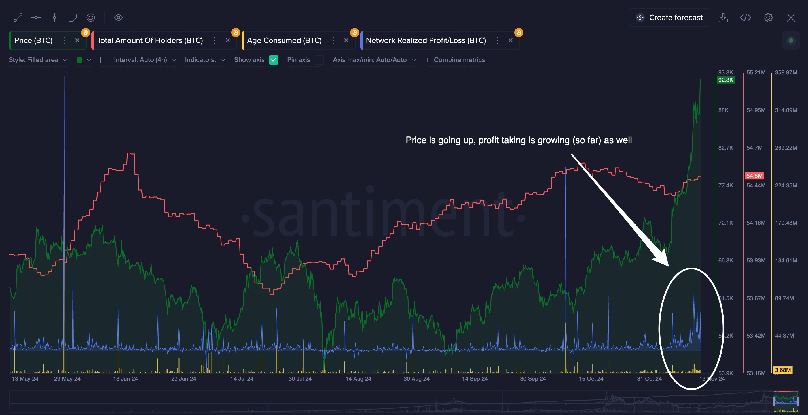
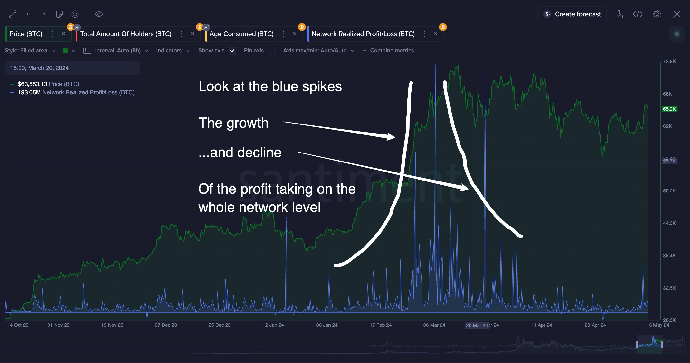

### Metrics

[Supply Distribution](https://academy.santiment.net/metrics/supply-distribution/)
[Network Realized Profit and Loss](https://academy.santiment.net/education-and-use-cases/understanding-long-term-market-trends-and-cycles/#network-realized-profit-and-loss)

### Scenario

It’s November 2024 and BTC is at $92,300, Sebastian, having bought his first holdings a year earlier, November 2023, at $37880 is watching the price rise accelerate after a 3 year bear market and a year of slow uptrend. Bitcoin’s previous all time high was in November of 2021 at the astonishing price of approximately $66,000. The bottom of the previous bear cycle hit on November 09 2022, at the price of around ~15-16k. He’s thinking to himself, “Do I sell?”, “Is the market overheated?” and other such questions. So he decides to do some analysis.

The market and its analysis can be approached in several ways, often complementary to each other. Techniques include technical analysis, sentiment analysis, and on-chain analysis. Below, Sebastien selected an approach that is both comprehensive and relatively simple to understand.

His focus is on understanding the behavior of specific market participants:

- What are the actions of smaller BTC holders?
- How much profit are these holders, who acquired BTC at lower prices, currently realizing?

By examining these metrics, the underlying market sentiment can be determined. Specifically, the behavior of smaller holders will reveal if retail investors are overly greedy or overly fearful. Analyzing profit-taking patterns will help identify whether we are in a state of too much greed, which typically indicates a market top. This is seen when profit-taking declines, since market participants irrationally hope the market will go higher.

As of November 13th 2024, these conditions haven't fully materialized.

**Retail Balances & Profit Taking Analysis:**

The chart indicates that retail holders began **decreasing** their balances around October 15th, coinciding with the start of BTC's real rally. It looks like retail is selling into the rally. It also looks like it’s weighted towards fear more than greed because the amount of selling would be less if participants were getting greedy. Given this, it is unlikely that this is a macro cycle top. Though it may become a short term top.

The price is going up on BTC while the the profit-taking level appears healthy, with increases correlating to each BTC price jump. At a market top, we expect to see a pattern similar to March 2024 (pictured below) when a probable short term peak is indicated due to the spike in Network Realized Profit and Loss(NRPL). NRPL measures the collective profit or loss of coins that change addresses daily. Big negative spikes are usually the best long-term buy signals. Big positive spikes suggest that the most active market participants are in big profit. In this case the NRPL is spiking and is doing so for multiple consecutive days, giving us a signal that it could be a short term top.

**Decision:**
Sell some of the position, with the goal of reentering within the next 4-16 weeks at a lower price.

**Outcome:**
This moment was followed by a 4 month minor downtrend which contained multiple opportunities to buy back in under $90k.

We have compiled a [chart layout](https://app.santiment.net/charts/btc-major-metrics-1410) that includes these two metrics along with several others.

In conclusion, monitoring these two subjects—retail activity and profit-taking—is crucial. Historically, these have been key indicators of retail greed or fear of missing out (FOMO), which often precede market tops. Stay vigilant for these signs as they may hint at the next potential turning point in the market.
