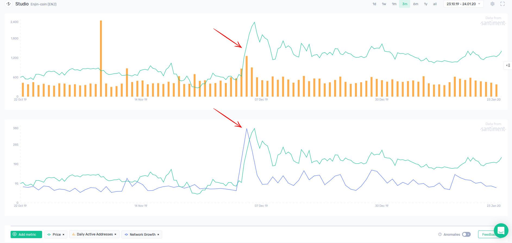

Two of our metrics that are great at highlighting network activity trends are:

1. **Daily Active Addresses (DAA)** - the total number of unique network addresses involved in daily transactions
2. **Network Growth** - the number of new addresses created on the network each day

If these indicators spike during a pump - signalling a rise in speculative interest - but begin to decline shortly after, it can often signal an incoming correction.

Take ENJ for example, which had a giant spike in active addresses at the beginning of December, coinciding with the price rally:

As soon as the on-chain activity reverted back to its pre-pump levels, ENJ was unable to sustain the uptrend and began correcting.

### On-chain Activity as Long-term Health Indicator

MKR’s Daily Active Address and Network Growth, all time

Before you enter any trade, proper due diligence is key. Both DAA and Network Growth are great proxies for project adoption over time:

- Does the network continue to add new addresses daily, or has the growth stopped?
- Is there activity on the network even when the price is down?
- How active is the community during major governance events, or on-chain voting sessions?

You can answer many important questions about a project’s health by analyzing its long-term network activity. While it won’t tell you when, it can very well tell you if buying a certain token is a good idea in the first place.
