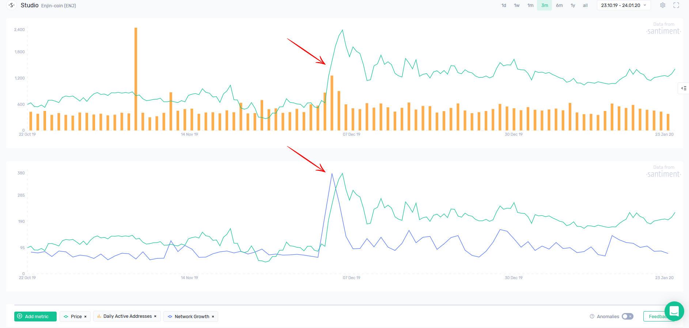
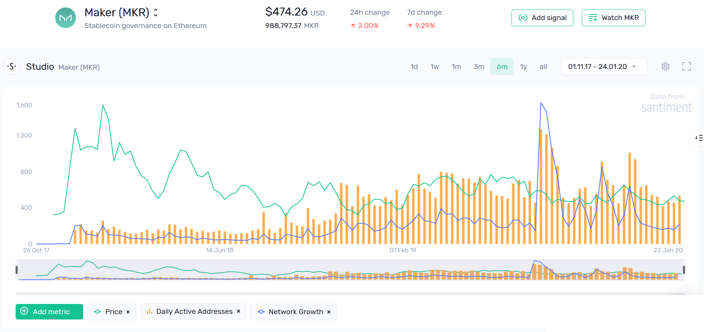

Two key metrics that effectively highlight network activity trends are:

1. **Daily Active Addresses (DAA)** - This represents the total number of unique network addresses involved in transactions each day.
2. **Network Growth** - This refers to the number of new addresses created on the network daily.

These indicators can be particularly useful in identifying market tops. If there is a spike in these metrics during a price increase - indicating a rise in speculative interest - but they begin to decline shortly after, this often signals an impending market correction.

Consider the case of ENJ, which experienced a significant spike in active addresses at the beginning of December, coinciding with a price rally:

As soon as the on-chain activity returned to its pre-rally levels, ENJ was unable to maintain the upward trend and began a correction. 

### Using On-chain Activity as a Long-term Health Indicator

Before entering any trade, it's crucial to conduct thorough due diligence. Both Daily Active Addresses (DAA) and Network Growth serve as excellent indicators of a project's adoption over time. Here are some questions you might consider:

- Is the network consistently adding new addresses daily, or has the growth stagnated?
- Does network activity persist even when the price is down?
- How engaged is the community during significant governance events or on-chain voting sessions?

By analyzing a project's long-term network activity, you can answer many vital questions about its health. While this analysis won't predict when to buy a specific token, it can certainly help determine if purchasing it is a wise decision in the first place.

