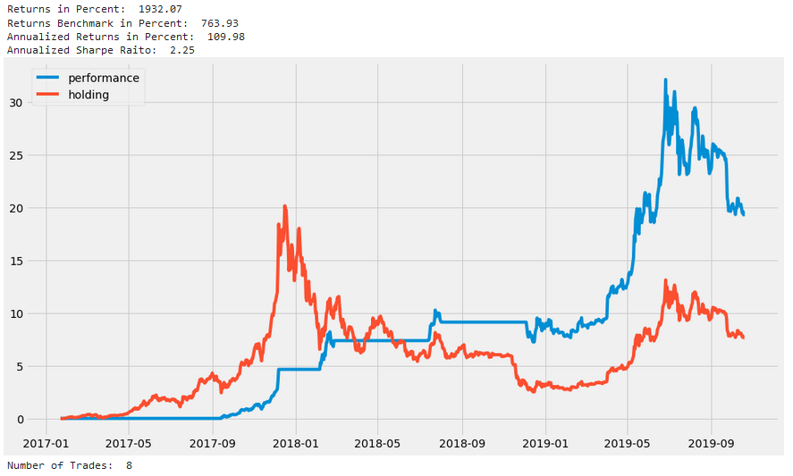
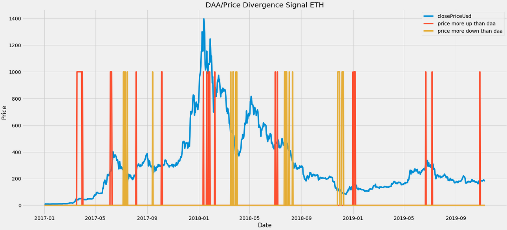
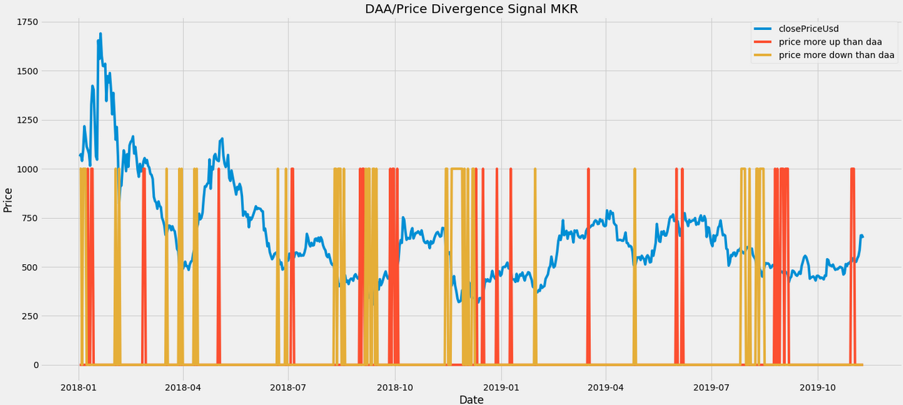
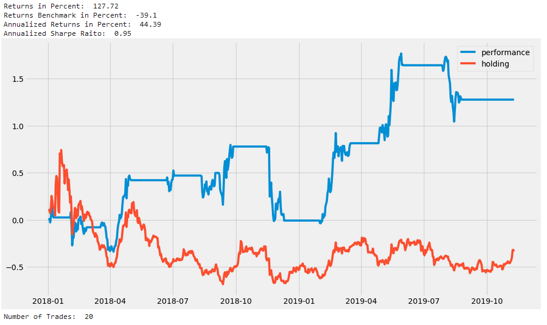

Of all the metrics that can be generated from on-chain data, **the daily active addresses** - DAA for short - is probably most well known. 

For the uninitiated, DAA is simply the **number of unique crypto addresses** interacting with (sending or receiving) a particular coin on a daily basis. As such, DAA is one of the best on-chain proxies for measuring the amount of users and the overall level of network activity, making it an extremely valuable indicator in cryptocurrency evaluation.

The [network effect](https://en.wikipedia.org/wiki/Network_effect) posits that the number of active users directly influences the value of a network. In crypto, we can observe this causality by referring to a coin's on-chain activity. For example, looking at Bitcoin's DAA over time, we can clearly see that the amount of daily active users seems to correlate strongly with the asset's price action:

That said, it's not as easy to explain where this relationship actually comes from, or exactly what influences what. Higher prices *could* attract more people to invest in Bitcoin and in turn lead to growth in active addresses. On the other hand, an increase in daily active addresses *could* lead investors and their models to start valuing Bitcoin higher and buy more. In other words, the 'chicken and the egg' problem is alive and well in crypto.

As always, the truth lies probably somewhere in between. In fact, when testing this via the [Granger Causality test](https://en.wikipedia.org/wiki/Granger_causality), we couldn't find that either metric (DAA or price) clearly moves before the other.

However, when looking directly at the graph, we can see the patterns clearly emerge. For example, throughout Q1 of 2019, the DAA were steadily growing way before the market started to recover. Same holds true for July 2019, when a decline in DAA preceded a decline in price.

So could there be some forecasting potential in this metric?

## Creating a Price-DAA Divergence Signal

To test this hypothesis, we defined and back tested a signal which fired every time the trends in daily addresses and the price of BTC moved too far away from each other. 

In other words, we calculated the log returns over a rolling window of X days, and defined a threshold that would trigger a signal whenever the difference between the two metrics (DAA and price) exceeded that threshold.
 
So how did our signal perform historically? As an informed reader might have realized, the method has two tuning parameters:

1. The number of days we look back to calculate the trend, and
2. The `divergence threshold`, which defines how much of a difference in DAA-price trends triggers a signal 

There's no theory at the moment to suggest an optimal (or, really, any) set of parameters, so we tried to select variables that made (some) sense and generated a reasonable amount of signals.

For our first test, we selected a window of three weeks (21 days) and a threshold of 0.3:

Most of the resulting signals seem to be positioned at rather interesting points in Bitcoin's price. However, there's just a tad too many signals being triggered with this set up, making it too noisy. 

To resolve this, we attempted to set our threshold a bit higher, meaning we need a stronger divergence in trends between Bitcoin's daily addresses and its price for the signal to trigger.

After testing various setups to see which ones generate a reasonable amount of signals, we  eventually landed on a divergence threshold of 0.5. Here's the output: 

The resulting signals look very interesting - and **much** clearer. A lot of the time, the triggers seem to be positioned right at the points of short-term and long-term trend reversals. Pretty exciting!

## Defining Entry/Exit Points

However what we still don't have is a clear BUY or SELL signal. For now, we only created an effective **"something's about to change"** indicator - now let's try and remove the uncertainties. 

So far, we've only looked at the **absolute divergence** between the trends in price and DAA. This time, let's use the same parameters but try to differentiate between times when: 

a) DAA trends ↑ while the price trends ↓

b) DAA trends ↓ while the price trends ↑ 

More precisely, we're now discerning between cases where Bitcoin's DAA goes up **more than** the price and cases where Bitcoin's DAA goes down **more than** the price.

Here are those same signals, now marked based on whether DAA goes ↑ or ↓ compared to the price:

Success! The 'price grew more than DAA' signals seem to be very interesting buy indicators (September 2017, February 2018, August 2018 etc). Similarly, the 'price declined more than DAA' signals appear as potent exit indicators (June 2017, December 2017, July 2018 etc). 

Now THAT looks almost like a tradeable strategy. So let's run a backtest, and see how our Bitcoin portfolio would have performed if we only BOUGHT and SOLD per these historical signals:

Our returns with the new Price-DAA Divergence strategy (in blue) would be more than 2x compared to simply HODLing Bitcoin (in red) over the same time frame. Pretty good!

**However!** It is important to note that these signals should probably not be traded this exclusively (buy **only** when BUY-signal and hold **only** till **SELL**-signal). The reason is simple - there is no guarantee that these signals will detect **ALL** major trend changes. 

At the end of the day, we selected the 0.5. Divergence Threshold relatively arbitrarily. We might have as easily set the threshold a bit higher, leading to less trading signals. 

For example, imagine that that solitary BUY signal in September of 2017 wasn't there. We would have COMPLETELY missed out on the 2017 bull market and probably underperformed (and definitely gotten drunk). So while these signals are still incredibly spot on in our opinion, it's important to note they should - in practice - always be combined with additional signals and complementary strategies, to ensure optimal results. 

## Branching out

So far, we've only tested our price-DAA divergence strategy on Bitcoin. How does the model translate to other major cryptocurrencies?

Let's use the same parameters (3-week window and 0.5 divergence threshold) on Ethereum. The output:

Another solid set of BUY and SELL signals. BUY signals triggered mostly during short-term bottoms (July 2017, March 2018, October 2019 etc), while SELL signals seem to correlate strongly with excellent selling opportunities (June 2017, January 2018, January 2019, June 2019 etc). 

We'll use the same disclaimer again - you should NOT adhere to these signals exclusively. If you look closer, by relying only on our price-DAA signals in this case, we would actually miss out on most of the 2017 ETH bull run. 

In other words, different coins will require different parameters to generate optimal results. For example, the signals for Maker (MKR) look similarly effective when we define a price-DAA threshold of **0.9**:

To prove it, here's a backtest of this batch of BUY/SELL signals:

In the observed time frame (2018-now), MKR HODLers lost ~35% of their initial investment. Our strategy, on the other hand, netted a **130% profit**.

## Final Word

While the above strategy shows potential, it should NOT be adhered to mindlessly. As you saw, you could've missed the whole 2017 bull run relying exclusively on the model. No strategy is 100%, which is why you should **always** use it in conjunction with other metrics, signals and indicators. 

Which reminds me - Sanbase and Sangraphs combined have over 120 different on-chain, social and development indicators. If you need additional tools to use with the Price-DAA strategy, that would be a pretty good place to start. 

