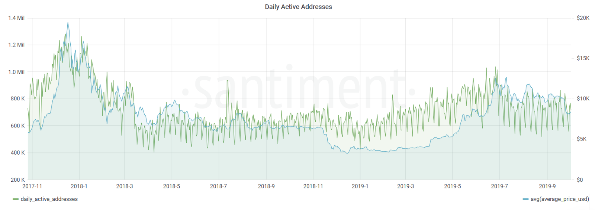
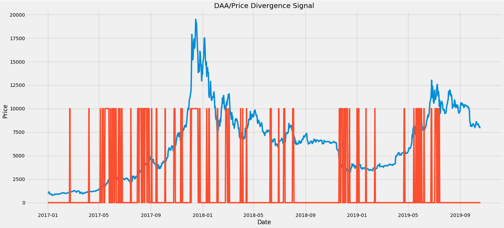
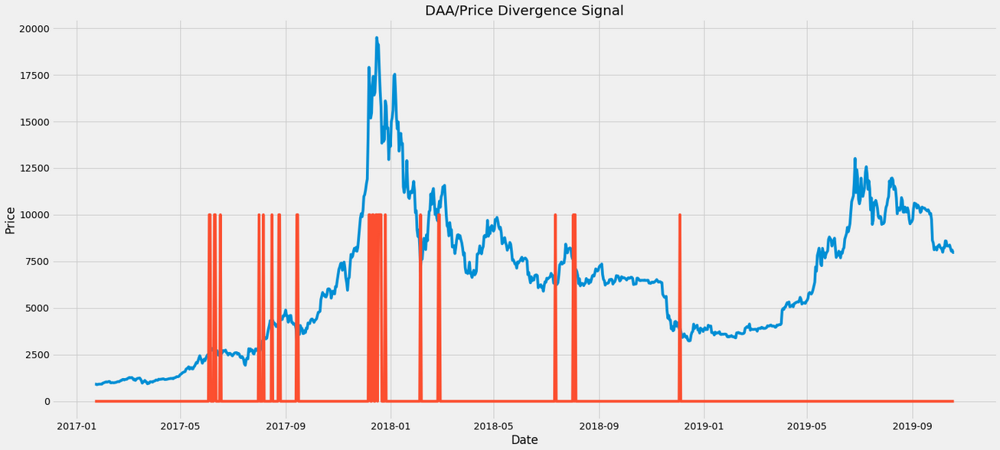
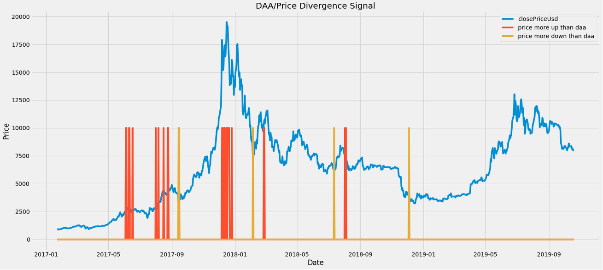
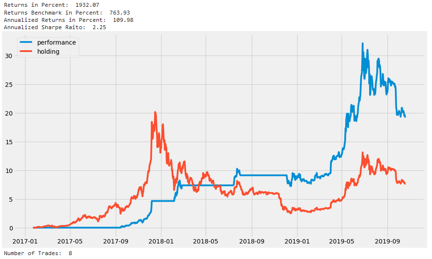
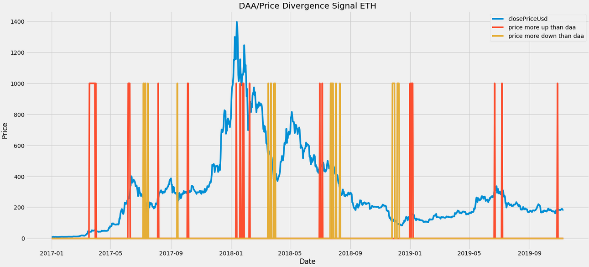
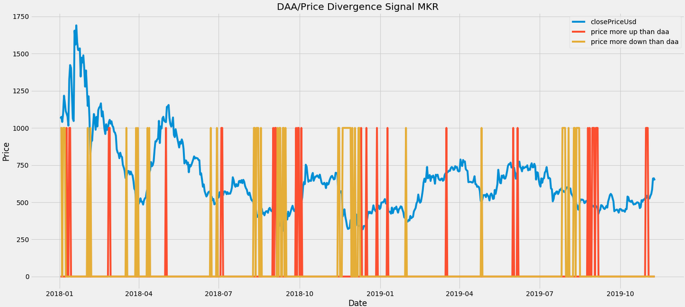
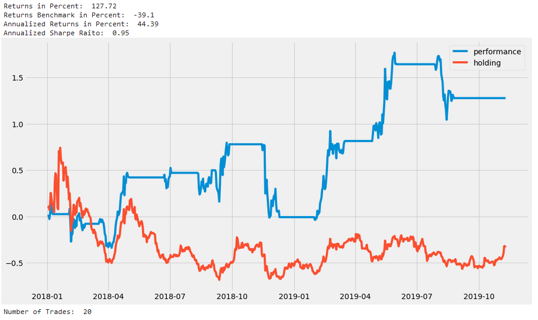

Of all the metrics that can be generated from on-chain data, **the daily active addresses** - DAA for short - is probably the most well known.

For the uninitiated, DAA is simply the **number of unique crypto addresses** interacting with (sending or receiving) a particular coin on a daily basis. As such, DAA is one of the best on-chain proxies for measuring the amount of users and the overall level of network activity, making it an extremely valuable indicator in cryptocurrency evaluation.

The [network effect](https://en.wikipedia.org/wiki/Network_effect) posits that the number of active users directly influences the value of a network. In crypto, we can observe this causality by referring to a coin's on-chain activity. For example, looking at Bitcoin's DAA over time, we can clearly see that the amount of daily active users seems to correlate strongly with the asset's price action:

That said, it's not as easy to explain where this relationship actually comes from, or exactly what influences what. Higher prices *could* attract more people to invest in Bitcoin and in turn lead to growth in active addresses. On the other hand, an increase in daily active addresses *could* lead investors and their models to start valuing Bitcoin higher and buy more. In other words, the 'chicken and the egg' problem is alive and well in crypto.

As always, the truth probably lies somewhere in between. In fact, when testing this via the [Granger Causality test](https://en.wikipedia.org/wiki/Granger_causality), we couldn't find that either metric (DAA or price) clearly moves before the other.

However, when looking directly at the graph, we can see the patterns clearly emerge. For example, throughout Q1 of 2019, the DAA were steadily growing well before the market started to recover. The same holds true for July 2019, when a decline in DAA preceded a decline in price.

So could there be some forecasting potential in this metric?

## Creating a Price-DAA Divergence Signal

To test our hypothesis, we defined and back-tested a signal that would activate whenever the trends in daily addresses and the price of BTC diverged significantly.

In simpler terms, we calculated the log returns over a rolling window of X days and set a threshold. This threshold would trigger a signal whenever the difference between the two metrics (DAA and price) exceeded it.

So, how did our signal perform historically? As an astute reader may have noticed, this method has two tuning parameters:

1. The number of days we look back to calculate the trend.
2. The `divergence threshold`, which defines how much of a difference in DAA-price trends triggers a signal.

Currently, there's no theory to suggest an optimal set of parameters. Therefore, we tried to select variables that made sense and generated a reasonable number of signals.

For our initial test, we selected a window of three weeks (21 days) and a threshold of 0.3:

Most of the resulting signals seem to be positioned at rather interesting points in Bitcoin's price. However, this setup triggered too many signals, making it too noisy.

To resolve this, we increased our threshold, meaning we needed a stronger divergence in trends between Bitcoin's daily addresses and its price for the signal to trigger.

After testing various setups to see which ones generated a reasonable number of signals, we eventually settled on a divergence threshold of 0.5. Here's the output:

The resulting signals look very interesting - and **much** clearer. Often, the triggers seem to be positioned right at the points of short-term and long-term trend reversals. Quite exciting!

## Defining Entry/Exit Points

While we have developed an effective **"something's about to change"** indicator, it does not provide a clear BUY or SELL signal. To address this, we will differentiate between instances when:

a) DAA trends increase ↑ while the price trends decrease ↓

b) DAA trends decrease ↓ while the price trends increase ↑ 

In other words, we are distinguishing between cases where Bitcoin's DAA rises **more than** the price and cases where Bitcoin's DAA falls **more than** the price. 

The following image shows these signals, marked based on whether DAA increases or decreases compared to the price:

Success! The 'price grew more than DAA' signals appear to be effective buy indicators (September 2017, February 2018, August 2018 etc). Similarly, the 'price declined more than DAA' signals could serve as strong exit indicators (June 2017, December 2017, July 2018 etc). 

This approach seems to form the basis of a tradeable strategy. Let's backtest it to see how our Bitcoin portfolio would have performed if we only BOUGHT and SOLD based on these historical signals:

Our returns with the new Price-DAA Divergence strategy (in blue) would be more than 2x compared to simply HOLDing Bitcoin (in red) over the same time frame. 

However, it's important to note that these signals should not be traded exclusively (buy **only** when BUY-signal and hold **only** till **SELL**-signal). There is no guarantee that these signals will detect **ALL** major trend changes. 

We selected the 0.5 Divergence Threshold relatively arbitrarily. We could have set the threshold higher, which would have resulted in fewer trading signals. 

For instance, if the solitary BUY signal in September 2017 was not present, we would have COMPLETELY missed the 2017 bull market. Therefore, while these signals are accurate in our opinion, they should always be combined with additional signals and complementary strategies for optimal results.

## Branching out

Until now, we've only applied our price-DAA divergence strategy to Bitcoin. So, how does this model perform when applied to other major cryptocurrencies? 

Let's test it on Ethereum, using the same parameters as before: a 3-week window and a 0.5 divergence threshold. Here's what we get:

The results show a robust set of BUY and SELL signals. BUY signals were primarily triggered during short-term bottoms (July 2017, March 2018, October 2019, etc.), while SELL signals seem to align well with excellent selling opportunities (June 2017, January 2018, January 2019, June 2019, etc.).

However, it's important to note that these signals should not be followed exclusively. A closer look reveals that relying solely on our price-DAA signals would have caused us to miss most of the 2017 ETH bull run. 

In other words, different cryptocurrencies will require different parameters to generate optimal results. For instance, the signals for Maker (MKR) appear similarly effective when we set a price-DAA threshold of **0.9**:

To demonstrate this, let's look at a backtest of this set of BUY/SELL signals:

In the observed time frame (2018-present), MKR HODLers lost approximately 35% of their initial investment. In contrast, our strategy yielded a **130% profit**.

## Conclusion

While the aforementioned strategy demonstrates potential, it should not be followed blindly. As observed, relying solely on this model could have caused you to miss the entire 2017 bull run. No strategy is foolproof, hence it is crucial to **always** use it in combination with other metrics, signals, and indicators. 

This brings to mind that Sanbase offers over 120 different on-chain, social, and development indicators. If you're seeking additional tools to complement the Price-DAA strategy, these platforms would be an excellent starting point. 

