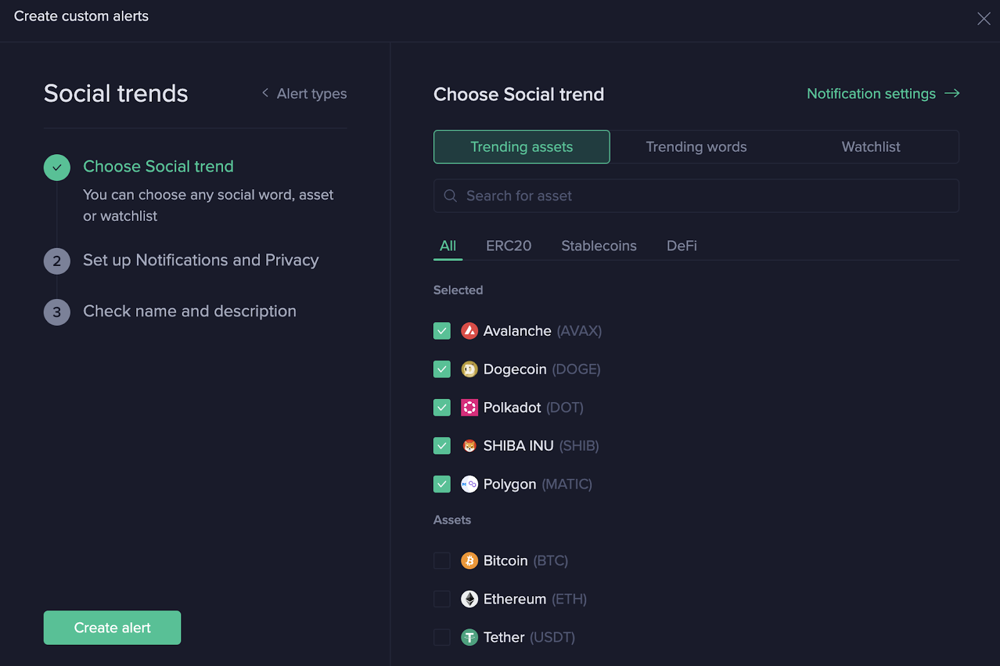

# Sanbase Alerts Use Cases

Santiment is proud to be the only tool in the industry that developed its proprietary method of looking at the crypto market.
Social dynamics can be a strong indicator of turbulence approaching.
You are probably already following some Twitter accounts or getting your latest updates from Telegram chats, however there is a problem:
You cannot physically read every channel, and therefore your attention is limited to a certain amount of select news sources.

They say there is no smoke without a fire. If you are watching several coins you could have noticed that some of them get more buzz in the social media than others. Occasionally, an asset gets way too much attention, like it was with Dogecoin.

Take a look at the Chart below. You can easily see an extreme spike (in blue) in the social volume that occurred at the end of November 2021.

You don’t need many analytical skills to notice that the price, which was already on the decline, shortly dropped completely after the social media spike.

As usual, we insist that there is no one specific metric that can indicate such drastic change, but it is advisable to observe them all to identify which ones ‘talk’ to you more than others.

Seeing this spike back in November 2021 could have been a strong informational signal about Dogecoin.

## Setting up Alerts for Social Trends

Let’s see how you can do this yourself. We suggest that you start with the most basic social trends alert first. It will only trigger if your keyword starts ranking in the TOP 10 social trending terms.

## Step 1

Select Social Trends alert from the Alerts menu. Go to the Trending assets tab.

Pick those coins that you would like to watch (alternatively, use your already existing watchlist)

## Step 2

Specify preferred notification method and frequency for when the alert goes off.

## Step 3

Give your alert a name or it will be created automatically based on the terms you picked for watching.

You are done!

This is a very solid alert. Getting into TOP 10 is fairly rare, so if you do get notified, then it’s really worth checking out.

---

## Setting up a Social Volume Alert

Another social alert scenario can provide you with much more sensitive data - just like in the Dogecoin example at the beginning of this article.

It may well be the case that a significant Social Media Volume spike for a particular coin will not be reflected in the overall Social Trends. In this case you can miss an important signal.

Using Dogecoin, let us walk you through the Social Volume alert set up.

## Step 1.1

Go to the Assets tile.

## Step 1.2

Select Dogecoin from the list.

## Step 1.3

In the Choose Metric space go to the Social and find Social Volume.

Now you will see this:
The red dots on the chart indicate every time the alert would have gone off in the past 3 months (90 times).
This is plain noise.

## Step 1.4

To adjust your alert click on the dropdown menu under condition and select “Moving up %”
Play with the numerical field on the right to discover which increase seems to provide most value. In this particular case we set it to 113% increase compared to the previous 1 day,  and that would have triggered our alert only 5 times in 3 months. The other bars on the chart appear to be more or less equal indeed.

## Step 1.5

Select preferred notification methods and frequency.

## Step 1.6

Confirm you are happy with the Alert’s name. Hit Create Alert.

You are done!
