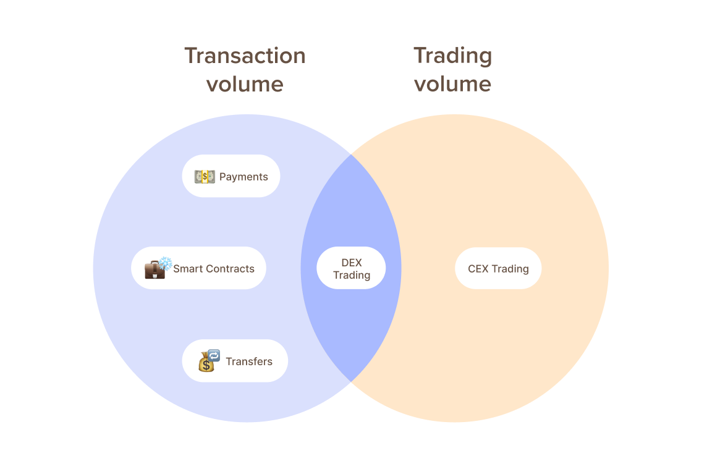
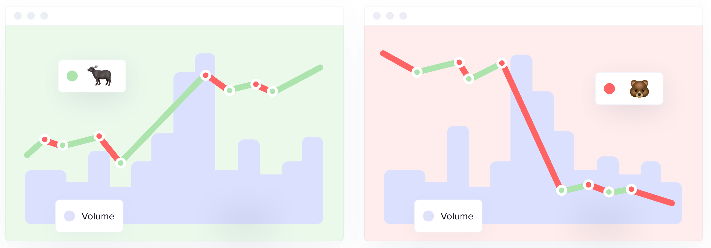

### Trading Volume

- Includes only transactions related to trading. Consists of data from decentralized exchanges (DEX) and centralized exchanges (CEX).

### Transaction Volume

- Includes all movements of tokens on the blockchain
- Covers transfers between wallets (e.g., for securing funds or managing investment portfolios)
- Includes payments for goods and services (real-world utility
of cryptocurrencies)
- Includes interactions with smart contracts (DeFi activities such as staking, lending, and swapping tokens)

### What is the difference between Trading Volume and Transaction Volume?

In short, transaction volume represents all on-chain movements of a token,
while trading volume represents only the trading-related transactions (on-chain
and off-chain).

The transaction volume metric is quite expansive and includes a variety
of
on-chain activities that go beyond just trading-related transactions.
It
captures transfers between wallets, which could be for reasons like securing
funds or managing different investment portfolios. Additionally,
it includes
payments for goods and services, showcasing the real-world utility of
cryptocurrencies. On top of these, the metric also encompasses interactions
with smart contracts, which are pivotal in decentralized finance (DeFi)
activities like staking, lending, and swapping tokens.

Another difference to note is that transaction volume is purely on-chain data,
while trading volume is combination of on-chain data (from DEXs)
and off-chain
data (which is self-reported from CEXs). 

<Notebox type="none">
**Both metrics are crucial but serve different analytical purposes:**
transaction volume offers a peek into the actual use and movement of the currency within
its network, while trading volume helps understand the market sentiment and
liquidity.
</Notebox>

### How to interpret Volume metrics

Both volume metrics act in a relatively similar ways, hence in the examples we
will refer only to trading volume. 

An increase in trading volume is generally considered a precursor
to a big price move. 

For example, if Bitcoin's trading volume dramatically increases without
a
corresponding price change, it might suggest that something significant
is
happening beneath the surface that hasn't yet affected the price. **Savvy traders
might interpret this as an early warning signal of a potential price movement
and adjust their strategies accordingly**, either by securing their current
positions or preparing to capitalize on the anticipated movement.

When both the price of a token and the trading volume are moving in the same
direction, it generally suggests a strong market consensus regarding the value
of the token. If they're both increasing, this is often seen as a bullish sign,
indicating strong buying interest and potentially sustainable price growth.
**This scenario typically reflects a positive sentiment among investors, as they
are actively participating and driving the price up with their trades.**

Conversely, if both the price and trading volume are decreasing, it might
indicate a bearish market sentiment. This suggests that selling pressure is
high, and many holders are trying to offload their tokens, which can lead to a
decrease in price. **This kind of alignment between price and volume can signal a
consensus on value that is either very positive or very negative, depending on
the direction.**

<Notebox type="exclamation">
Context is crucial, so we strongly suggest not to make trading decisions based
solely on this metric. Use a combination of metrics that will help you make a
more informed decision.
</Notebox>

### How to monitor Volume metrics with Sanbase

Here is a ready-to-be-copied Layout with Trading and Transaction volume for
your convenience: [link here](https://app.santiment.net/charts/YM8Zi2X6__sCl)

As soon as you have adjusted the Chart based on your preferences (time
intervals, colors, etc.) you can save it as a new private Layout. Then, using
the Master selector (the bigger one on the top) you can change the currently
analysed token to another while your visual preferences and metrics remain the
same.

Or you can use the smaller selector to build on top of your chart and insert
more metrics, even for multiple tokens at once.

See what others in crypto can’t!

<Resource title="More technical documentation about the metrics can be found here">
- [Trading Volume in USD | Santiment Academy](/metrics/trading-volume)
- [Transaction Volume | Santiment Academy](/metrics/transaction-volume)
</Resource>

