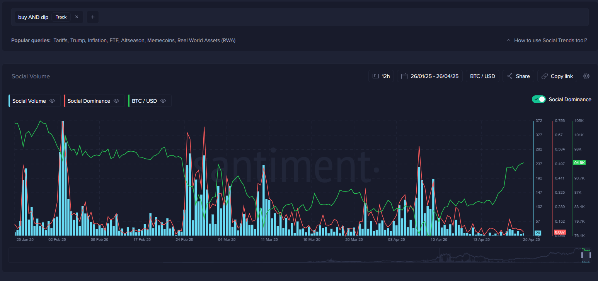
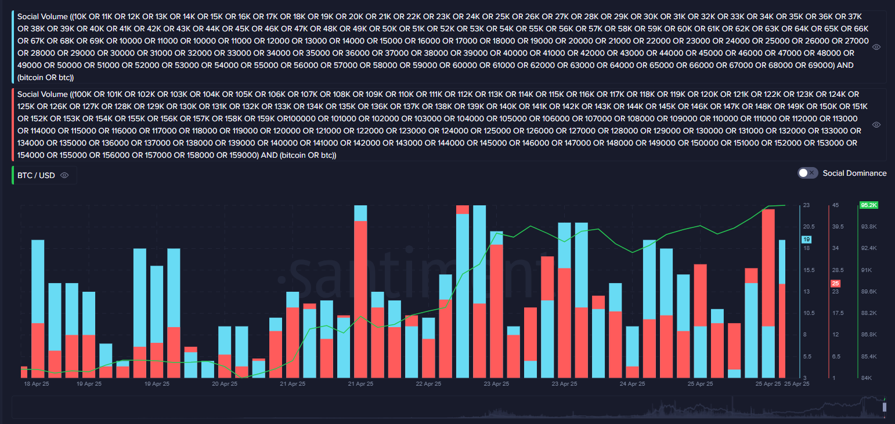
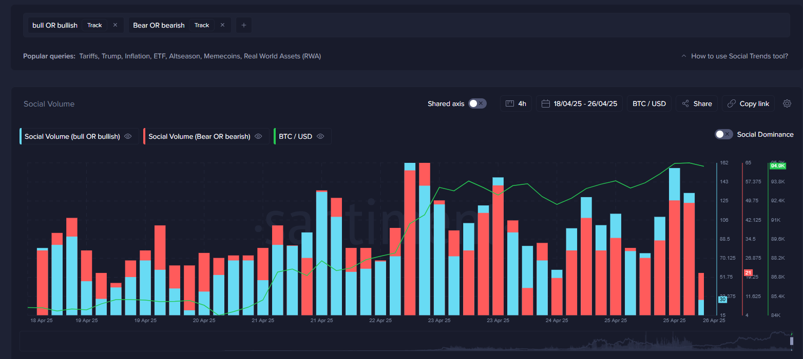
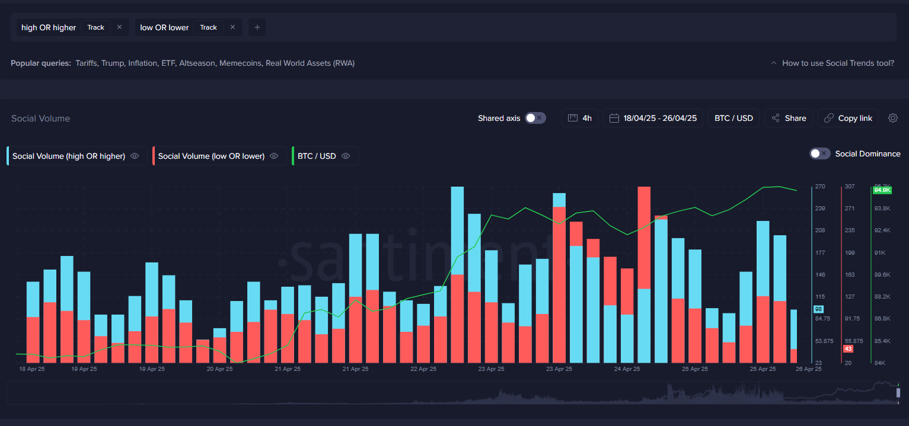
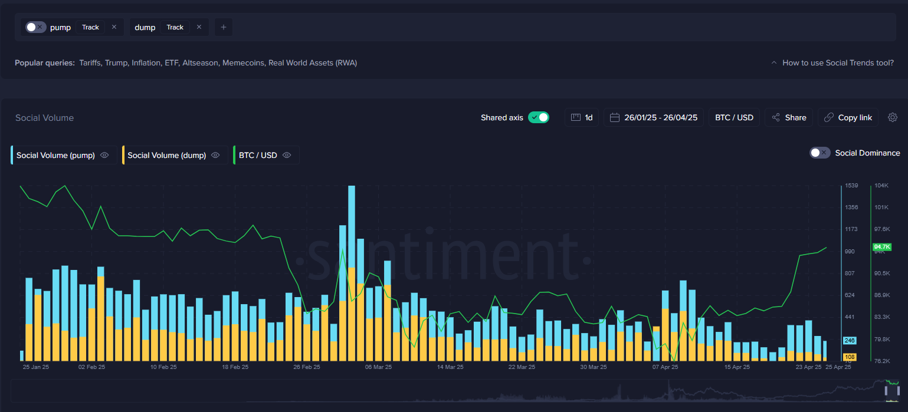
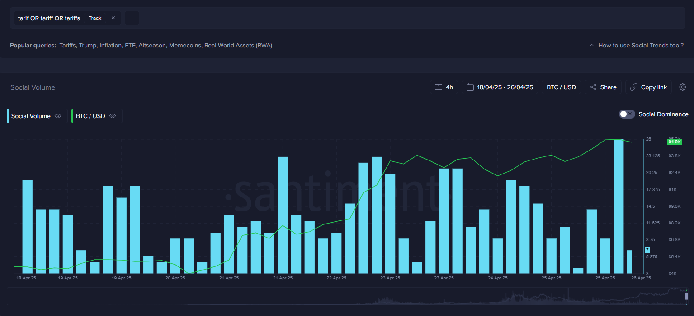
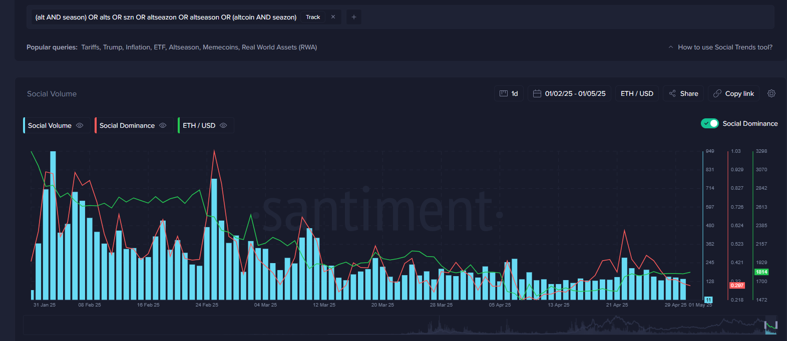

<iframe
  width="560"
  height="315"
  src="https://www.youtube.com/embed/X3xtvZMlGQ4?si=0x6eV4MvxZoEgFSO&amp;start=476"
  title="YouTube video player"
  frameborder="0"
  allow="accelerometer; autoplay; clipboard-write; encrypted-media; gyroscope; picture-in-picture; web-share"
  referrerpolicy="strict-origin-when-cross-origin"
  allowfullscreen
></iframe>

Expectations are a powerful force in shaping financial markets. Yet, they can
also be your worst enemy if yours fall into the same category as most. It’s
common for the market to move in the opposite direction from what most
participants anticipate, and contrarian traders are typically the ones who most
commonly come out on top in volatile markets. Recognizing this, Sanbase
analyzes user discussions across all major crypto channels, offering a
data-driven perspective on the current sentiment and expectations within the
crowd.

With Santiment’s [**Historical Crypto Trends**](https://app.santiment.net/social-trends/crypto-trends) tool, you can
assess how collective expectations have matched up with actual market movements
in the past. This not only provides valuable context but also helps in
forecasting potential future changes by recognizing familiar patterns.

As you explore the tool’s graphs, you’ll encounter key metrics such as
[**social volume**](https://academy.santiment.net/metrics/social-volume/#definition) and
[**social dominance**](https://academy.santiment.net/metrics/social-dominance/#social-dominance-for-an-asset).
These powerful market indicators both offer insight into the intensity and
focus of market conversations, as well as reveal how the subject matter of
these conversations transition between topics.

In this article, we’ll explore the primary queries within the
[**Historical Crypto Trends**](https://app.santiment.net/social-trends/crypto-trends) tool,
helping you gain a comprehensive understanding of market participants’
expectations and how these sentiments play out over time.

## Spotting Market Bottoms with the _Buy the Dip_ Query



Tracking the frequency of "buy the dip" mentions on social channels helps gauge
market sentiment. Spikes in these mentions signal investor optimism, often
after temporary rebounds that may still lead to further declines. Low volume of
conversations surrounding ‘buying the dip’ reflects fear and can indicate
potential buying opportunities. High volume reflects an overly eager crowd that
is not yet fearful, meaning the market dip is likely to continue longer.
Monitoring this trend with Sanbase provides valuable insights for timing market
entry points.

**Query text:**

```
buy AND dip
```

[Link on social query](https://app.santiment.net/s/nrdmCug6)

## Going Against the Crowd with BTC Price Expectations



Analyzing social chatter about Bitcoin’s future price reveals valuable
sentiment signals. Widespread predictions of unrealistically high prices
indicate market greed and often precede price pullbacks. In contrast, frequent
talk of extremely low prices reflects fear and can signal a potential market
bottom. Tracking these patterns with Sanbase helps identify shifts in sentiment
for more informed trading decisions. We recommend adjusting the thresholds of
these round number price mentions to consistently be around 10-15% above the
current market value of Bitcoin, and 10-15% below.

**Query text:**

```
(10K OR 11K OR 12K OR 13K OR 14K OR 15K OR 16K OR 17K OR 18K OR 19K OR 20K OR 21K OR 22K OR 23K OR 24K OR 25K OR 26K OR 27K OR 28K OR 29K OR 30K OR 31K OR 32K OR 33K OR 34K OR 35K OR 36K OR 37K OR 38K OR 39K OR 40K OR 41K OR 42K OR 43K OR 44K OR 45K OR 46K OR 47K OR 48K OR 49K OR 50K OR 51K OR 52K OR 53K OR 54K OR 55K OR 56K OR 57K OR 58K OR 59K OR 60K OR 61K OR 62K OR 63K OR 64K OR 65K OR 66K OR 67K OR 68K OR 69K OR 10000 OR 11000 OR 10000 OR 11000 OR 12000 OR 13000 OR 14000 OR 15000 OR 16000 OR 17000 OR 18000 OR 19000 OR 20000 OR 21000 OR 22000 OR 23000 OR 24000 OR 25000 OR 26000 OR 27000 OR 28000 OR 29000 OR 30000 OR 31000 OR 32000 OR 33000 OR 34000 OR 35000 OR 36000 OR 37000 OR 38000 OR 39000 OR 40000 OR 41000 OR 42000 OR 43000 OR 44000 OR 45000 OR 46000 OR 47000 OR 48000 OR 49000 OR 50000 OR 51000 OR 52000 OR 53000 OR 54000 OR 55000 OR 56000 OR 57000 OR 58000 OR 59000 OR 60000 OR 61000 OR 62000 OR 63000 OR 64000 OR 65000 OR 66000 OR 67000 OR 68000 OR 69000) AND (bitcoin OR btc)
```

```
(100K OR 101K OR 102K OR 103K OR 104K OR 105K OR 106K OR 107K OR 108K OR 109K OR 110K OR 111K OR 112K OR 113K OR 114K OR 115K OR 116K OR 117K OR 118K OR 119K OR 120K OR 121K OR 122K OR 123K OR 124K OR 125K OR 126K OR 127K OR 128K OR 129K OR 130K OR 131K OR 132K OR 133K OR 134K OR 135K OR 136K OR 137K OR 138K OR 139K OR 140K OR 141K OR 142K OR 143K OR 144K OR 145K OR 146K OR 147K OR 148K OR 149K OR 150K OR 151K OR 152K OR 153K OR 154K OR 155K OR 156K OR 157K OR 158K OR 159K OR100000 OR 101000 OR 102000 OR 103000 OR 104000 OR 105000 OR 106000 OR 107000 OR 108000 OR 109000 OR 110000 OR 111000 OR 112000 OR 113000 OR 114000 OR 115000 OR 116000 OR 117000 OR 118000 OR 119000 OR 120000 OR 121000 OR 122000 OR 123000 OR 124000 OR 125000 OR 126000 OR 127000 OR 128000 OR 129000 OR 130000 OR 131000 OR 132000 OR 133000 OR 134000 OR 135000 OR 136000 OR 137000 OR 138000 OR 139000 OR 140000 OR 141000 OR 142000 OR 143000 OR 144000 OR 145000 OR 146000 OR 147000 OR 148000 OR 149000 OR 150000 OR 151000 OR 152000 OR 153000 OR 154000 OR 155000 OR 156000 OR 157000 OR 158000 OR 159000) AND (bitcoin OR btc)
```

[Link on social query](https://app.santiment.net/s/jbpgKsYO)

## Analyzing Crowd Mentions of Bear or Bull Market



Monitoring how often the crypto community references a "bull market" or "bear
market" provides essential insight into prevailing market sentiment. A sudden
surge in mentions of a "bull market" typically signals growing optimism, which
can sometimes indicate the market is becoming overheated and due for a
correction. Conversely, an increasing volume of "bear market" discussions often
reflects heightened pessimism and anxiety, which can suggest the market is
approaching or has reached a bottom.

**Query text:**

```
bull OR bullish
```

```
bear OR bearish
```

[Link on social query](https://app.santiment.net/s/njhTxpbX)

## Analyzing Mentions of "Higher" or "Lower" in Price Discussions


Tracking how often traders and market participants mention that prices will go
"higher" or "lower" offers valuable clues about market expectations. A spike in
conversations predicting that prices will move "higher" often signals growing
optimism and bullish sentiment, which can sometimes precede a period of
correction as the market becomes overconfident. On the other hand, an increase
in mentions of prices moving "lower" tends to reflect rising pessimism or fear,
which can point to an oversold market and a possible rebound.

**Query text:**

```
high OR higher`
```

```
low OR lower
```

[Link on social query](https://app.santiment.net/s/-iQm0v3E)

## Analyzing Mentions of "Pump" and "Dump" in Market Discussions



Monitoring how frequently the crypto community uses terms like "pump" or "dump"
can offer critical insights into crowd behavior and short-term market
sentiment. A sudden increase in mentions of a potential "pump" often signals
heightened excitement and speculative interest, which can sometimes lead to
rapid price surges followed quickly by corrections as enthusiasm fades.
Conversely, a rise in "dump" discussions tends to indicate growing anxiety
about potential price drops, often surrounding fears of sell-offs or
manipulation.

**Query text:**

```
pump
```

```
dump
```

[Link on social query](https://app.santiment.net/s/ibsJUqyi)

## Tariffs



In 2025, Donald Trump introduced tariffs that rocked traders’ opinions about
both stock and crypto markets. For the most part, tariffs are discussed at a
high frequency whenever there are new developments or changes to countries’
policies on tariffs. These policy changes often coincide with a shift in market
direction. Therefore, you can likely find profitable trades by buying if tariff
discussions spike while markets had been declining, or selling if tariff
discussions spike while markets had been rising.

**Query text:**

```
tarif OR tariff OR tariffs
```

[Link on social query](https://app.santiment.net/s/1rjfXuuc)

## Altseason



When traders begin to become enthralled with altcoins, this is often a
reflection of greed or overconfidence in the markets. And if altcoins have been
on a prolonged rally, you may see a spike in the term “altseason”. This means
that traders are confident enough that the current altcoin rally will continue.
Since markets historically move the opposite direction of the crowd’s
expectations, you can interpret spikes in “altseason” as a bearish one in
almost all cases.

**Query text:**

```
(alt AND season) OR alts OR szn OR altseazon OR altseason OR (altcoin AND seazon)
```

[Link on social query](https://app.santiment.net/s/FQjsj8kr)

## Conclusion

By leveraging tools like [Historical Crypto Trends](https://app.santiment.net/social-trends/crypto-trends), investors and
analysts can move beyond guesswork and gain a data-backed understanding of
market sentiment. Analyzing custom keyword frequencies on the Social Trends
page not only sheds light on current expectations but also equips you to
recognize trends and anticipate possible market shifts. Ultimately,
incorporating these insights can lead to more informed and confident
decision-making in the dynamic world of crypto.
