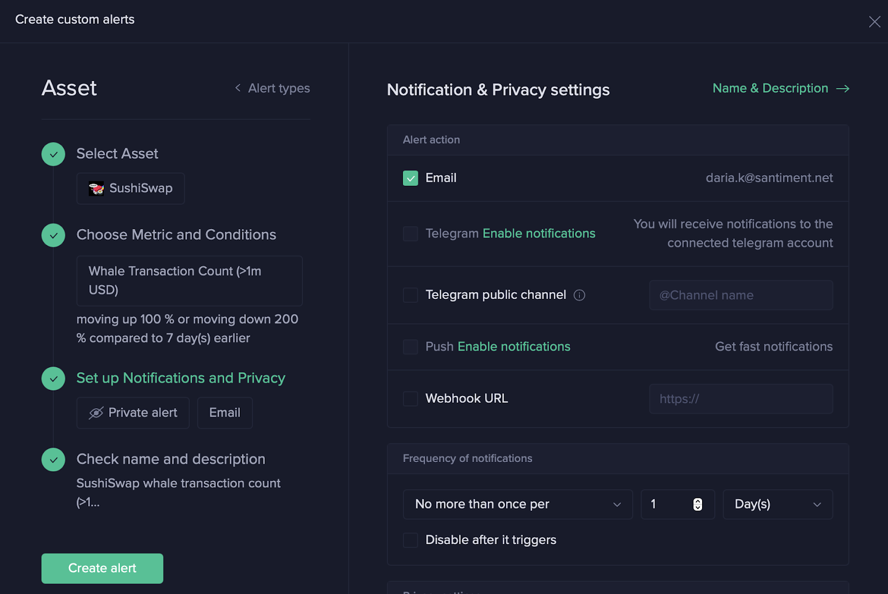

# Sanbase Alerts Use Cases

Whale activity is one of the most intriguing metrics. Keeping a close eye on what the major players in the market are doing (depending on the asset could be addresses worth $1mn+) can be used for guiding your own crypto strategy.

Most traders, predictably, are wary of making wrong decisions when the markets enter turbulent times. The risk of buying or selling at the wrong moment is too high: will the prices drop? Will they climb back up?

Sometimes the opposite could be the case: the market seems quiet but then a whale comes in and things start shifting quickly.

Let’s take an example.

In February-March 2021 we could see how at some point whale activity (pink+orange) for YFI was indicative of the price tops (green), always followed by significant drops. Starting from April the opposite seems to be the case - whale activity and price diverged.

What happens next?

In May 2021, YFI’s price still seemed to be on the rise. Whale activity looked stable.

Suddenly, on May 8, we see a sharp transaction growth which coincided with the price peak again and was followed by a spectacular price fall.

How to act on it is up to you. But knowledge is power, and timely knowledge is triple power.

## Setting up a Whale Transaction Alert

Let’s see how you can do this yourself. We suggest that you start with the most basic social trends alert first. It will only trigger if your keyword starts ranking in the TOP 10 social trending terms.

## Step 1

Go to Alerts and select an asset you want to track (alternatively, use your already existing watchlist)

## Step 2

Go to the metrics and select preferred Whale Transactions from the On-Chain set of metrics

Study the chart carefully. In the example the alert would have fired 79 times in 3 months. This looks like noise.

## Step 3

Adjust the conditions until you are satisfied with the potential number of alerts. For instance, switch to the % metric moving up or down compared to the previous 7 days. Below we have found a solution that brings the total number of alerts to 21 in 3 months.

## Step 4

Select preferred notification methods and frequency.

## Step 5

Confirm you are happy with the Alert’s name. Hit Create Alert.

You are done!
