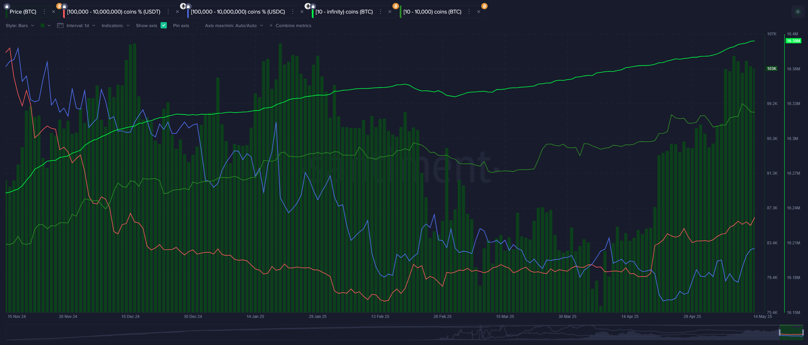
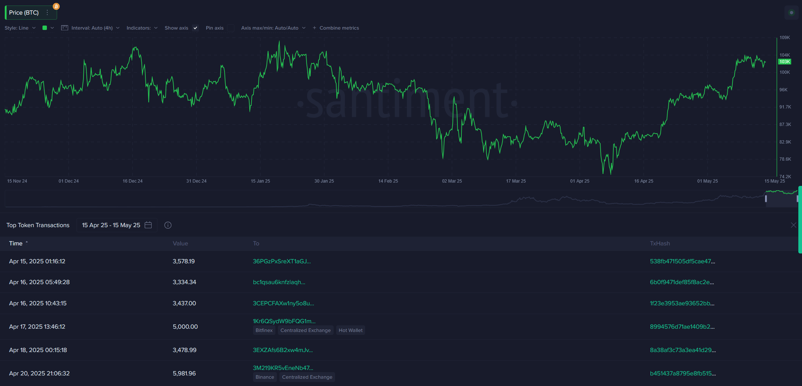
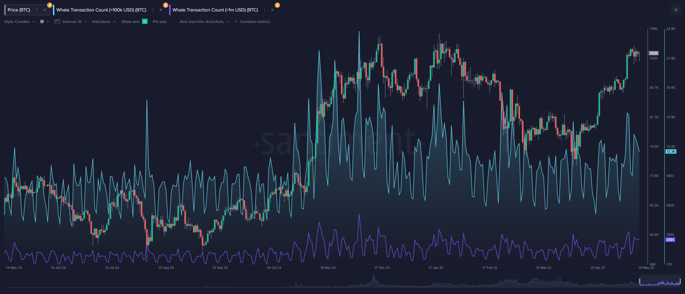
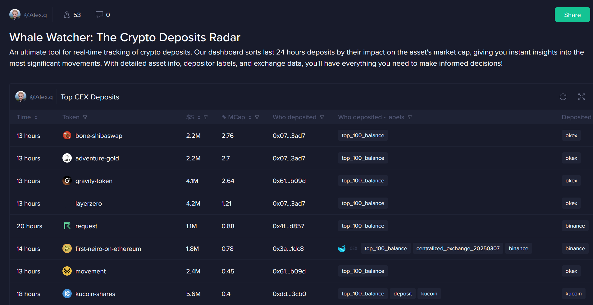

<iframe width="560" height="315" src="https://www.youtube.com/embed/xjV6dSXJ79k?si=0Q0hIukTOv_yX9F9" title="YouTube video player" frameborder="0" allow="accelerometer; autoplay; clipboard-write; encrypted-media; gyroscope; picture-in-picture; web-share" referrerpolicy="strict-origin-when-cross-origin" allowfullscreen></iframe>

It's important to monitor on how cryptocurrency whales are
treating their bags. Generally, if they're accumulating, it's a good sign
crypto market caps are continuing to rise. If they're moving many coins to
exchanges, on the other hand, it's a sign that a dump may be around the corner.

There are several different methods to monitor whale activity on Santiment.
Let's go through a few of the most efficient ones:

## Key Stakeholder Tiers (Supply Distribution)

One of the best ways to get an idea of what whales are collectively doing with
their coins is by checking out the total holdings of key large whales that tend
to control the destiny of future price movements. For Bitcoin, we generally
suggest checking out the wallets holding 10 or more BTC (currently about \$1M
or more) or, more specifically the wallets holding between 10 to 10K BTC. You
can see them, and a few other [key whale tiers here](https://app.santiment.net/s/2wEU5Co9).

For most altcoins, since their market caps aren't nearly as massive as
Bitcoin's you can use a rule of thumb of finding the tier closest to $100K, and
ranging up to the tier closest to $10M. This range will typically (not always,
but usually) have some of the highest correlation on price movements.

An easy way to create your own tiers and track groups of collective whale
wallets is to:

1. Go to "Balance of Addresses" on the left panel, and add it to your current
   chart template.

2. Click on the "Merge" button on the chart tools that were added to your chart
   template.

3. Hit the checkmarks next to the tiers you'd like (do the math to calculate
   how many coins equal $100K up to $10M)

4. Hit the confirm button

## Specific Key Stakeholders Wallets

Another method to keep tabs on whales is by opening the [Top Transactions table](https://app.santiment.net/s/kataWThn). For any asset that has whale
metrics on the platform, you will be presented with the 50 largest transfers
over the past 30 days. This table is complete with the date and time each
transaction occurred, as well as the wallet they sent to, and the raw
transaction hash link for further analysis/investigation.

You can either get to it from opening the linked text in the last paragraph, or
by going to the Charts page on Santiment, and searching for "Top Transactions"
in the left search bar, and double clicking the metric to add it to the current
chart.

To take things further, you can always look up a specific wallet on
Santiment's [Historical
Balance](https://app.santiment.net/labs/balance?assets=) page to see how any
wallet's coin holdings have fluctuated over time. This feature also shows every
coin currently held within the wallet, as well as the total USD holdings of the
wallet. This can be highly useful when looking for specific whale addresses
that have a fairly strong correlation with where markets tend to move next.

If you see the chart page show up as blank, it may be because the wallet isn't
Bitcoin-based, Ethereum-based, or Litecoin-based. We do plan to have this
feature get further support for more networks down the road, though.

## Whale Transaction Spikes

For a more simplistic way to recognize when an asset's price pattern may be
about to change, check out the amount of "whale transactions" that exceed a
value of $100K or more, or $1M or more. You can find the [default template for it here](https://app.santiment.net/s/n8ctb2Yd).

An asset like Bitcoin, being the largest market cap in crypto, will naturally
have tens of thousands of \$100K+ whale transactions on any given day. But if
you venture outside the top 250 market caps or so, you'll come across coins
that only see 1 or 2 on any given day.

Whether the coin is a big or small asset, though, you'll still likely find
value in seeing when whales are becoming active again. Many make the mistake of
assuming that an increase in whale transactions is always a bullish sign. In
actuality, it is a sign of volatility and price direction change. When whales
make large transfers, they could equally be accumulating or dumping. So that's
why it can be very useful to reference it in tandem with the Key Stakeholder
Tiers.

## Whale CEX Deposit Dashboard

<iframe width="560" height="315" src="https://www.youtube.com/embed/lnzph78TCPg?si=zOw2-0HBUlNaJcJV" title="YouTube video player" frameborder="0" allow="accelerometer; autoplay; clipboard-write; encrypted-media; gyroscope; picture-in-picture; web-share" referrerpolicy="strict-origin-when-cross-origin" allowfullscreen></iframe>

Often times, you may not be sure of what asset you are looking for, and you
simply want to see which coins may suddenly be getting significantly moved by
whales. We specifically have built a dashboard for tracking when large batches
of any coin are moving to centralized exchanges. This is especially useful as a
warning sign that a coin's price may soon dump, and it's a good time to take
profit. Coins typically move from cold wallets to centralized exchanges for one
reason, and it's to sell them.

We have written a couple of comprehensive articles about how to effectively use
this
dashboard [here](https://insights.santiment.net/read/try-the-new-centralized-exchange-deposit-dashboard-now-8202) and [here](https://insights.santiment.net/read/using-santiment-s-whale-deposit-centralized-exchange-dashboard-8463).
And we definitely encourage you to check them out to begin utilizing this
helpful tool.

Do you have some other ways you like to track whale activity on Santiment? Let
us know what you think about our suggestions, or if you have further ideas of
your own. We may just integrate more features if you have an idea on more
useful blockchain data scraping!

---

<Notebox type="pin">

**Explore the data**

To explore the data you can start a two-week free trial from [the pricing page](https://app.santiment.net/pricing)

</Notebox>

---

<Notebox type="note">

**Disclaimer**

The opinions expressed in the post are for general informational
purposes only and are not intended to provide specific advice or
recommendations for any individual or on any specific security or investment
product.

</Notebox>
